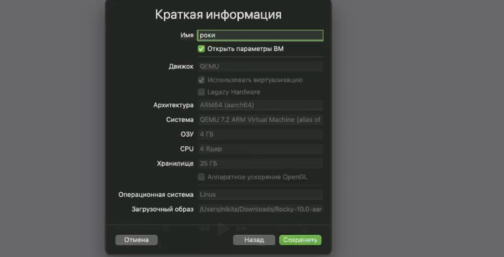
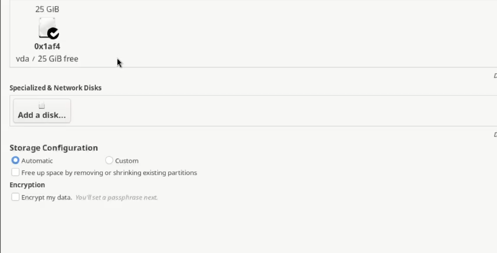
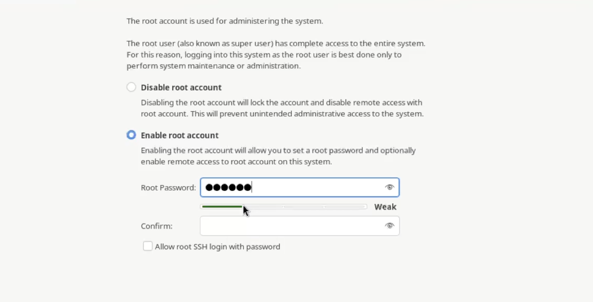
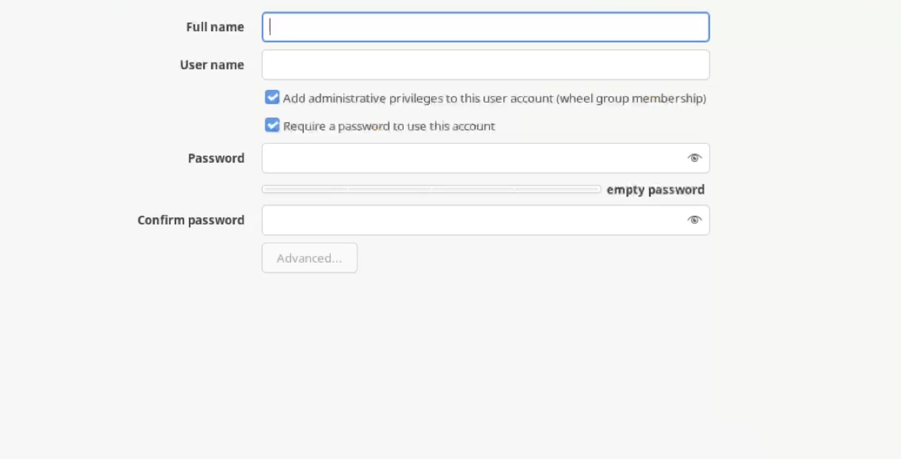
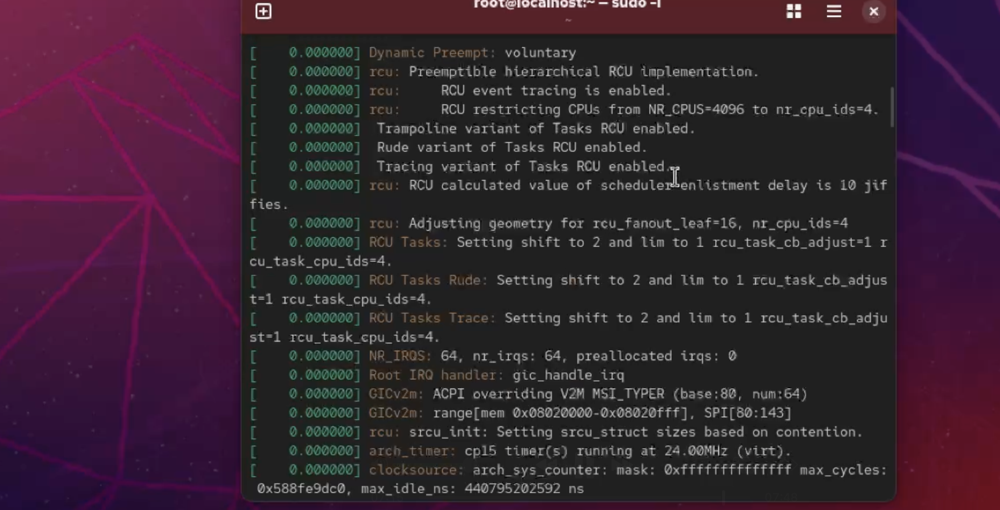

---
## Front matter
lang: ru-RU
title: Отчёт по выполнению лабораторной работы №1
subtitle: Установка Roky
author:
  - Коровкин Н. М.
institute:
  - Российский университет дружбы народов, Москва, Россия
date: 24 февраля 2025

## i18n babel
babel-lang: russian
babel-otherlangs: english

## Formatting pdf
toc: false
toc-title: Содержание
slide_level: 2
aspectratio: 169
section-titles: true
theme: metropolis
header-includes:
 - \metroset{progressbar=frametitle,sectionpage=progressbar,numbering=fraction}
 - '\makeatletter'
 - '\beamer@ignorenonframefalse'
 - '\makeatother'
 
## Fonts
mainfont: PT Serif
romanfont: PT Serif
sansfont: PT Sans
monofont: PT Mono
mainfontoptions: Ligatures=TeX
romanfontoptions: Ligatures=TeX
sansfontoptions: Ligatures=TeX,Scale=MatchLowercase
monofontoptions: Scale=MatchLowercase,Scale=0.9
---

# Информация

## Докладчик

:::::::::::::: {.columns align=center}
::: {.column width="70%"}

  * Коровкин Никита Михайлович
  * Студент
  * Российский университет дружбы народов
  * [1132246835@pfur.ru](mailto:1132246835@pfur.ru)

:::
::: {.column width="30%"}

:::
::::::::::::::

## Цель работы

Установить Linux Rocky и ознакомиться с его возможностями

## Задание

Установить ОС и выдолнить домешнее задание

## Выполнение лабораторной работы

Первым этапом является создание виртуальной машины. Откроем  UTM загрузим образ с диска и начнем выбирать нужные характеристики.

{ width=70%}

## Запуск машины

Затем запускаем и выбираем язык

{ width=70%}

## Диск

Выбираем диск для установки

{ width=70%}

## Рут

Рут аккаунт

{width=70%}

## Регистрация

Регистрируем аккаунт.

{width=70%}

## Режим разработки

Затем включаем режим разработчика

{ width=70%}

## Характеристи

Используем команду чтобы узнать характеристики

{ width=70%}

## Характеристи

Узнаем теперь информацию о процессоре

{width=70%}

## Характеристи

Затем о ЦПУ

{width=70%}

## Характеристи

Памяти

{ width=70%}

## Характеристи

и файловой системe

{ width=70%}

## Выводы

в результате выполнения работы была установлена система
