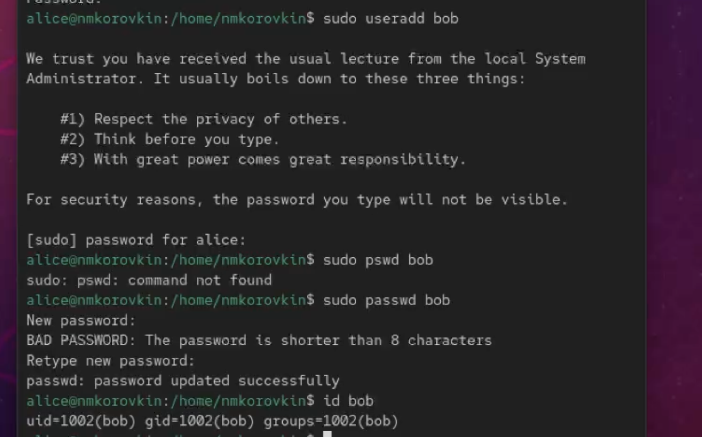

---
## Front matter
lang: ru-RU
title: Отчёт по выполнению лабораторной работы №2
subtitle: Работа с группами
author:
  - Коровкин Н. М.
institute:
  - Российский университет дружбы народов, Москва, Россия
date: 10 сентября 2025

## i18n babel
babel-lang: russian
babel-otherlangs: english

## Formatting pdf
toc: false
toc-title: Содержание
slide_level: 2
aspectratio: 169
section-titles: true
theme: metropolis
header-includes:
 - \metroset{progressbar=frametitle,sectionpage=progressbar,numbering=fraction}
 - '\makeatletter'
 - '\beamer@ignorenonframefalse'
 - '\makeatother'
 
## Fonts
mainfont: PT Serif
romanfont: PT Serif
sansfont: PT Sans
monofont: PT Mono
mainfontoptions: Ligatures=TeX
romanfontoptions: Ligatures=TeX
sansfontoptions: Ligatures=TeX,Scale=MatchLowercase
monofontoptions: Scale=MatchLowercase,Scale=0.9
---

# Информация

## Докладчик

:::::::::::::: {.columns align=center}
::: {.column width="70%"}

  * Коровкин Никита Михайлович
  * Студент
  * Российский университет дружбы народов
  * [1132246835@pfur.ru](mailto:1132246835@pfur.ru)

:::
::: {.column width="30%"}

:::
::::::::::::::

## Цель работы

Получить представление о работе с учётными записями пользователей и группами
пользователей в операционной системе типа Linux.

## Задание

Получить представление о работе с учётными записями пользователей и группами
пользователей и выдолнить домешнее задание

## Выполнение лабораторной работы

Для начала узнаем какую учетную запись мы используем с помощью whoami а потом воспользуемся командой id.С помощью нее мы узнаем индентификатор пользователя, индентификатор основной группы, все группы куда входит пользователь

## Выполнение лабораторной работы

Введя ту же команду уже от Рут мы получим другой вывод. uid всегда будет равен 0, основная группа будет иметь то же значение. Также рут не ограничен в правах и имеет доступ ко всем файлам и процессам.

## Открытие файла

Теперь мы откроем файл в безопасном режиме.

## группа wheel

Находим группу wheel.Группа wheel в Linux — это специальная группа пользователей, которая исторически используется для контроля доступа к командам вроде su или sudo, позволяющим пользователям получать права суперпользователя (root)

## создание учетной записи

Теперь создадим учетную запись пользователя Элис. Посмотрим информацию о том в каких она группах, добавим ей пароль и переключимся на нее.

## создание другого пользователя

От лица Элис создадим теперь боба

## открываем файл

Откроем logins.def

## ищем пункт 1

Находим сначала CREATE HOME

## ищем следующий пункт

Находим следующий пункт и меняем значение на no

## Создаем 2 папки

Переходим в папку и создаем две папки для документов и фотографий.

## Редактируем файл

Открываем bashrc и дописываем в конец строку

## Добавляем кэрол

После этого вновь переключаемся на элис и создаем Кэрол.Добавляем пароль, переключаемся на нее и смотрим информацию. Здесь показано что первоначальная группа 1003

## Проверяем наличие папок

Теперь смотрим наличие нужных папок у кэрол.Все на месте

## Информация о пароле

Теперь посмотрим информацию о пароле Кэрол. Здесь мы имеем хэшированный пароль, который мы должны настроить - срок его действия.

## Выполнение лабораторной работы

В этом упражнении требуется создать две группы и добавить некоторых пользователей в эти группы.

## Выполнение лабораторной работы

Теперь смотрим информацию о кэрол.Она находится в третей группе а ее основная 100 как и должно быть.

## Выполнение лабораторной работы

У элис и боба также отображается информация о группах.Для них основная - 1004.

## Ответ на контрольные вопросы

1. `id`, `groups`, `whoami`, `getent passwd`
2. UID root = 0, узнать можно командой `id root` или через `/etc/passwd`
3. `su` переключает пользователя, требует пароль того пользователя; `sudo` выполняет команду с правами другого пользователя, использует свой пароль
4. `/etc/sudoers`
5. `visudo`
6. В группу `sudo` (Debian/Ubuntu) или `wheel` (RHEL/CentOS)
7. `/etc/default/useradd` (настройки по умолчанию), `/etc/skel/` (шаблон файлов для нового пользователя)
8. Основная группа — `/etc/passwd`, дополнительные группы — `/etc/group`; например, alice: основной GID 1001 в `/etc/passwd`, в дополнительных группах `/etc/group`
9. `passwd` (смена пароля), `chage` (срок действия пароля)
10. Нельзя напрямую, нужно `groupadd`, `groupmod` или `gpasswd` — они безопасно редактируют `/etc/group`

## Выводы

в результате выполнения работы мы научились работать с группами

## Список литературы{.unnumbered}

::: {#refs}
:::
