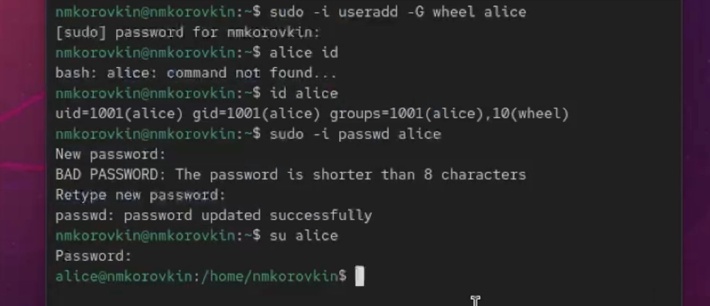
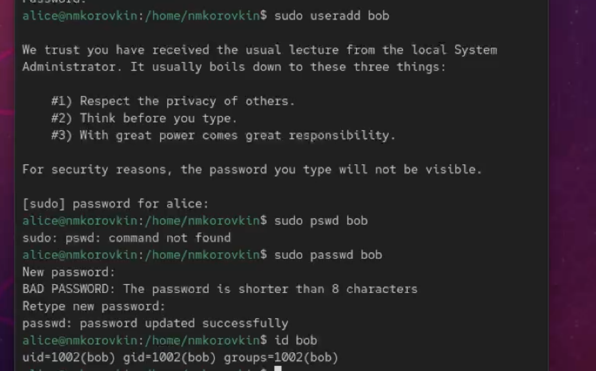
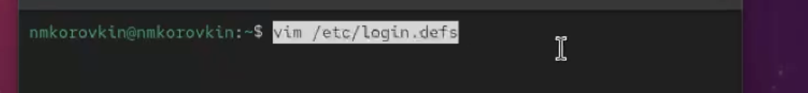
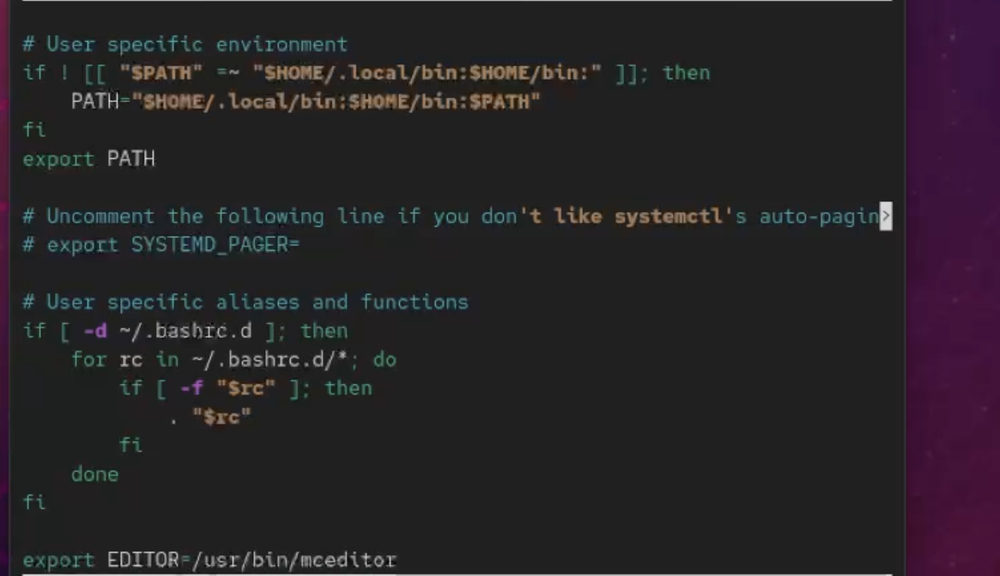
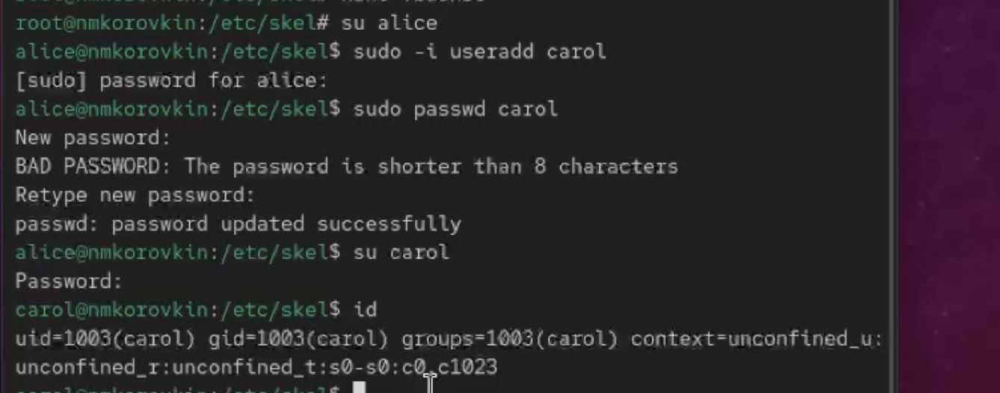
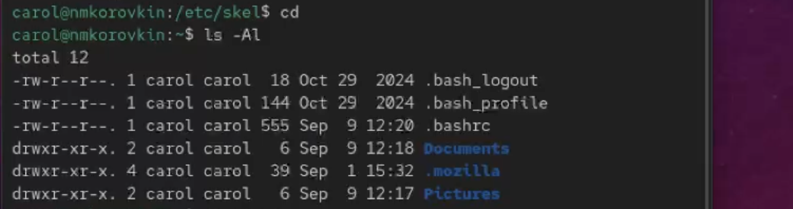
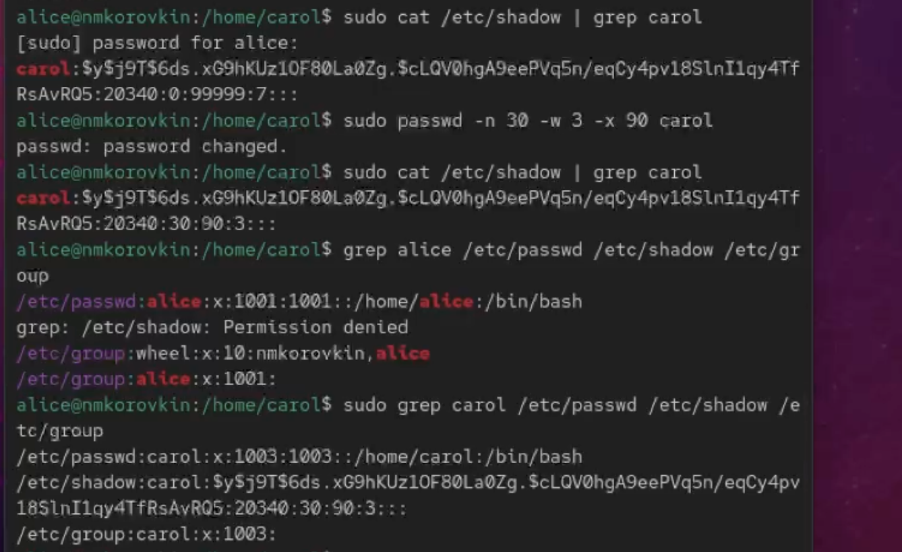
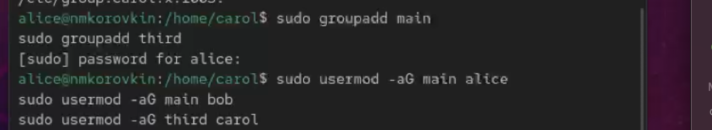
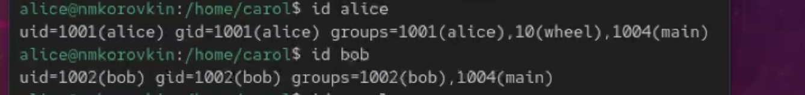

---
## Front matter
title: "Лабораторная работа №2"
subtitle: "Отчёт"
author: "Коровкин Никита Михайлович"

## Generic otions
lang: ru-RU
toc-title: "Содержание"

## Bibliography
bibliography: bib/cite.bib
csl: pandoc/csl/gost-r-7-0-5-2008-numeric.csl

## Pdf output format
toc: true # Table of contents
toc-depth: 2
lof: true # List of figures
lot: true # List of tables
fontsize: 12pt
linestretch: 1.5
papersize: a4
documentclass: scrreprt
## I18n polyglossia
polyglossia-lang:
  name: russian
  options:
	- spelling=modern
	- babelshorthands=true
polyglossia-otherlangs:
  name: english
## I18n babel
babel-lang: russian
babel-otherlangs: english
## Fonts
mainfont: PT Serif
romanfont: PT Serif
sansfont: PT Sans
monofont: PT Mono
mainfontoptions: Ligatures=TeX
romanfontoptions: Ligatures=TeX
sansfontoptions: Ligatures=TeX,Scale=MatchLowercase
monofontoptions: Scale=MatchLowercase,Scale=0.9
## Biblatex
biblatex: true
biblio-style: "gost-numeric"
biblatexoptions:
  - parentracker=true
  - backend=biber
  - hyperref=auto
  - language=auto
  - autolang=other*
  - citestyle=gost-numeric
## Pandoc-crossref LaTeX customization
figureTitle: "Рис."
tableTitle: "Таблица"
listingTitle: "Листинг"
lofTitle: "Список иллюстраций"
lotTitle: "Список таблиц"
lolTitle: "Листинги"
## Misc options
indent: true
header-includes:
  - \usepackage{indentfirst}
  - \usepackage{float} # keep figures where there are in the text
  - \floatplacement{figure}{H} # keep figures where there are in the text
---

# Цель работы

Получить представление о работе с учётными записями пользователей и группами
пользователей в операционной системе типа Linux.

# Задание

Получить представление о работе с учётными записями пользователей и группами
пользователей и выдолнить домешнее задание

# Выполнение лабораторной работы

Для начала узнаем какую учетную запись мы используем с помощью whoami а потом воспользуемся командой id.С помощью нее мы узнаем индентификатор пользователя, индентификатор основной группы, все группы куда входит пользователь(рис. [-@fig:001]).

{#fig:01 width=70%}

Введя ту же команду уже от Рут мы получим другой вывод. uid всегда будет равен 0, основная группа будет иметь то же значение. Также рут не ограничен в правах и имеет доступ ко всем файлам и процессам.(рис. [-@fig:002]).

{#fig:02 width=70%}

Теперь мы откроем файл в безопасном режиме.(рис. [-@fig:003]).

{#fig:03 width=70%}

Находим группу wheel.Группа wheel в Linux — это специальная группа пользователей, которая исторически используется для контроля доступа к командам вроде su или sudo, позволяющим пользователям получать права суперпользователя (root)(рис. [-@fig:004]).

{#fig:04 width=70%}

Теперь создадим учетную запись пользователя Элис. Посмотрим информацию о том в каких она группах, добавим ей пароль и переключимся на нее.(рис. [-@fig:005]).

{#fig:05 width=70%}

От лица Элис создадим теперь боба(рис. [-@fig:006]).

{#fig:06 width=70%}

Откроем logins.def(рис. [-@fig:007]).

{#fig:07 width=70%}

Находим сначала CREATE HOME(рис. [-@fig:008]).

{#fig:08 width=70%}

Находим следующий пункт и меняем значение на no(рис. [-@fig:009]).

{#fig:09 width=70%}

Переходим в папку и создаем две папки для документов и фотографий.(рис. [-@fig:010]).

{#fig:10 width=70%}

Открываем bashrc и дописываем в конец строку(рис. [-@fig:011])

{#fig:11 width=70%}

После этого вновь переключаемся на элис и создаем Кэрол.Добавляем пароль, переключаемся на нее и смотрим информацию. Здесь показано что первоначальная группа 1003(рис. [-@fig:012])

{#fig:12 width=70%}

Теперь смотрим наличие нужных папок у кэрол.Все на месте(рис. [-@fig:013])

{#fig:13 width=70%}

Теперь посмотрим информацию о пароле Кэрол. Здесь мы имеем хэшированный пароль, который мы должны настроить - срок его действия.(рис. [-@fig:014])

{#fig:14 width=70%}

В этом упражнении требуется создать две группы и добавить некоторых пользователей в эти группы.(рис. [-@fig:015])

{#fig:15 width=70%}

Теперь смотрим информацию о кэрол.Она находится в третей группе а ее основная 100 как и должно быть.(рис. [-@fig:016])

{#fig:16 width=70%}

У элис и боба также отображается информация о группах.Для них основная - 1004.(рис. [-@fig:017])

{#fig:17 width=70%}

# Ответ на контрольные вопросы

1. `id`, `groups`, `whoami`, `getent passwd`
2. UID root = 0, узнать можно командой `id root` или через `/etc/passwd`
3. `su` переключает пользователя, требует пароль того пользователя; `sudo` выполняет команду с правами другого пользователя, использует свой пароль
4. `/etc/sudoers`
5. `visudo`
6. В группу `sudo` (Debian/Ubuntu) или `wheel` (RHEL/CentOS)
7. `/etc/default/useradd` (настройки по умолчанию), `/etc/skel/` (шаблон файлов для нового пользователя)
8. Основная группа — `/etc/passwd`, дополнительные группы — `/etc/group`; например, alice: основной GID 1001 в `/etc/passwd`, в дополнительных группах `/etc/group`
9. `passwd` (смена пароля), `chage` (срок действия пароля)
10. Нельзя напрямую, нужно `groupadd`, `groupmod` или `gpasswd` — они безопасно редактируют `/etc/group`

# Выводы

в результате выполнения работы мы научились работать с группами

# Список литературы{.unnumbered}

::: {#refs}
:::
