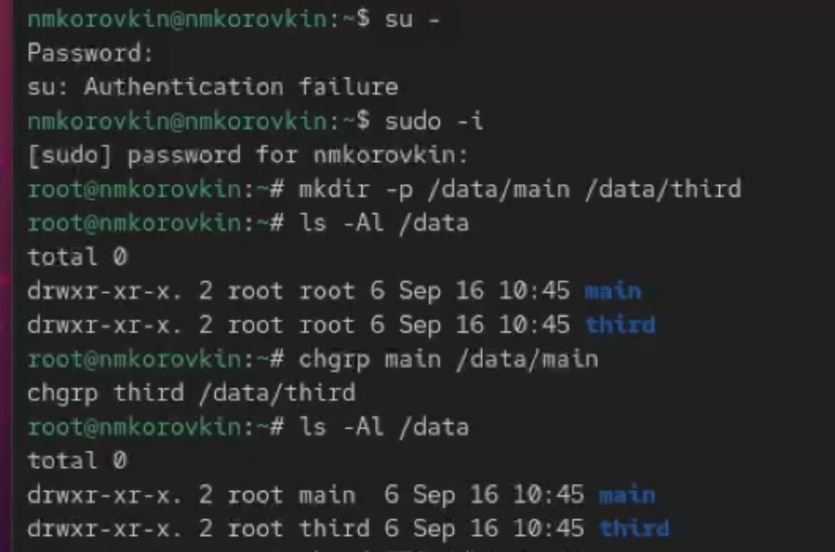
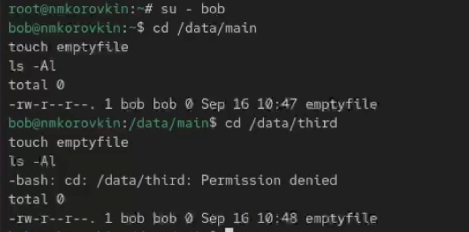
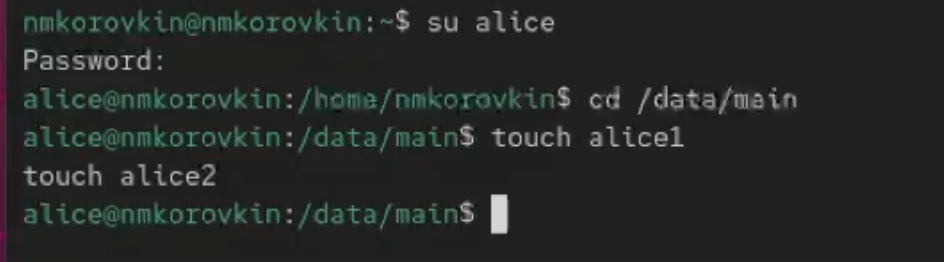
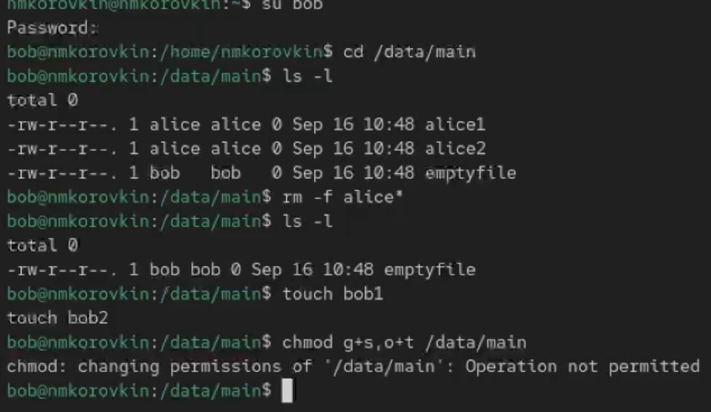
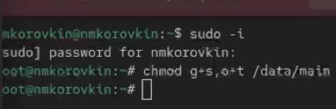
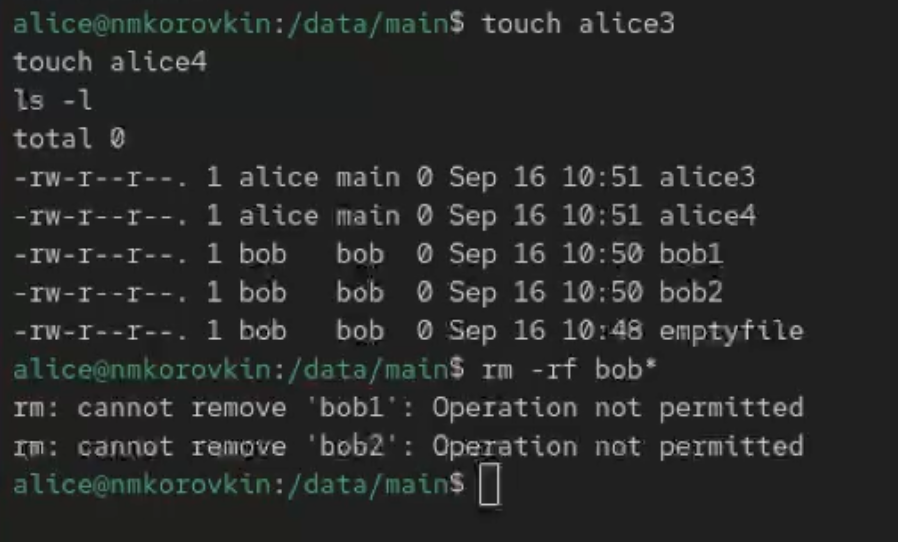
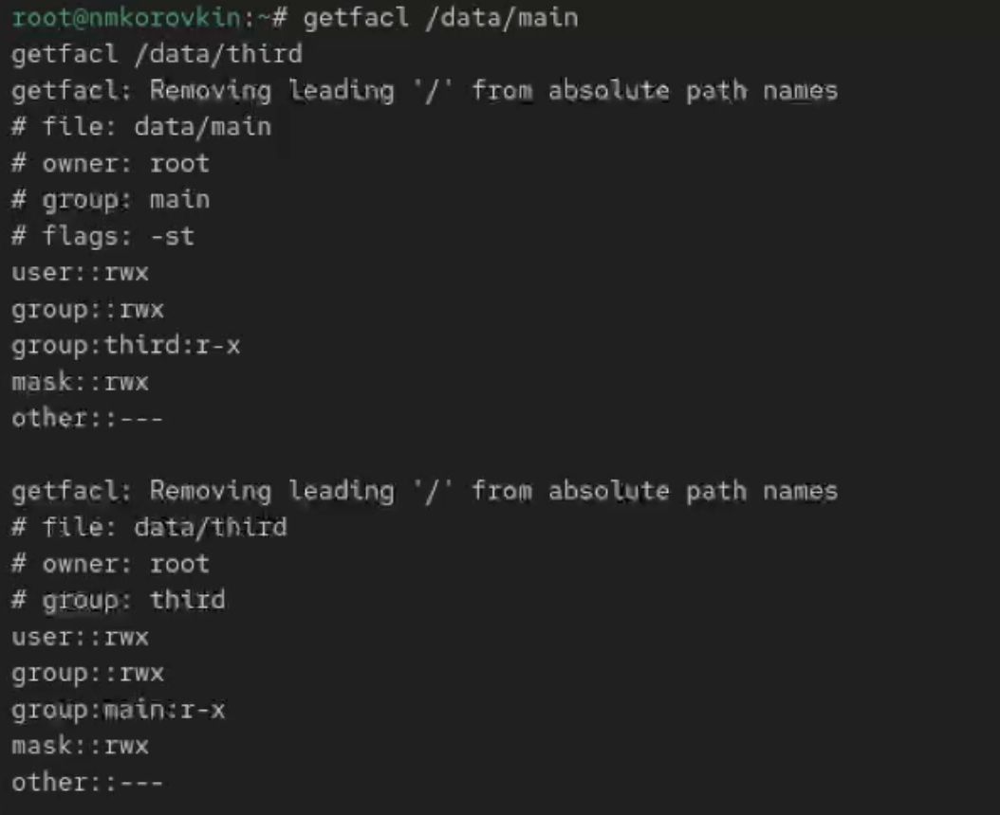
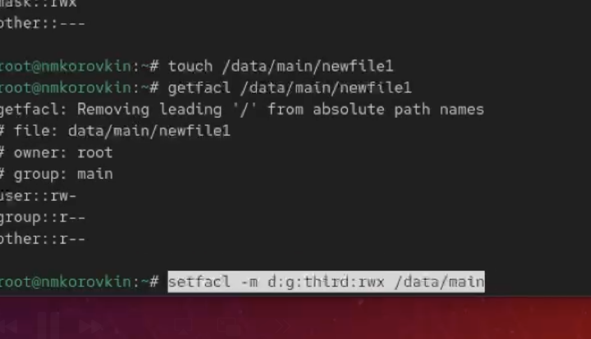
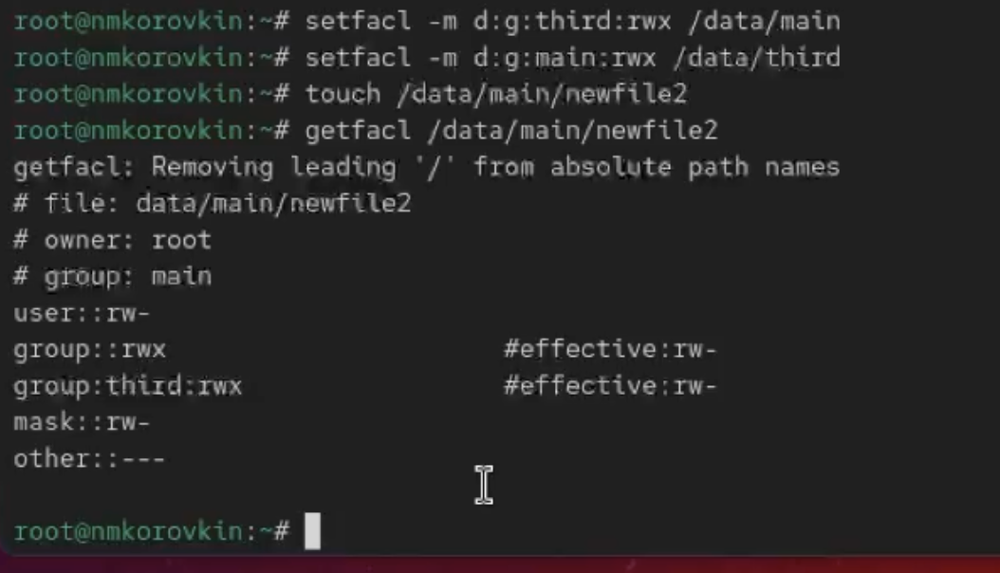
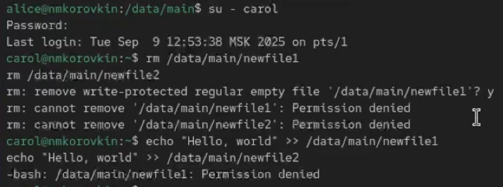

---
## Front matter
lang: ru-RU
title: Отчёт по выполнению лабораторной работы №3
subtitle: Работа с группами
author:
  - Коровкин Н. М.
institute:
  - Российский университет дружбы народов, Москва, Россия
date: 16 сентября 2025

## i18n babel
babel-lang: russian
babel-otherlangs: english

## Formatting pdf
toc: false
toc-title: Содержание
slide_level: 2
aspectratio: 169
section-titles: true
theme: metropolis
header-includes:
 - \metroset{progressbar=frametitle,sectionpage=progressbar,numbering=fraction}
 - '\makeatletter'
 - '\beamer@ignorenonframefalse'
 - '\makeatother'
 
## Fonts
mainfont: PT Serif
romanfont: PT Serif
sansfont: PT Sans
monofont: PT Mono
mainfontoptions: Ligatures=TeX
romanfontoptions: Ligatures=TeX
sansfontoptions: Ligatures=TeX,Scale=MatchLowercase
monofontoptions: Scale=MatchLowercase,Scale=0.9
---

# Информация

## Докладчик

:::::::::::::: {.columns align=center}
::: {.column width="70%"}

  * Коровкин Никита Михайлович
  * Студент
  * Российский университет дружбы народов
  * [1132246835@pfur.ru](mailto:1132246835@pfur.ru)

:::
::: {.column width="30%"}

:::
::::::::::::::

## Цель работы

Получение навыков настройки базовых и специальных прав доступа для групп пользователей в операционной системе типа Linux.

## Задание

1. Прочитайте справочное описание man по командам chgrp, chmod, getfacl, setfacl.
2. Выполните действия по управлению базовыми разрешениями для групп пользователей (раздел 3.3.1).
3. Выполните действия по управлению специальными разрешениями для групп пользователей (раздел 3.3.2).
4. Выполните действия по управлению расширенными разрешениями с использованием
списков ACL для групп пользователей

## Выполнение лабораторной работы

Для начала в терминале войдем с рут правами. Создадим 2 каталога и посмотрим информацию о доступе к ним. Введем команду - и теперь доступ есть как у рут, так и у главной и третей группах.

## Установим разрешения

Установим разрешения, позволяющие владельцам каталогов записывать файлы в эти каталоги и запрещающие доступ к содержимому каталогов всем другим пользователям
и группам

## проверяем доступ

В другом терминале перейдем под учётную запись пользователя bob. Под пользователем bob попробуем перейти в каталог /data/main и создадим файл
emptyfile в этом каталоге. В папке третей группе доступ отказан для боба

## Выполнение лабораторной работы

Перейдем на Алису и создадим два файла 

## удаляем файлы алисы и проверяем, удалились ли

переходим на боба, переходим в папку и смотрим файлы.Теперь удаляем файлы алисы и проверяем, удалились ли

## Переходим на рут и изменяем доступ

Переходим на рут и изменяем доступ

## Выполнение лабораторной работы

Перейдя на алису создаем новые файлы и пытаемся удалить файлы боба - но у нас не выходит

Откройем терминал с учётной записью root. Установим права на чтение и выполнение в каталоге. Используем команду getfacl, чтобы убедиться в правильности установки разрешений

## Выполнение лабораторной работы

создаем два файла и опять используем команду getfacl, чтобы убедиться в правильности установки разрешений

## Выполнение лабораторной работы

Установим права на чтение и выполнение в каталоге /data/main для группы third и права на чтение и выполнение для группы main в каталоге /data/third:
Используем команду getfacl, чтобы убедиться в правильности установки разрешений
Создаем новый файл с именем newfile1 в каталоге /data/main
Как видим доступ есть у группы мейн однако каталог создан из под рут. так получилось благодаря верхним командам. у группы 3 доступа нет

## Выполнение лабораторной работы

Для проверки полномочий группы third в каталоге /data/third войдем в другом терминале под учётной записью члена группы third. Как видим, ни удалить ни добавить текст в файлы мы не можем

## Ответ на контрольные вопросы

1. `chown user:group file` - меняет владельца и группу файла.
Пример: `chown alice:dev file.txt`

2. `find / -user имя` - ищет все файлы пользователя.
Пример: `find /home -user alice`

3. `chmod -R 770 /data` - права rwx для владельца и группы, 0 для других.

4. `chmod +x file.sh` - добавляет право на выполнение.

5. `chmod g+s dir` - новые файлы в каталоге получают группу каталога.

6. `chmod +t dir` - sticky bit, удалять можно только свои файлы.

7. `setfacl -m g:group:r-- *` - группе даётся право чтения всех файлов.

8. `setfacl -R -m g:group:r-- .` и `setfacl -R -d -m g:group:r-- .` — чтение для группы и всех новых файлов.

9. `umask 007` - у "других" пользователей нет прав на новые файлы.

10. `chattr +i myfile` - файл нельзя удалить или изменить.

## Выводы

в результате выполнения работы мы научились работать с группами и доступами

## Список литературы{.unnumbered}

::: {#refs}
:::
