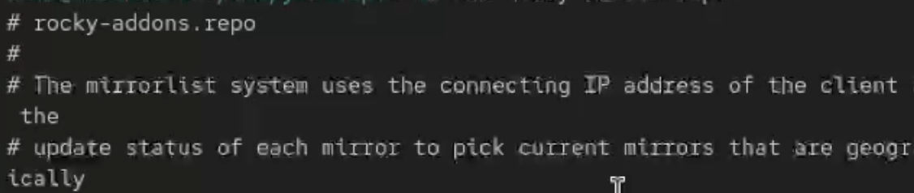
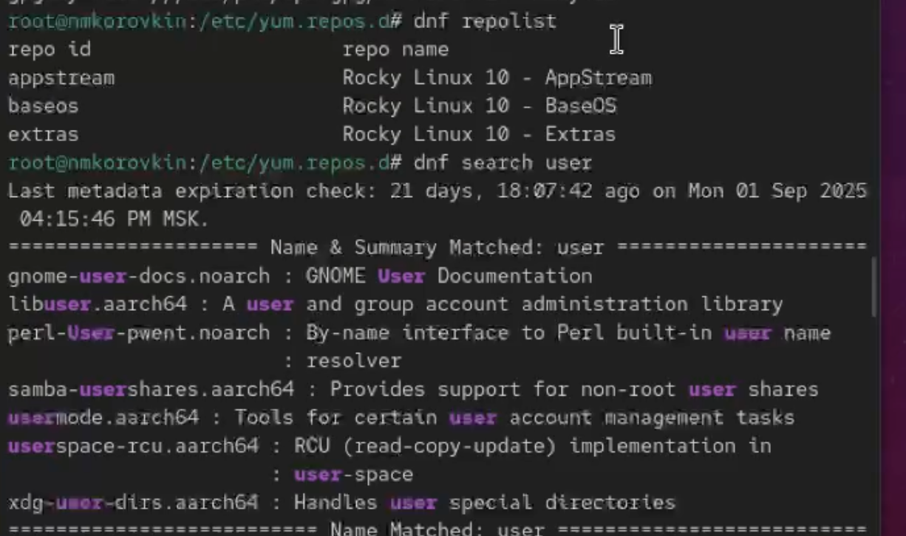
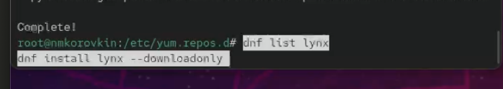
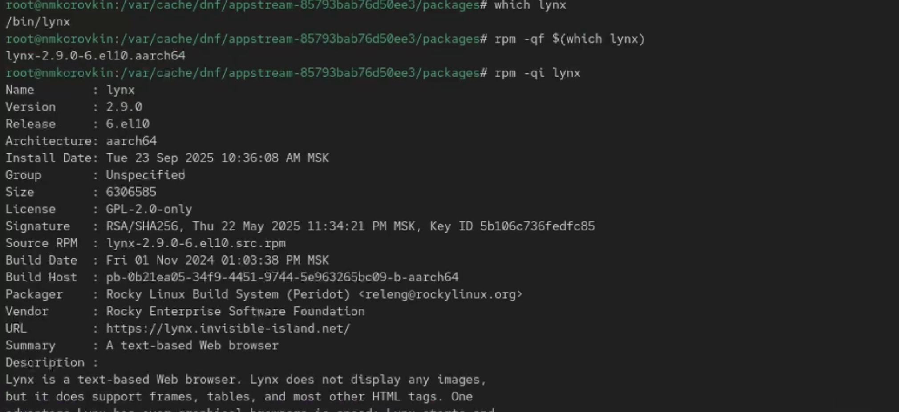
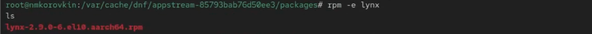
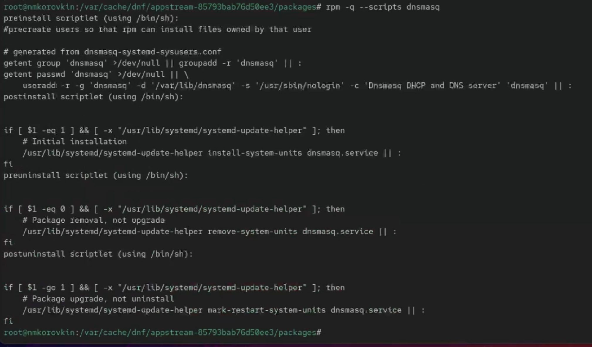
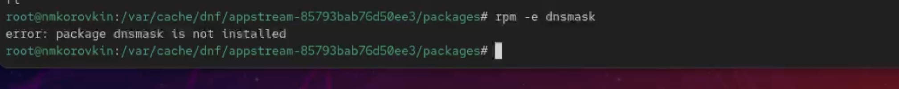

---
## Front matter
lang: ru-RU
title: Отчёт по выполнению лабораторной работы №4
subtitle: Работа с группами
author:
  - Коровкин Н. М.
institute:
  - Российский университет дружбы народов, Москва, Россия
date: 24 сентября 2025

## i18n babel
babel-lang: russian
babel-otherlangs: english

## Formatting pdf
toc: false
toc-title: Содержание
slide_level: 2
aspectratio: 169
section-titles: true
theme: metropolis
header-includes:
 - \metroset{progressbar=frametitle,sectionpage=progressbar,numbering=fraction}
 - '\makeatletter'
 - '\beamer@ignorenonframefalse'
 - '\makeatother'
 
## Fonts
mainfont: PT Serif
romanfont: PT Serif
sansfont: PT Sans
monofont: PT Mono
mainfontoptions: Ligatures=TeX
romanfontoptions: Ligatures=TeX
sansfontoptions: Ligatures=TeX,Scale=MatchLowercase
monofontoptions: Scale=MatchLowercase,Scale=0.9
---

# Информация

## Докладчик

:::::::::::::: {.columns align=center}
::: {.column width="70%"}

  * Коровкин Никита Михайлович
  * Студент
  * Российский университет дружбы народов
  * [1132246835@pfur.ru](mailto:1132246835@pfur.ru)

:::
::: {.column width="30%"}

:::
::::::::::::::

## Цель работы

Получить навыки работы с репозиториями и менеджерами пакетов.

## Задание

1. Изучите, как и в каких файлах подключаются репозитории для установки программного обеспечения; изучите основные возможности (поиск, установка, обновление,
удаление пакета, работа с историей действий) команды dnf (см. раздел 4.4.1).
2. Изучите и повторите процесс установки/удаления определённого пакета с использованием возможностей dnf (см. раздел 4.4.1).
3. Изучите и повторите процесс установки/удаления определённого пакета с использованием возможностей rpm (см. раздел 4.4.2).

## Выполнение лабораторной работы

Сначала я вошёл в режим работы суперпользователя с помощью команды su -.
Затем я перешёл в каталог /etc/yum.repos.d и изучил его содержимое. И также просмотрел содержимое одного из файлов репозиториев при помощи cat название_файла.repo. Так я смог увидеть, какие репозитории подключены в системе.

## Смотрим список репозиториев

Дальше я вывел список доступных репозиториев с помощью команды dnf repolist. Эта команда показывает, какие репозитории настроены и активны.

## Ищем нужные пакеты

Чтобы найти пакеты, в названии или описании которых встречается слово user, я использовал команду dnf search user. В выводе показались пакеты, которые каким-то образом связаны с этим словом — например, содержащие его в имени или описании.

## Устанавливаем утилиту

После этого я  установил утилиту nmap. Для начала я нашёл её в списке пакетов командой dnf search nmap,  посмотрел подробности  а потом выполнил установку при помощи dnf install nmap. также попробовал установить с помощью "dnf install nmap\*".

## Удаляем пакет

Разница заключается в том, что при использовании nmap ставится конкретный пакет, а запись nmap* может установить все пакеты, начинающиеся с этого имени (например, дополнительные модули или зависимости).

Позже я удалил пакет nmap командами dnf remove nmap и dnf remove nmap*. Вторая команда также может удалить пакеты, имена которых начинаются с nmap.

## Смотрим список доступных групп

Я посмотрел список доступных групп пакетов через dnf groups list и более детально через LANG=C dnf groups list. 

## Выполнение лабораторной работы

После этого установил группу при помощи dnf groupinstall "RPM Development Tools". Для удаления этой группы можно воспользоваться командой dnf groupremove "RPM Development Tools".

## Устанавливаем текстовый браузер

Чтобы просмотреть историю использования dnf, я воспользовался командой dnf history. Также я попробовал отменить одно из действий, например шестое по счёту, через dnf history undo 6.

Когда мне понадобилось установить текстовый браузер lynx из rpm-пакета, я сначала скачал его с помощью dnf list lynx и dnf install lynx --downloadonly. 

## Выполнение лабораторной работы

После загрузки я нашёл каталог с пакетом через find /var/cache/dnf/ -name lynx*.
Перейдя в этот каталог, я установил пакет 

## Выполнение лабораторной работы

Затем я определил расположение исполняемого файла через which lynx. Чтобы понять, к какому пакету принадлежит этот файл, я использовал rpm -qf $(which lynx). Дополнительную информацию о пакете я получил с помощью rpm -qi lynx.

## Выполнение лабораторной работы

Список всех файлов пакета я вывел через rpm -ql lynx. Отдельно я посмотрел файлы документации командой rpm -qd lynx

## Выполнение лабораторной работы

Конфигурационные файлы пакета я нашёл с помощью rpm -qc lynx. С помощью rpm -q --scripts lynx я посмотрел установочные скрипты. Эти скрипты могут автоматически выполнять действия при установке или удалении пакета — например, создавать каталоги, обновлять конфигурации или запускать сервисы.

## Выполнение лабораторной работы

затем я удалил пакет командой rpm -e lynx.

## Выполнение лабораторной работы

Когда мне нужно было установить dnsmasq (это сервис, который может работать как DNS-, DHCP- и TFTP-сервер), я сначала посмотрел его в списке пакетов (dnf list dnsmasq), затем установил через dnf install dnsmasq и определил расположение исполняемого файла командой which dnsmasq.

## Выполнение лабораторной работы

Чтобы узнать, к какому пакету относится бинарный файл, я использовал rpm -qf $(which dnsmasq). Подробности о пакете получил с помощью rpm -qi dnsmasq.
Список всех файлов в пакете я вывел через rpm -ql dnsmasq, а документацию через rpm -qd dnsmasq. Также я посмотрел руководство командой man dnsmasq.

## Выполнение лабораторной работы

Конфигурационные файлы пакета удалось найти с помощью rpm -qc dnsmasq. Я также изучил установочные скрипты через rpm -q --scripts dnsmasq. Эти скрипты нужны для того, чтобы автоматически выполнить некоторые действия во время установки или удаления пакета (например, запускать или останавливать службы).

## Выполнение лабораторной работы

В конце я удалил пакет через rpm -e dnsmasq.

## Ответ на контрольные вопросы

1. Чтобы найти пакет, в котором находится файл useradd, используется команда:

dnf provides */useradd

Она показывает, какой rpm-пакет содержит этот файл.

2. Чтобы показать имя группы dnf с инструментами безопасности и её содержимое:
dnf group info "Security Tools"

3. Чтобы установить rpm, который скачан вручную и не в репозитории:
rpm -i имя_пакета.rpm

4. Чтобы проверить, нет ли в пакете опасных скриптов:
rpm -qp --scripts имя_пакета.rpm

5. Чтобы посмотреть всю документацию пакета:
rpm -qd имя_пакета

6. Чтобы узнать, к какому пакету принадлежит файл:
rpm -qf /путь/к/файлу

## Выводы

в результате выполнения работы мы научились работать с репозиториями и менеджерами пакетов.

## Список литературы{.unnumbered}

::: {#refs}
:::
