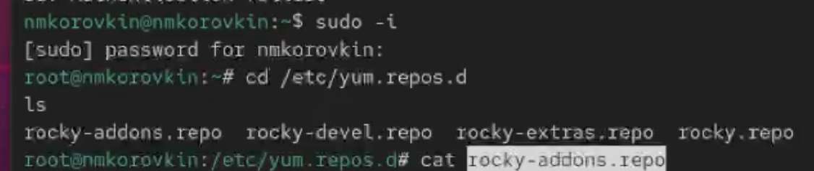
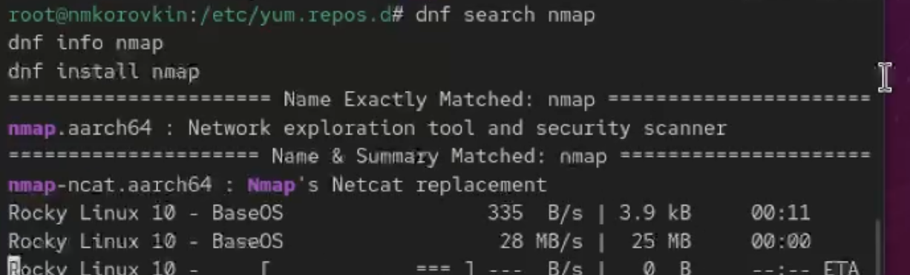
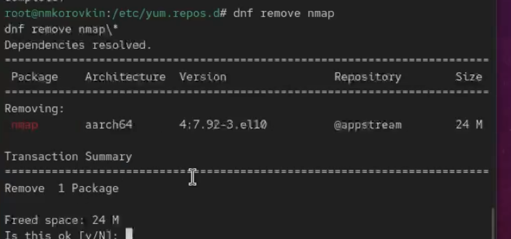
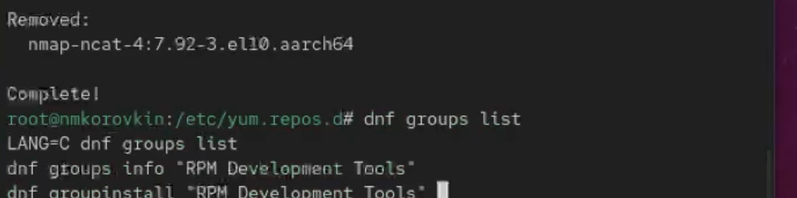
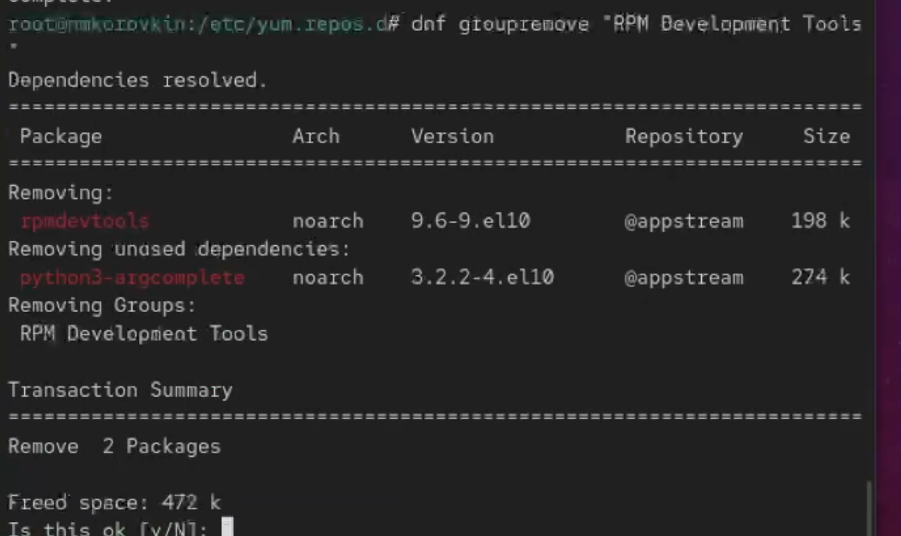
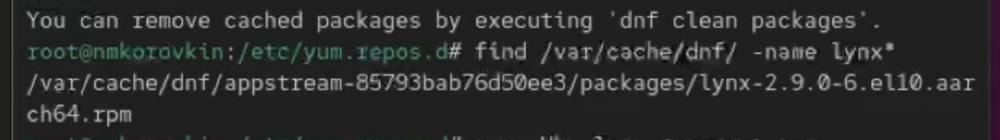
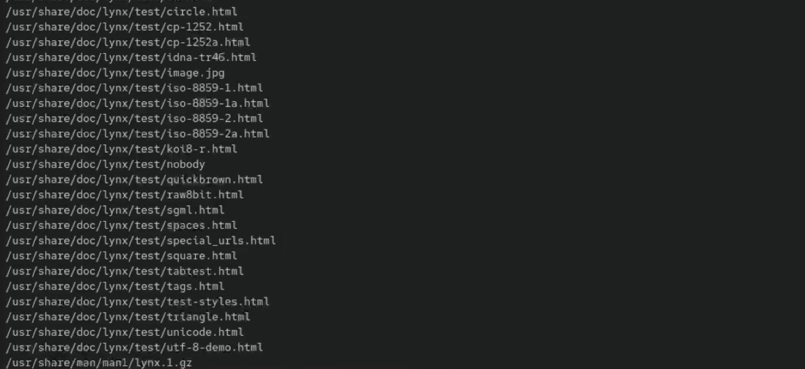
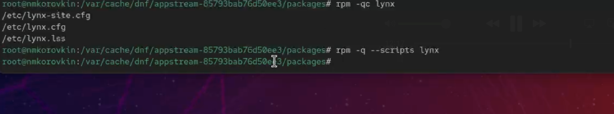
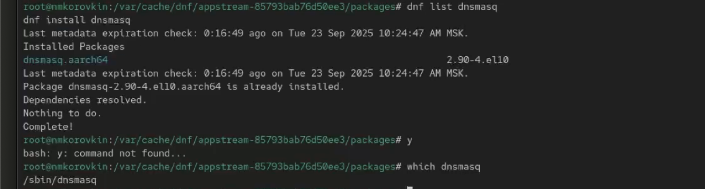
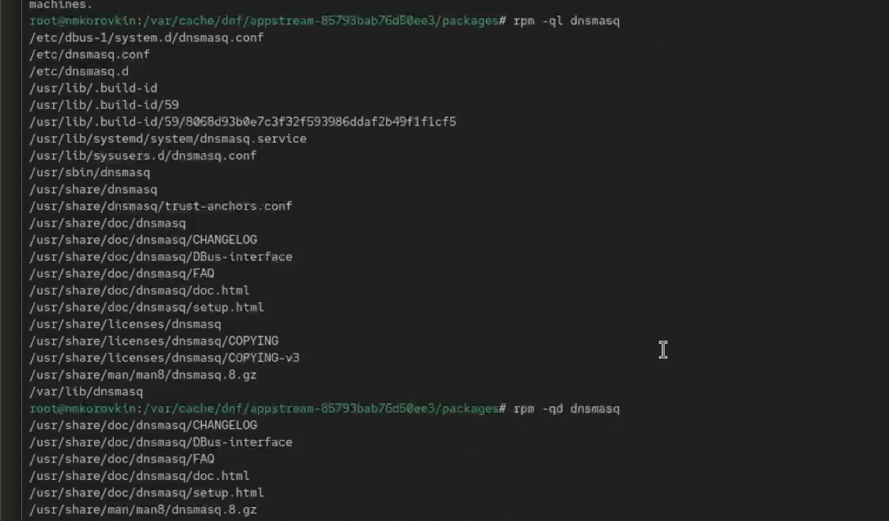

---
## Front matter
title: "Лабораторная работа №4"
subtitle: "Отчёт"
author: "Коровкин Никита Михайлович"

## Generic otions
lang: ru-RU
toc-title: "Содержание"

## Bibliography
bibliography: bib/cite.bib
csl: pandoc/csl/gost-r-7-0-5-2008-numeric.csl

## Pdf output format
toc: true # Table of contents
toc-depth: 2
lof: true # List of figures
lot: true # List of tables
fontsize: 12pt
linestretch: 1.5
papersize: a4
documentclass: scrreprt
## I18n polyglossia
polyglossia-lang:
  name: russian
  options:
	- spelling=modern
	- babelshorthands=true
polyglossia-otherlangs:
  name: english
## I18n babel
babel-lang: russian
babel-otherlangs: english
## Fonts
mainfont: PT Serif
romanfont: PT Serif
sansfont: PT Sans
monofont: PT Mono
mainfontoptions: Ligatures=TeX
romanfontoptions: Ligatures=TeX
sansfontoptions: Ligatures=TeX,Scale=MatchLowercase
monofontoptions: Scale=MatchLowercase,Scale=0.9
## Biblatex
biblatex: true
biblio-style: "gost-numeric"
biblatexoptions:
  - parentracker=true
  - backend=biber
  - hyperref=auto
  - language=auto
  - autolang=other*
  - citestyle=gost-numeric
## Pandoc-crossref LaTeX customization
figureTitle: "Рис."
tableTitle: "Таблица"
listingTitle: "Листинг"
lofTitle: "Список иллюстраций"
lotTitle: "Список таблиц"
lolTitle: "Листинги"
## Misc options
indent: true
header-includes:
  - \usepackage{indentfirst}
  - \usepackage{float} # keep figures where there are in the text
  - \floatplacement{figure}{H} # keep figures where there are in the text
---

# Цель работы

Получить навыки работы с репозиториями и менеджерами пакетов.

# Задание

1. Изучите, как и в каких файлах подключаются репозитории для установки программного обеспечения; изучите основные возможности (поиск, установка, обновление,
удаление пакета, работа с историей действий) команды dnf (см. раздел 4.4.1).
2. Изучите и повторите процесс установки/удаления определённого пакета с использованием возможностей dnf (см. раздел 4.4.1).
3. Изучите и повторите процесс установки/удаления определённого пакета с использованием возможностей rpm (см. раздел 4.4.2).

# Выполнение лабораторной работы

Сначала я вошёл в режим работы суперпользователя с помощью команды su -.
Затем я перешёл в каталог /etc/yum.repos.d и изучил его содержимое. И также просмотрел содержимое одного из файлов репозиториев при помощи cat название_файла.repo. Так я смог увидеть, какие репозитории подключены в системе.(рис. [-@fig:001])

{#fig:1 width=70%}

Дальше я вывел список доступных репозиториев с помощью команды dnf repolist. Эта команда показывает, какие репозитории настроены и активны.(рис. [-@fig:002])

{#fig:2 width=70%}

Чтобы найти пакеты, в названии или описании которых встречается слово user, я использовал команду dnf search user. В выводе показались пакеты, которые каким-то образом связаны с этим словом — например, содержащие его в имени или описании.(рис. [-@fig:003])

{#fig:3 width=70%}

После этого я  установил утилиту nmap. Для начала я нашёл её в списке пакетов командой dnf search nmap,  посмотрел подробности  а потом выполнил установку при помощи dnf install nmap. также попробовал установить с помощью "dnf install nmap\*".(рис. [-@fig:004])

{#fig:4 width=70%}

Разница заключается в том, что при использовании nmap ставится конкретный пакет, а запись nmap* может установить все пакеты, начинающиеся с этого имени (например, дополнительные модули или зависимости).

Позже я удалил пакет nmap командами dnf remove nmap и dnf remove nmap*. Вторая команда также может удалить пакеты, имена которых начинаются с nmap.(рис. [-@fig:005])

{#fig:5 width=70%}

Я посмотрел список доступных групп пакетов через dnf groups list и более детально через LANG=C dnf groups list. (рис. [-@fig:006])

{#fig:6 width=70%}

После этого установил группу при помощи dnf groupinstall "RPM Development Tools". Для удаления этой группы можно воспользоваться командой dnf groupremove "RPM Development Tools".(рис. [-@fig:007])

{#fig:7 width=70%}

Чтобы просмотреть историю использования dnf, я воспользовался командой dnf history. Также я попробовал отменить одно из действий, например шестое по счёту, через dnf history undo 6.

Когда мне понадобилось установить текстовый браузер lynx из rpm-пакета, я сначала скачал его с помощью dnf list lynx и dnf install lynx --downloadonly. (рис. [-@fig:008])

{#fig:8 width=70%}

После загрузки я нашёл каталог с пакетом через find /var/cache/dnf/ -name lynx*.
Перейдя в этот каталог, я установил пакет при помощи rpm -Uhv lynx-<шт>.rpm.(рис. [-@fig:009])

{#fig:9 width=70%}

Затем я определил расположение исполняемого файла через which lynx. Чтобы понять, к какому пакету принадлежит этот файл, я использовал rpm -qf $(which lynx). Дополнительную информацию о пакете я получил с помощью rpm -qi lynx.(рис. [-@fig:010])

{#fig:10 width=70%}

Список всех файлов пакета я вывел через rpm -ql lynx. Отдельно я посмотрел файлы документации командой rpm -qd lynx(рис. [-@fig:011])

{#fig:11 width=70%}

Конфигурационные файлы пакета я нашёл с помощью rpm -qc lynx. С помощью rpm -q --scripts lynx я посмотрел установочные скрипты. Эти скрипты могут автоматически выполнять действия при установке или удалении пакета — например, создавать каталоги, обновлять конфигурации или запускать сервисы.(рис. [-@fig:012])

{#fig:12 width=70%}

затем я удалил пакет командой rpm -e lynx.(рис. [-@fig:013])

{#fig:13 width=70%}

Когда мне нужно было установить dnsmasq (это сервис, который может работать как DNS-, DHCP- и TFTP-сервер), я сначала посмотрел его в списке пакетов (dnf list dnsmasq), затем установил через dnf install dnsmasq и определил расположение исполняемого файла командой which dnsmasq.(рис. [-@fig:014])

{#fig:14 width=70%}

Чтобы узнать, к какому пакету относится бинарный файл, я использовал rpm -qf $(which dnsmasq). Подробности о пакете получил с помощью rpm -qi dnsmasq.
Список всех файлов в пакете я вывел через rpm -ql dnsmasq, а документацию через rpm -qd dnsmasq. Также я посмотрел руководство командой man dnsmasq.(рис. [-@fig:015])

{#fig:15 width=70%}

Конфигурационные файлы пакета удалось найти с помощью rpm -qc dnsmasq. Я также изучил установочные скрипты через rpm -q --scripts dnsmasq. Эти скрипты нужны для того, чтобы автоматически выполнить некоторые действия во время установки или удаления пакета (например, запускать или останавливать службы).(рис. [-@fig:016])

{#fig:16 width=70%}

В конце я удалил пакет через rpm -e dnsmasq.(рис. [-@fig:017])

{#fig:17 width=70%}

# Ответ на контрольные вопросы

1. Чтобы найти пакет, в котором находится файл useradd, используется команда:

dnf provides */useradd

Она показывает, какой rpm-пакет содержит этот файл.

2. Чтобы показать имя группы dnf с инструментами безопасности и её содержимое:
dnf group info "Security Tools"

3. Чтобы установить rpm, который скачан вручную и не в репозитории:
rpm -i имя_пакета.rpm

4. Чтобы проверить, нет ли в пакете опасных скриптов:
rpm -qp --scripts имя_пакета.rpm

5. Чтобы посмотреть всю документацию пакета:
rpm -qd имя_пакета

6. Чтобы узнать, к какому пакету принадлежит файл:
rpm -qf /путь/к/файлу

# Выводы

в результате выполнения работы мы научились работать с репозиториями и менеджерами пакетов.

# Список литературы{.unnumbered}

::: {#refs}
:::
