---
## Front matter
lang: ru-RU
title: Отчёт по выполнению лабораторной работы №5
subtitle: Работа с группами
author:
  - Коровкин Н. М.
institute:
  - Российский университет дружбы народов, Москва, Россия
date: 30 сентября 2025

## i18n babel
babel-lang: russian
babel-otherlangs: english

## Formatting pdf
toc: false
toc-title: Содержание
slide_level: 2
aspectratio: 169
section-titles: true
theme: metropolis
header-includes:
 - \metroset{progressbar=frametitle,sectionpage=progressbar,numbering=fraction}
 - '\makeatletter'
 - '\beamer@ignorenonframefalse'
 - '\makeatother'
 
## Fonts
mainfont: PT Serif
romanfont: PT Serif
sansfont: PT Sans
monofont: PT Mono
mainfontoptions: Ligatures=TeX
romanfontoptions: Ligatures=TeX
sansfontoptions: Ligatures=TeX,Scale=MatchLowercase
monofontoptions: Scale=MatchLowercase,Scale=0.9
---

# Информация

## Докладчик

:::::::::::::: {.columns align=center}
::: {.column width="70%"}

  * Коровкин Никита Михайлович
  * Студент
  * Российский университет дружбы народов
  * [1132246835@pfur.ru](mailto:1132246835@pfur.ru)

:::
::: {.column width="30%"}

:::
::::::::::::::

## Цель работы

Получить навыки управления системными службами операционной системы посредством systemd.

## Задание

1. Выполните основные операции по запуску (останову), определению статуса, добавлению (удалению) в автозапуск и пр. службы Very Secure FTP (раздел 5.4.1).
2. Продемонстрируйте навыки по разрешению конфликтов юнитов для служб
firewalld и iptables (раздел 5.4.2).
3. Продемонстрируйте навыки работы с изолированными целями (разделы 5.4.3, 5.4.4).

## Выполнение лабораторной работы

Сначала я получил полномочия администратора, введя команду su -.
Затем я проверил статус службы Very Secure FTP командой systemctl status vsftpd. В выводе показалось, что сервис отключён, так как он ещё не установлен. Это логично — ведь программа ещё не загружена в систему.
Я установил службу с помощью dnf -y install vsftpd, после чего запустил её

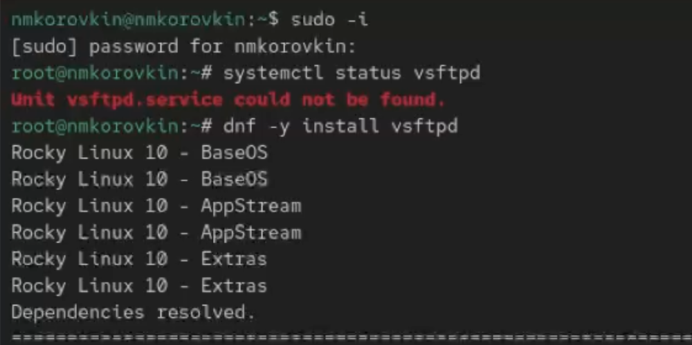

## проверка

Проверка через systemctl status vsftpd показала, что служба работает, но при перезапуске операционной системы она не запустится автоматически (статус: disabled).

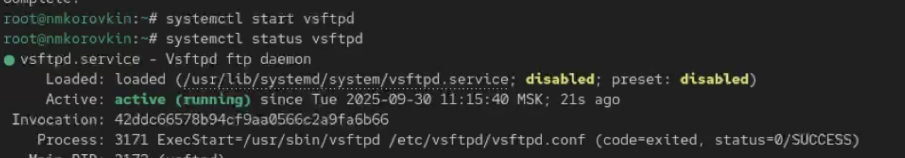

## изменение статуса

Чтобы добавить службу в автозапуск, я выполнил systemctl enable vsftpd. Для проверки статуса использовал systemctl status vsftpd, а затем удалил из автозагрузки командой systemctl disable vsftpd и снова проверил. Я заметил, что после отключения она перестала быть активной при старте системы.

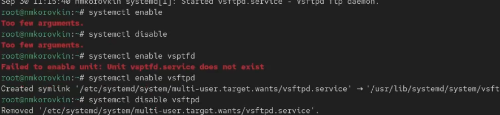

## просмотр символических ссылок

Дальше я посмотрел символические ссылки, которые отвечают за запуск сервисов:ls /etc/systemd/system/multi-user.target.wants.Там ссылки на vsftpd не оказалось.
Я снова добавил сервис в автозагрузку(systemctl enable vsftpd) и проверил каталог ещё раз. Теперь там появилась символическая ссылка на файл /usr/lib/systemd/system/vsftpd.service. Это значит, что при старте системы служба будет автоматически запускаться.(рис. [-@fig:004])

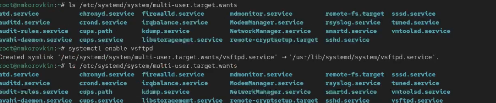

## проверка

Ещё раз проверил статус службы через systemctl status vsftpd. Теперь видно, что сервис стал enabled.

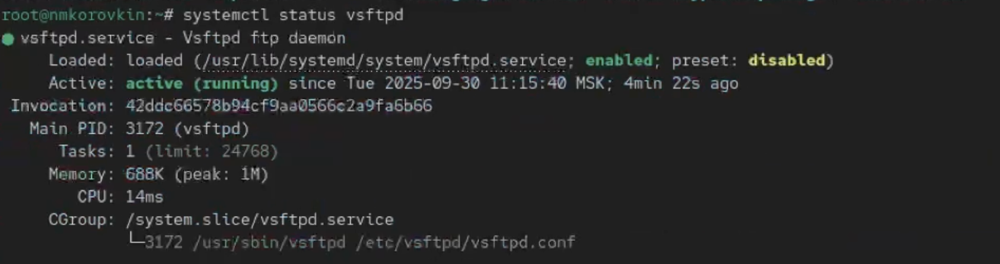

## вывод списка

После этого я вывел список зависимостей юнита командой systemctl list-dependencies vsftpd,

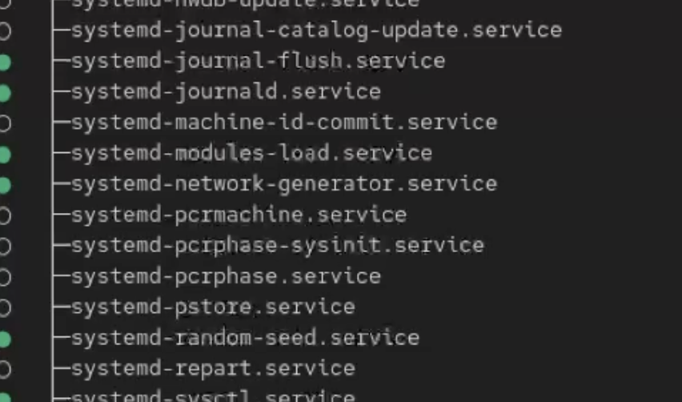

## вывод списка

а затем список тех сервисов, которые зависят от него:systemctl list-dependencies vsftpd --reverse.

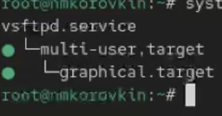

## установка службы

Теперь я перешёл к изучению конфликтов юнитов. В systemd есть службы, которые не могут работать одновременно (например, iptables и firewalld).
Сначала я установил iptables: dnf -y install iptables*. 

## установка службы

Проверил статус обеих служб:systemctl status firewalld и systemctl status iptables.

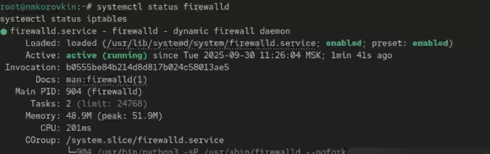

## запуск службы

Когда я попытался запустить их одновременно (systemctl start firewalld и systemctl start iptables), оказалось, что одна из них отключается при запуске другой. Это и есть проявление конфликта.

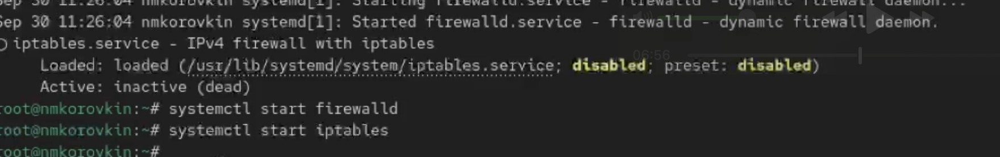

## файл конфигурации

Чтобы убедиться в причинах, я посмотрел файл конфигурации firewalld: cat /usr/lib/systemd/system/firewalld.service.В нём можно увидеть строку с настройками конфликтов (параметр Conflicts)

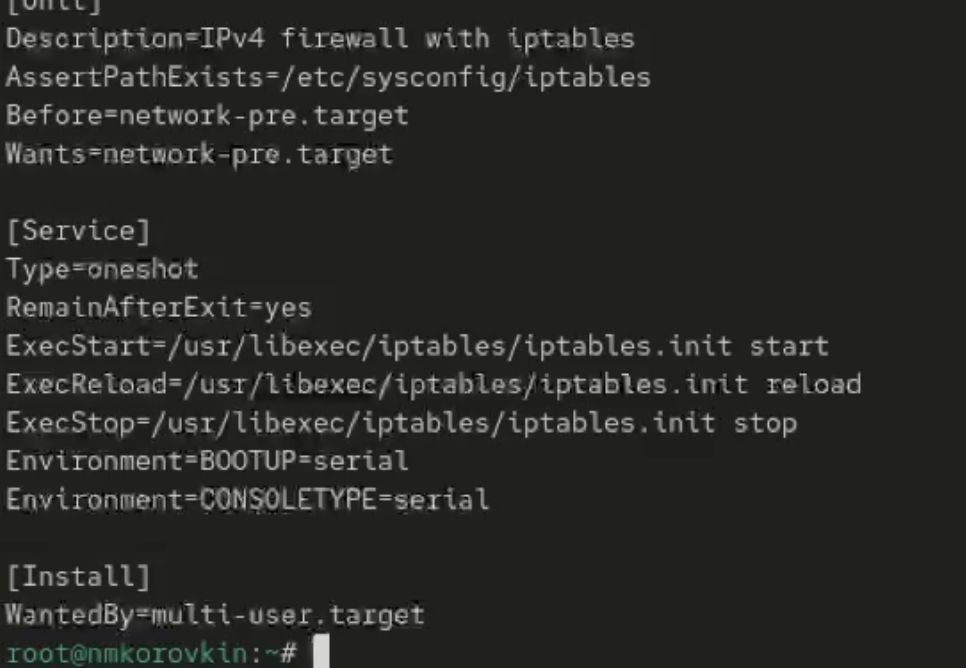

## файл конфигурации

Затем я посмотрел настройки iptables:cat /usr/lib/systemd/system/iptables.service.Там также прописано, с чем этот юнит конфликтует.
Чтобы не мешать firewalld, я остановил iptables: systemctl stop iptables, а затем запустил firewalld: systemctl start firewalld.
Чтобы исключить случайный запуск iptables, я замаскировал сервис:systemctl mask iptables.

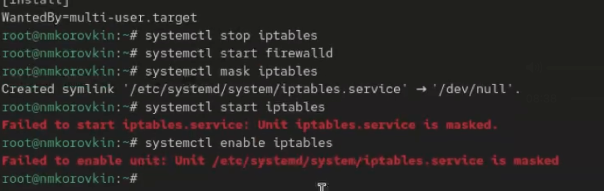

## изолируемые цели

Теперь в каталоге /etc/systemd/system/ появилась символическая ссылка iptables.service на /dev/null. Это значит, что сервис заблокирован.
Когда я попробовал снова запустить iptables (systemctl start iptables), система выдала ошибку: служба замаскирована. Аналогично, при попытке добавить её в автозагрузку (systemctl enable iptables), она осталась неактивной со статусом "masked".

Дальше я изучил изолируемые цели. Они в systemd примерно соответствуют уровням запуска старой системы SystemV init. Например:
* poweroff.target — выключение (runlevel 0),
* rescue.target — режим восстановления (runlevel 1),
* multi-user.target — многопользовательский режим без графики (runlevel 3),
* graphical.target — графический режим (runlevel 5),
* reboot.target — перезагрузка (runlevel 6).

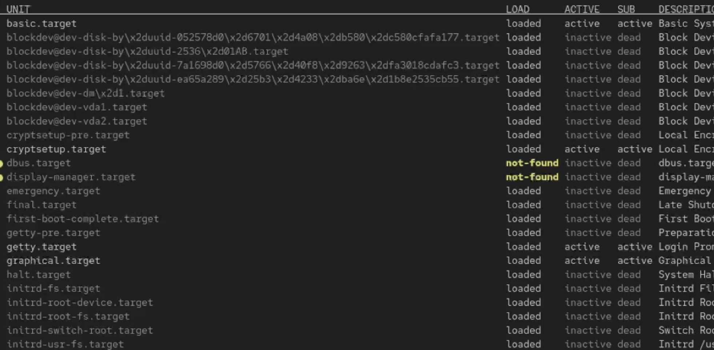

## изолируемые цели

Я перешёл в каталог /usr/lib/systemd/system и командой grep Isolate *.target нашёл список целей, которые можно изолировать. У них в конфигурации есть строка AllowIsolate=yes.

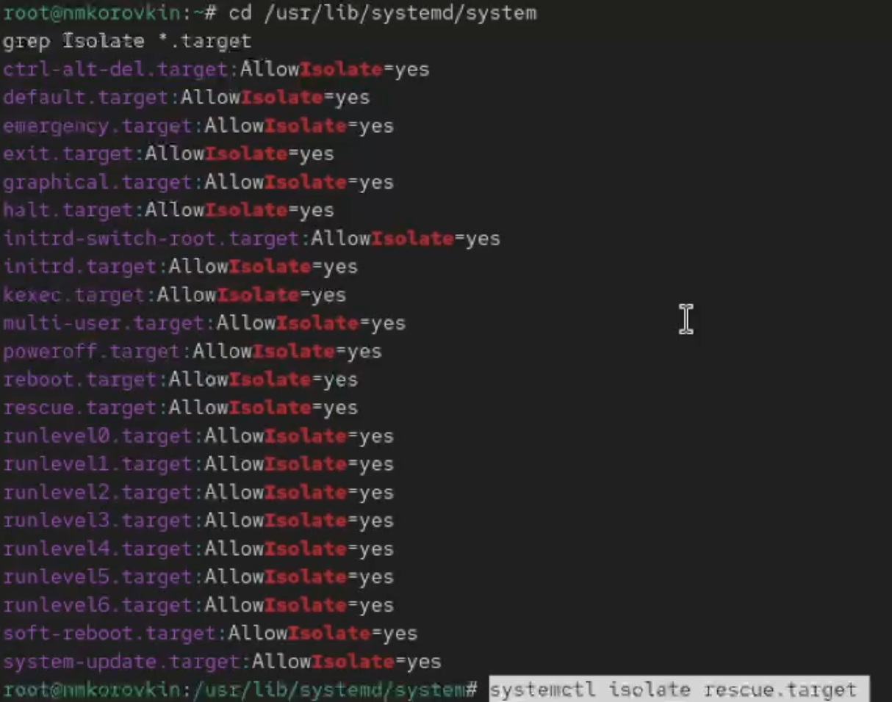

## установка службы

Затем я переключил систему в режим восстановления:systemctl isolate rescue.target. При этом пришлось ввести пароль root.
Дальше я проверил, как работает перезапуск через systemctl isolate reboot.target. Система корректно перезапустилась.

После этого я посмотрел, какая цель у меня стоит по умолчанию: systemctl get-default.
Чтобы изменить режим загрузки, я использовал команду systemctl set-default. Например, чтобы включить загрузку в текстовый режим, я выполнил: systemctl set-default multi-user.target

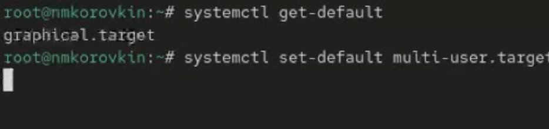

## отключение интерфейса

и перезагрузил систему командой reboot. После запуска я увидел, что система загрузилась без графической оболочки.
Потом я снова получил права администратора и вернул загрузку в графический режим: systemctl set-default graphical.target.

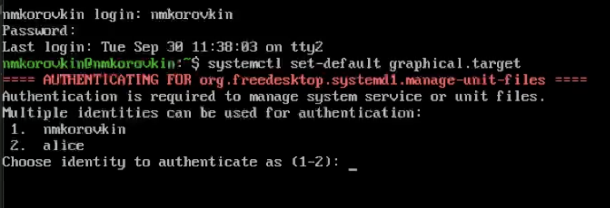

## отключение интерфейса

После перезагрузки система загрузилась уже с графикой.

## Ответ на контрольные вопросы

1. Что такое юнит (unit)? Примеры.
Юнит - это объект, которым управляет systemd (служба, цель, точка монтирования и т.д.).
Примеры:

сервис (sshd.service),

цель (multi-user.target),

точка монтирования (home.mount),

таймер (backup.timer).

2. Команда, чтобы убедиться, что цель больше не входит в автозапуск.
systemctl get-default — посмотреть текущую цель.
Если нужная цель не указана как default, значит она не в автозапуске.

3. Команда для отображения всех загруженных сервисных юнитов.
systemctl list-units --type=service

4. Использовать systemctl enable <unit>.
Эта команда создаёт символическую ссылку в каталог wants.

5. systemctl isolate rescue.target

6. Причина сообщения о том, что цель не может быть изолирована.
Потому что в её конфигурации нет строки AllowIsolate=yes. Такие цели нельзя запускать отдельно.

7. systemctl list-dependencies <unit> --reverse

## Выводы

в результате выполнения работы мы научились работать с репозиториями и менеджерами пакетов.

## Список литературы{.unnumbered}

::: {#refs}
:::
