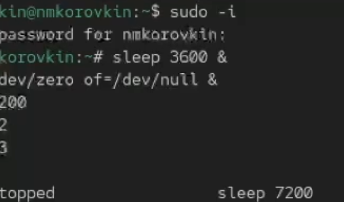
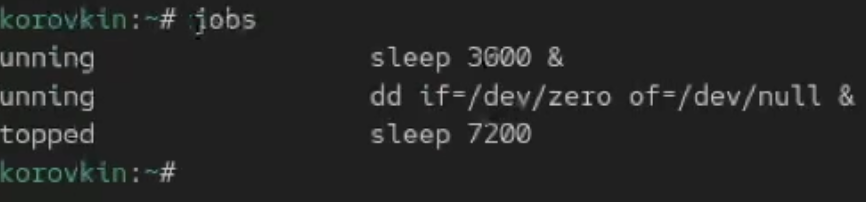
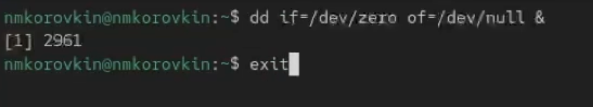
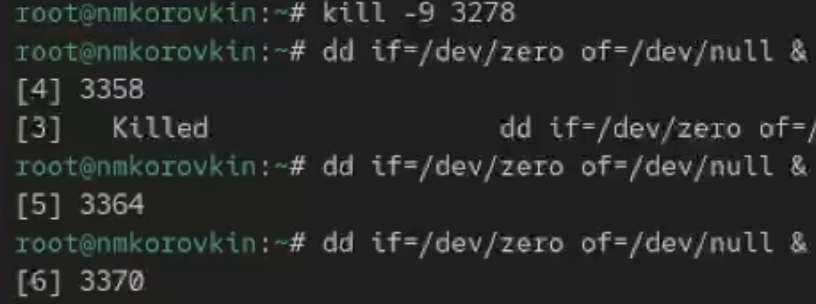
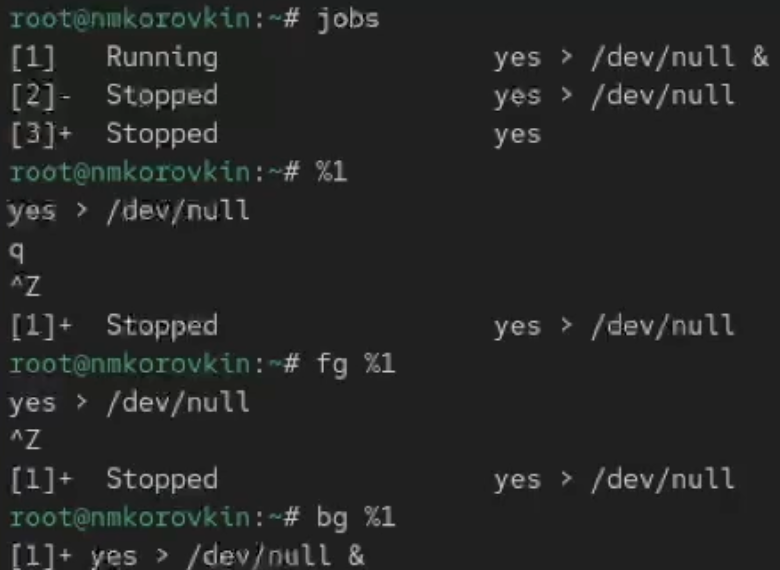

---
## Front matter
lang: ru-RU
title: Отчёт по выполнению лабораторной работы №6
subtitle: Работа с группами
author:
  - Коровкин Н. М.
institute:
  - Российский университет дружбы народов, Москва, Россия
date: 30 сентября 2025

## i18n babel
babel-lang: russian
babel-otherlangs: english

## Formatting pdf
toc: false
toc-title: Содержание
slide_level: 2
aspectratio: 169
section-titles: true
theme: metropolis
header-includes:
 - \metroset{progressbar=frametitle,sectionpage=progressbar,numbering=fraction}
 - '\makeatletter'
 - '\beamer@ignorenonframefalse'
 - '\makeatother'
 
## Fonts
mainfont: PT Serif
romanfont: PT Serif
sansfont: PT Sans
monofont: PT Mono
mainfontoptions: Ligatures=TeX
romanfontoptions: Ligatures=TeX
sansfontoptions: Ligatures=TeX,Scale=MatchLowercase
monofontoptions: Scale=MatchLowercase,Scale=0.9
---

# Информация

## Докладчик

:::::::::::::: {.columns align=center}
::: {.column width="70%"}

  * Коровкин Никита Михайлович
  * Студент
  * Российский университет дружбы народов
  * [1132246835@pfur.ru](mailto:1132246835@pfur.ru)

:::
::: {.column width="30%"}

:::
::::::::::::::

## Цель работы

Получить навыки управления процессами операционной системы.

## Задание

Выполнить два этапа лабораторной работы

## Выполнение лабораторной работы

1. Работа с заданиями (jobs)

Сначала я получил права администратора, выполнив команду:

su -
После этого я запустил несколько процессов.
Сначала я запустил команду:

sleep 3600 &
Эта команда "усыпляет" процесс на час, а символ & в конце означает, что процесс будет выполняться в фоновом режиме, не блокируя терминал.

Затем я выполнил:

dd if=/dev/zero of=/dev/null &
Эта команда копирует бесконечный поток нулей (/dev/zero) в «чёрную дыру» (/dev/null). Таким образом, процесс нагружает процессор, но не создаёт файлов. Она также запущена в фоновом режиме.

После этого я запустил ещё одну команду:

sleep 7200

## Выполнение лабораторной работы
Эта команда усыпляет процесс на два часа, но без символа &, поэтому терминал «зависает» до окончания работы команды. Чтобы вернуть управление, я нажал Ctrl + Z, тем самым приостановив выполнение процесса.

Чтобы увидеть список всех запущенных мной заданий, я ввёл:

jobs
В списке я увидел три задания: два в состоянии Running и одно в состоянии Stopped (приостановленное).

## Выполнение лабораторной работы

Чтобы возобновить приостановленное задание в фоновом режиме, я использовал: bg 3 Теперь все процессы выполнялись в фоновом режиме. Проверив снова с помощью jobs, я увидел, что их состояние изменилось на Running.

Затем я переместил первое задание на передний план командой: fg 1
После этого я прервал его выполнение с помощью Ctrl + C. Проверив список заданий, я убедился, что первое задание завершено.

Так же я последовательно завершил второе и третье задания.
Для этого переводил их на передний план и останавливал с помощью Ctrl + C.

## Выполнение лабораторной работы
2. Управление процессами в нескольких терминалах

Я открыл второй терминал и под своей учётной записью выполнил команду:dd if=/dev/zero of=/dev/null &. Эта команда снова запустила процесс в фоне.

После этого я закрыл второй терминал с помощью команды: exit.

## Выполнение лабораторной работы
В другом(первом) терминале я запустил утилиту:

top
Эта утилита показывает все запущенные в системе процессы в реальном времени. Я увидел, что процесс dd всё ещё работает, хотя терминал, из которого он был запущен, закрыт.
Это объясняется тем, что процесс был запущен как фоновый и не был связан с управляющим терминалом напрямую.

Для выхода из top я нажал клавишу q.

## Выполнение лабораторной работы
Затем я снова открыл top и с помощью клавиши k указал PID процесса dd, чтобы завершить его. После этого процесс исчез из списка.

## Управление приоритетами процессов
3. Управление приоритетами процессов

Я снова получил права администратора и запустил три одинаковых процесса: dd if=/dev/zero of=/dev/null &. Чтобы увидеть их PID (идентификаторы процессов), я выполнил: ps aux | grep dd
Команда ps aux показывает все запущенные процессы, а grep dd отбирает только те, где встречается «dd».

## Управление приоритетами процессов

Я выбрал один из PID и изменил его приоритет командой:

renice -n 5 <PID>
Команда renice изменяет приоритет процесса. Чем больше число, тем ниже приоритет (т.е. процесс получает меньше процессорного времени).

## Управление приоритетами процессов

Затем я ввёл:

ps fax | grep -B5 dd
Опция -B5 показывает 5 строк до найденного совпадения. Это позволяет увидеть дерево процессов и родительский процесс, из которого были запущены мои dd. Я нашёл PID корневой оболочки (родительского процесса) и завершил её:
kill -9 <PID>
После этого оболочка закрылась, а вместе с ней прекратили работу все процессы dd.
Это наглядно показывает, что если завершить родительский процесс, то все его дочерние процессы также остановятся.

## Самостоятельная работа

4. Самостоятельная работа

Задание 1

Я трижды запустил процесс dd в фоне: dd if=/dev/zero of=/dev/null &. После этого я изменил приоритет одного из них, повысив его с помощью:renice -n -5 <PID>.
Отрицательное значение приоритета означает, что процесс получает больший приоритет и выполняется быстрее.

## Самостоятельная работа

Затем я ещё раз изменил приоритет того же процесса на -15.
Разница заключается в том, что чем меньше (отрицательнее) значение nice, тем выше приоритет процесса. То есть процесс с приоритетом -15 будет выполняться с большей скоростью, чем с -5.

После проверки я завершил все запущенные процессы dd.

## Самостоятельная работа

Задание 2

Я запустил программу yes в фоновом режиме с подавлением вывода:

yes > /dev/null &
Затем я запустил yes на переднем плане также с подавлением вывода и приостановил её с помощью Ctrl + Z. После этого я возобновил её командой bg и затем завершил с помощью kill.

## Самостоятельная работа

После этого я запустил yes без подавления вывода и снова приостановил выполнение, затем возобновил и остановил.
Чтобы убедиться в текущих состояниях процессов, я использовал:jobs

{

## Самостоятельная работа

Затем я перевёл один из фоновых процессов на передний план (fg) и завершил его.
Другой процесс я снова запустил в фоне.
Проверив jobs, я увидел, что процесс действительно находится в состоянии Running.

## Самостоятельная работа

Чтобы запустить процесс, который будет продолжать работу даже после выхода из терминала, я использовал: nohup yes > /dev/null &
После закрытия терминала и открытия нового я убедился, что процесс продолжает выполняться.
Это возможно благодаря nohup, который игнорирует сигнал завершения сессии (SIGHUP).

Я просмотрел все процессы с помощью top, затем запустил ещё несколько yes в фоне и завершил два из них: один — по PID, другой — по номеру задания.

## Самостоятельная работа

Также я послал сигнал SIGHUP обычному процессу и процессу, запущенному с nohup. Первый завершился, а второй — продолжил работу, что подтверждает защиту от сигнала.

## Самостоятельная работа

После этого я запустил несколько процессов yes и завершил их все одновременно с помощью:

killall yes

## Самостоятельная работа

Затем я снова запустил один процесс yes и ещё один с использованием nice, чтобы задать ему более высокий приоритет: renice -n -5 yes > /dev/null &
После сравнения я заметил, что процесс с меньшим значением nice имеет более высокий приоритет.
Наконец, я выровнял приоритеты двух процессов, используя:renice -n 0 Теперь оба процесса имели одинаковые приоритеты.

## Ответ на контрольные вопросы
1. Команда:
jobs

2. Комбинация:
 Ctrl + Z, затем команда

bg

3. Комбинация:

Ctrl + C

4. Использовать другую оболочку и выполнить:

kill <PID>

5. Команда:
ps fax

6. Команда:

renice -n -5 1234

7. Команда:
killall dd

8. Команда:

killall mycommand

9. В `top` — клавиша **k**

10. Команда:

nice -n 10 <>

## Выводы

в результате выполнения работы мы научились работать процессами и управлять ими

## Список литературы{.unnumbered}

::: {#refs}
:::
