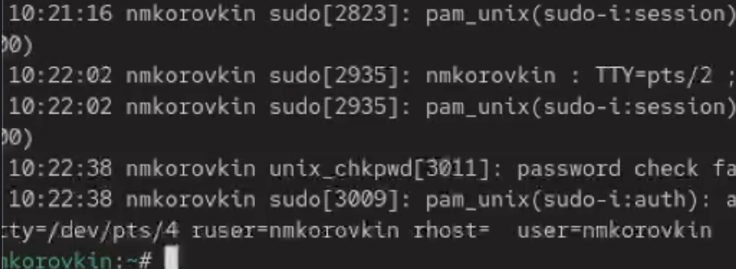
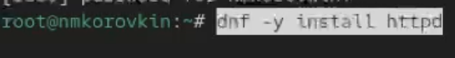
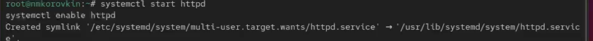
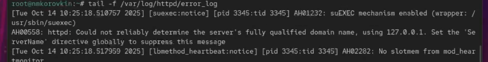
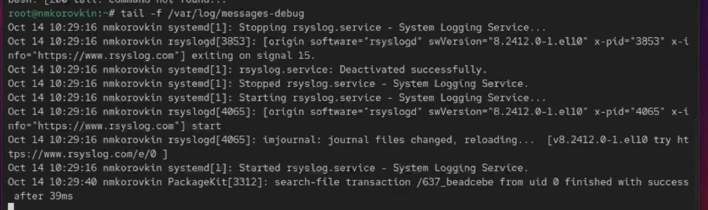
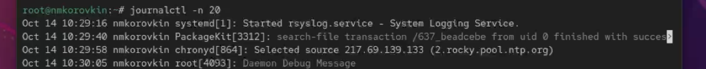

---
## Front matter
lang: ru-RU
title: Отчёт по выполнению лабораторной работы №7
subtitle: Работа с журналами
author:
  - Коровкин Н. М.
institute:
  - Российский университет дружбы народов, Москва, Россия
date: 17 октября 2025

## i18n babel
babel-lang: russian
babel-otherlangs: english

## Formatting pdf
toc: false
toc-title: Содержание
slide_level: 2
aspectratio: 169
section-titles: true
theme: metropolis
header-includes:
 - \metroset{progressbar=frametitle,sectionpage=progressbar,numbering=fraction}
 - '\makeatletter'
 - '\beamer@ignorenonframefalse'
 - '\makeatother'
 
## Fonts
mainfont: PT Serif
romanfont: PT Serif
sansfont: PT Sans
monofont: PT Mono
mainfontoptions: Ligatures=TeX
romanfontoptions: Ligatures=TeX
sansfontoptions: Ligatures=TeX,Scale=MatchLowercase
monofontoptions: Scale=MatchLowercase,Scale=0.9
---

# Информация

## Докладчик

:::::::::::::: {.columns align=center}
::: {.column width="70%"}

  * Коровкин Никита Михайлович
  * Студент
  * Российский университет дружбы народов
  * [1132246835@pfur.ru](mailto:1132246835@pfur.ru)

:::
::: {.column width="30%"}

:::
::::::::::::::

## Цель работы

Получить навыки работы с журналами мониторинга различных событий в системе.

## Задание

1. Продемонстрируйте навыки работы с журналом мониторинга событий в реальном
времени (см. раздел 7.4.1).
2. Продемонстрируйте навыки создания и настройки отдельного файла конфигурации
мониторинга отслеживания событий веб-службы (см. раздел 7.4.2).
3. Продемонстрируйте навыки работы с journalctl (см. раздел 7.4.3).
4. Продемонстрируйте навыки работы с journald (см. раздел 7.4.4).

## Выполнение лабораторной работы

Сперва я запустил три вкладки терминала и в каждой получил полномочия администратора, введя команду su -. Во второй вкладке я запустил мониторинг системных событий в реальном времени с помощью команды tail -f /var/log/messages.

## Выполнение лабораторной работы

В третьей вкладке я вернулся к своей пользовательской учётной записи, нажав Ctrl + D, и попытался снова получить полномочия администратора, но специально ввёл неправильный пароль.

## Выполнение лабораторной работы

 После этого я остановил мониторинг во второй вкладке, нажав Ctrl + C, и вывел последние двадцать строк журнала безопасности с помощью команды tail -n 20 /var/log/secure. Там я увидел записи о неудачных попытках авторизации.

 
## Выполнение лабораторной работы

Далее я установил веб-сервер Apache, выполнив команду dnf -y install httpd. 

## Выполнение лабораторной работы

После завершения установки я запустил веб-службу и включил её автозапуск при старте системы командами - systemctl start httpd и systemctl enable httpd 

## Выполнение лабораторной работы

Во второй вкладке я открыл просмотр журнала ошибок веб-службы в реальном времени через tail -f /var/log/httpd/error_log. После проверки остановил просмотр сочетанием клавиш Ctrl + C.

## Выполнение лабораторной работы

Затем я получил права администратора, открыл файл /etc/httpd/conf/httpd.conf и в конце добавил строку ErrorLog syslog:local1, чтобы перенаправить сообщения веб-сервера через syslog.

## Выполнение лабораторной работы

После этого я перешёл в каталог /etc/rsyslog.d, создал новый файл конфигурации httpd.conf и вписал туда строку local1.* -/var/log/httpd-error.log. Теперь все сообщения, отправленные через объект local1, записываются в отдельный лог-файл /var/log/httpd-error.log.

## Выполнение лабораторной работы

Затем я перезапустил службы rsyslog и httpd командами
systemctl restart rsyslog.service 
systemctl restart httpd

## Выполнение лабораторной работы

После этого все ошибки веб-службы начали записываться в указанный файл, что я проверил с помощью команды tail.
Чтобы настроить запись отладочной информации, я создал в каталоге /etc/rsyslog.d новый файл debug.conf и добавил в него строку *.debug /var/log/messages-debug. 

## Выполнение лабораторной работы

После этого снова перезапустил службу rsyslog (systemctl restart rsyslog.service). 

## Выполнение лабораторной работы

Во второй вкладке я запустил мониторинг отладочных сообщений через tail -f /var/log/messages-debug,

## Выполнение лабораторной работы

В третьей создал тестовое сообщение командой logger -p daemon.debug "Daemon Debug Message".

## Выполнение лабораторной работы

В окне с мониторингом я увидел отправленное сообщение, после чего остановил наблюдение с помощью Ctrl + C.
Затем я просмотрел системный журнал с момента последнего запуска системы с помощью команды journalctl. Для пролистывания использовал клавиши Enter и пробел, а для выхода — q. 

## Выполнение лабораторной работы

После этого вывел журнал без пейджера командой journalctl --no-pager.

## Выполнение лабораторной работы

Для просмотра событий в реальном времени запустил journalctl -f и прервал просмотр Ctrl + C.

## Выполнение лабораторной работы

Чтобы посмотреть доступные параметры фильтрации, я ввёл journalctl и дважды нажал Tab. 

## Выполнение лабораторной работы

После этого просмотрел события для пользователя с UID 0 командой journalctl _UID=0. 

## Выполнение лабораторной работы

Затем вывел последние двадцать строк журнала (journalctl -n 20)

## Выполнение лабораторной работы

И сообщения об ошибках (journalctl -p err).

## Выполнение лабораторной работы

Я также проверил фильтрацию по времени: вывел все сообщения со вчерашнего дня командой journalctl --since yesterday

## Выполнение лабораторной работы

и только ошибки за тот же период — journalctl --since yesterday -p err.

## Выполнение лабораторной работы

Для получения детальной информации использовал формат вывода journalctl -o verbose. В завершение просмотрел сообщения, относящиеся к модулю SSHD, с помощью journalctl _SYSTEMD_UNIT=sshd.service.

## Выполнение лабораторной работы

Чтобы сделать журнал journald постоянным, я открыл терминал, получил права администратора и создал каталог для хранения записей: mkdir -p /var/log/journal. Затем изменил права доступа, чтобы служба journald могла записывать в него данные:
chown root:systemd-journal /var/log/journal 
chmod 2755 /var/log/journal
Чтобы изменения вступили в силу, я выполнил команду killall -USR1 systemd-journald. После этого журнал journald стал постоянным, и я смог просмотреть сообщения, записанные с момента последней перезагрузки, командой journalctl -b.

## Ответ на контрольные вопросы

1. Для настройки rsyslogd используется файл /etc/rsyslog.conf

2. Сообщения, связанные с аутентификацией, находятся в файле /var/log/secure

3. Если ничего не настраивать, ротация файлов журналов выполняется
ежедневно

4. В конфигурацию нужно добавить строку:
*.info /var/log/messages.info

5. Для просмотра сообщений журнала в реальном времени используется команда:
tail -f /var/log/messages

6. Чтобы увидеть все сообщения для PID 1 между 9:00 и 15:00, выполняю:
journalctl _PID=1 --since 09:00 --until 15:00

7. Сообщения journald после последней перезагрузки системы показываются командой: journalctl -b

8. Чтобы сделать журнал journald постоянным, я создаю каталог **/var/log/journal**, задаю ему права с помощью команд
   chown root:systemd-journal /var/log/journal 
   chmod 2755 /var/log/journal
   
   затем перезапускаю journald командой killall -USR1 systemd-journald.

## Выводы

в результате выполнения работы мы научились работать с журналами и управлять ими

## Список литературы{.unnumbered}

::: {#refs}
:::
