---
## Front matter
title: "Лабораторная работа №7"
subtitle: "Отчёт"
author: "Коровкин Никита Михайлович"

## Generic otions
lang: ru-RU
toc-title: "Содержание"

## Bibliography
bibliography: bib/cite.bib
csl: pandoc/csl/gost-r-7-0-5-2008-numeric.csl

## Pdf output format
toc: true # Table of contents
toc-depth: 2
lof: true # List of figures
lot: true # List of tables
fontsize: 12pt
linestretch: 1.5
papersize: a4
documentclass: scrreprt
## I18n polyglossia
polyglossia-lang:
  name: russian
  options:
	- spelling=modern
	- babelshorthands=true
polyglossia-otherlangs:
  name: english
## I18n babel
babel-lang: russian
babel-otherlangs: english
## Fonts
mainfont: PT Serif
romanfont: PT Serif
sansfont: PT Sans
monofont: PT Mono
mainfontoptions: Ligatures=TeX
romanfontoptions: Ligatures=TeX
sansfontoptions: Ligatures=TeX,Scale=MatchLowercase
monofontoptions: Scale=MatchLowercase,Scale=0.9
## Biblatex
biblatex: true
biblio-style: "gost-numeric"
biblatexoptions:
  - parentracker=true
  - backend=biber
  - hyperref=auto
  - language=auto
  - autolang=other*
  - citestyle=gost-numeric
## Pandoc-crossref LaTeX customization
figureTitle: "Рис."
tableTitle: "Таблица"
listingTitle: "Листинг"
lofTitle: "Список иллюстраций"
lotTitle: "Список таблиц"
lolTitle: "Листинги"
## Misc options
indent: true
header-includes:
  - \usepackage{indentfirst}
  - \usepackage{float} # keep figures where there are in the text
  - \floatplacement{figure}{H} # keep figures where there are in the text
---

# Цель работы

Получить навыки работы с журналами мониторинга различных событий в системе.

# Задание

1. Продемонстрируйте навыки работы с журналом мониторинга событий в реальном
времени (см. раздел 7.4.1).
2. Продемонстрируйте навыки создания и настройки отдельного файла конфигурации
мониторинга отслеживания событий веб-службы (см. раздел 7.4.2).
3. Продемонстрируйте навыки работы с journalctl (см. раздел 7.4.3).
4. Продемонстрируйте навыки работы с journald (см. раздел 7.4.4).

# Выполнение лабораторной работы

Сперва я запустил три вкладки терминала и в каждой получил полномочия администратора, введя команду su -. Во второй вкладке я запустил мониторинг системных событий в реальном времени с помощью команды tail -f /var/log/messages.(рис. [-@fig:001])

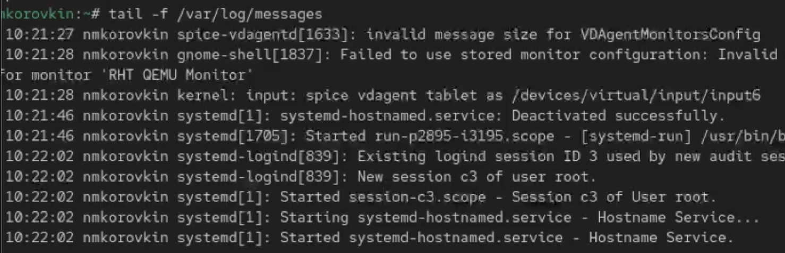{#fig:1 width=70%}

В третьей вкладке я вернулся к своей пользовательской учётной записи, нажав Ctrl + D, и попытался снова получить полномочия администратора, но специально ввёл неправильный пароль. (рис. [-@fig:002])

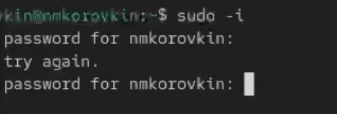{#fig:2 width=70%}

 После этого я остановил мониторинг во второй вкладке, нажав Ctrl + C, и вывел последние двадцать строк журнала безопасности с помощью команды tail -n 20 /var/log/secure. Там я увидел записи о неудачных попытках авторизации.(рис. [-@fig:003])

{#fig:3 width=70%}
 
 
Далее я установил веб-сервер Apache, выполнив команду dnf -y install httpd. (рис. [-@fig:004])

{#fig:4 width=70%}

После завершения установки я запустил веб-службу и включил её автозапуск при старте системы командами - systemctl start httpd и systemctl enable httpd (рис. [-@fig:005])

{#fig:5 width=70%}

Во второй вкладке я открыл просмотр журнала ошибок веб-службы в реальном времени через tail -f /var/log/httpd/error_log. После проверки остановил просмотр сочетанием клавиш Ctrl + C.(рис. [-@fig:006])

{#fig:6 width=70%}

Затем я получил права администратора, открыл файл /etc/httpd/conf/httpd.conf и в конце добавил строку ErrorLog syslog:local1, чтобы перенаправить сообщения веб-сервера через syslog.(рис. [-@fig:007])

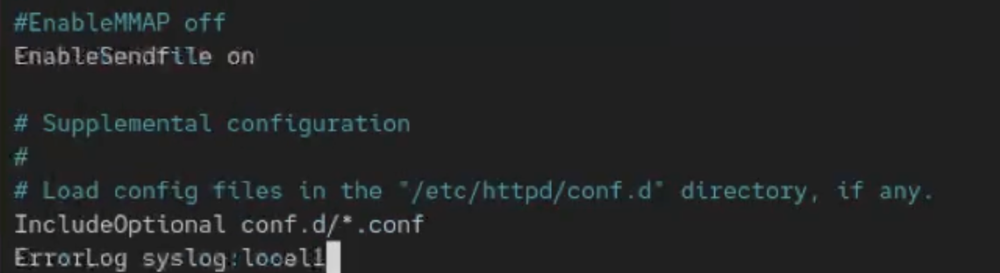{#fig:7 width=70%}

После этого я перешёл в каталог /etc/rsyslog.d, создал новый файл конфигурации httpd.conf и вписал туда строку local1.* -/var/log/httpd-error.log. Теперь все сообщения, отправленные через объект local1, записываются в отдельный лог-файл /var/log/httpd-error.log.(рис. [-@fig:008])

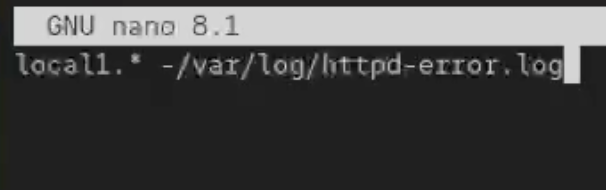{#fig:8 width=70%}

Затем я перезапустил службы rsyslog и httpd командами
systemctl restart rsyslog.service 
systemctl restart httpd(рис. [-@fig:009])

{#fig:9 width=70%}

После этого все ошибки веб-службы начали записываться в указанный файл, что я проверил с помощью команды tail.
Чтобы настроить запись отладочной информации, я создал в каталоге /etc/rsyslog.d новый файл debug.conf и добавил в него строку *.debug /var/log/messages-debug. (рис. [-@fig:010])

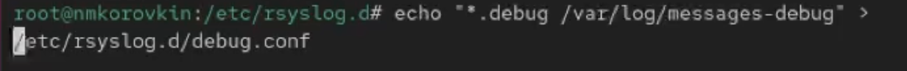{#fig:10 width=70%}

После этого снова перезапустил службу rsyslog (systemctl restart rsyslog.service). (рис. [-@fig:011])

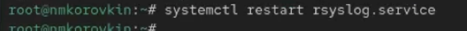{#fig:11 width=70%}

Во второй вкладке я запустил мониторинг отладочных сообщений через tail -f /var/log/messages-debug,(рис. [-@fig:012])

{#fig:12 width=70%}

В третьей создал тестовое сообщение командой logger -p daemon.debug "Daemon Debug Message".(рис. [-@fig:013])

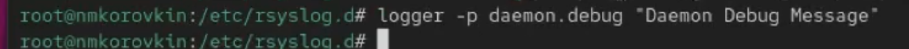{#fig:13 width=70%}

В окне с мониторингом я увидел отправленное сообщение, после чего остановил наблюдение с помощью Ctrl + C.
Затем я просмотрел системный журнал с момента последнего запуска системы с помощью команды journalctl. Для пролистывания использовал клавиши Enter и пробел, а для выхода — q. (рис. [-@fig:014])

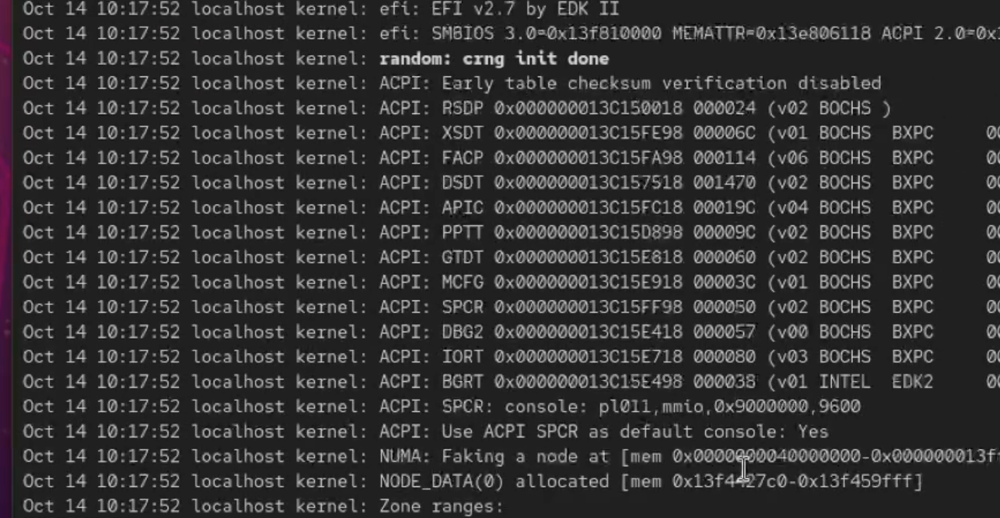{#fig:14 width=70%}

После этого вывел журнал без пейджера командой journalctl --no-pager.(рис. [-@fig:015])

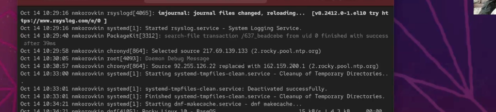{#fig:15 width=70%}

Для просмотра событий в реальном времени запустил journalctl -f и прервал просмотр Ctrl + C.(рис. [-@fig:016])

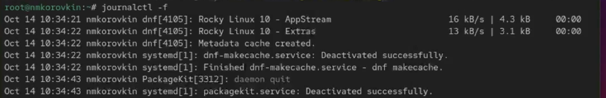{#fig:16 width=70%}

Чтобы посмотреть доступные параметры фильтрации, я ввёл journalctl и дважды нажал Tab. (рис. [-@fig:017])

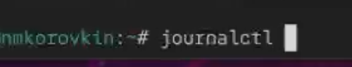{#fig:17 width=70%}

После этого просмотрел события для пользователя с UID 0 командой journalctl _UID=0. (рис. [-@fig:018])

{#fig:18 width=70%}

Затем вывел последние двадцать строк журнала (journalctl -n 20)(рис. [-@fig:019])

{#fig:19 width=70%}

И сообщения об ошибках (journalctl -p err).(рис. [-@fig:020])

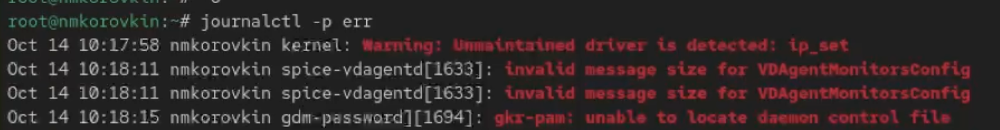{#fig:20 width=70%}

Я также проверил фильтрацию по времени: вывел все сообщения со вчерашнего дня командой journalctl --since yesterday(рис. [-@fig:021])

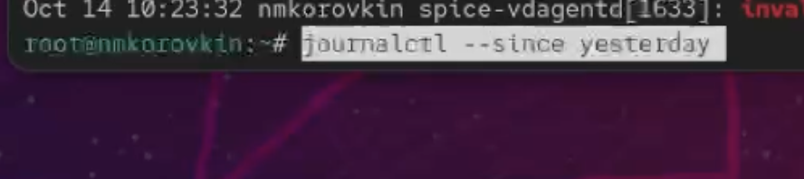{#fig:21 width=70%}

и только ошибки за тот же период — journalctl --since yesterday -p err.(рис. [-@fig:022])

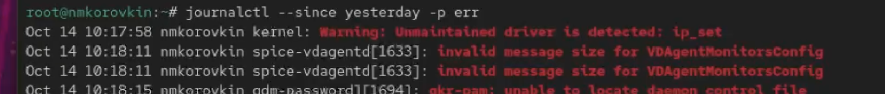{#fig:22 width=70%}

Для получения детальной информации использовал формат вывода journalctl -o verbose. В завершение просмотрел сообщения, относящиеся к модулю SSHD, с помощью journalctl _SYSTEMD_UNIT=sshd.service.(рис. [-@fig:023])

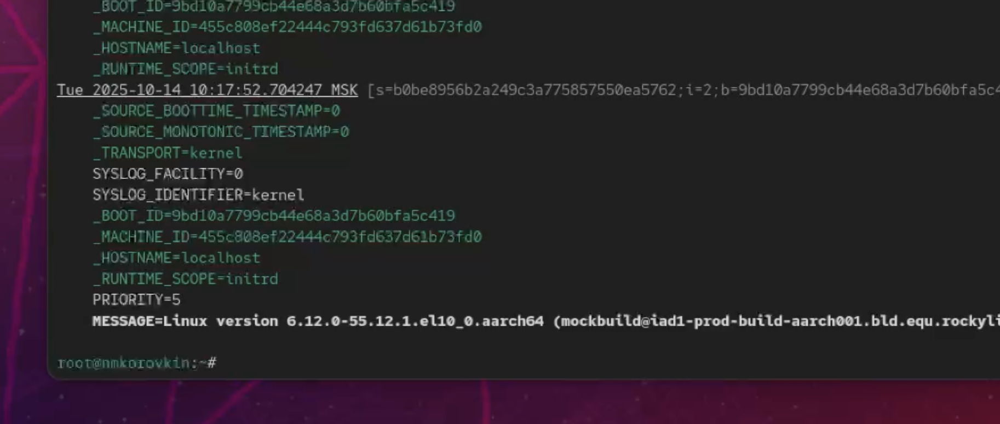{#fig:23 width=70%}

Чтобы сделать журнал journald постоянным, я открыл терминал, получил права администратора и создал каталог для хранения записей: mkdir -p /var/log/journal. Затем изменил права доступа, чтобы служба journald могла записывать в него данные:
chown root:systemd-journal /var/log/journal 
chmod 2755 /var/log/journal
Чтобы изменения вступили в силу, я выполнил команду killall -USR1 systemd-journald. После этого журнал journald стал постоянным, и я смог просмотреть сообщения, записанные с момента последней перезагрузки, командой journalctl -b.(рис. [-@fig:024])

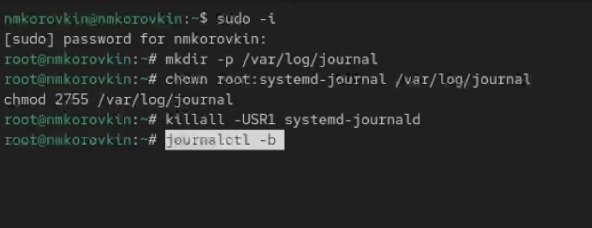{#fig:24 width=70%}

# Ответ на контрольные вопросы

1. Для настройки rsyslogd используется файл /etc/rsyslog.conf

2. Сообщения, связанные с аутентификацией, находятся в файле /var/log/secure

3. Если ничего не настраивать, ротация файлов журналов выполняется
ежедневно

4. В конфигурацию нужно добавить строку:
*.info /var/log/messages.info

5. Для просмотра сообщений журнала в реальном времени используется команда:
tail -f /var/log/messages

6. Чтобы увидеть все сообщения для PID 1 между 9:00 и 15:00, выполняю:
journalctl _PID=1 --since 09:00 --until 15:00

7. Сообщения journald после последней перезагрузки системы показываются командой: journalctl -b

8. Чтобы сделать журнал journald постоянным, я создаю каталог **/var/log/journal**, задаю ему права с помощью команд
   chown root:systemd-journal /var/log/journal 
   chmod 2755 /var/log/journal
   
   затем перезапускаю journald командой killall -USR1 systemd-journald.

# Выводы

в результате выполнения работы мы научились работать с журналами и управлять ими

# Список литературы{.unnumbered}

::: {#refs}
:::
