---
## Front matter
title: "Лабораторная работа №8"
subtitle: "Отчёт"
author: "Коровкин Никита Михайлович"

## Generic otions
lang: ru-RU
toc-title: "Содержание"

## Bibliography
bibliography: bib/cite.bib
csl: pandoc/csl/gost-r-7-0-5-2008-numeric.csl

## Pdf output format
toc: true # Table of contents
toc-depth: 2
lof: true # List of figures
lot: true # List of tables
fontsize: 12pt
linestretch: 1.5
papersize: a4
documentclass: scrreprt
## I18n polyglossia
polyglossia-lang:
  name: russian
  options:
	- spelling=modern
	- babelshorthands=true
polyglossia-otherlangs:
  name: english
## I18n babel
babel-lang: russian
babel-otherlangs: english
## Fonts
mainfont: PT Serif
romanfont: PT Serif
sansfont: PT Sans
monofont: PT Mono
mainfontoptions: Ligatures=TeX
romanfontoptions: Ligatures=TeX
sansfontoptions: Ligatures=TeX,Scale=MatchLowercase
monofontoptions: Scale=MatchLowercase,Scale=0.9
## Biblatex
biblatex: true
biblio-style: "gost-numeric"
biblatexoptions:
  - parentracker=true
  - backend=biber
  - hyperref=auto
  - language=auto
  - autolang=other*
  - citestyle=gost-numeric
## Pandoc-crossref LaTeX customization
figureTitle: "Рис."
tableTitle: "Таблица"
listingTitle: "Листинг"
lofTitle: "Список иллюстраций"
lotTitle: "Список таблиц"
lolTitle: "Листинги"
## Misc options
indent: true
header-includes:
  - \usepackage{indentfirst}
  - \usepackage{float} # keep figures where there are in the text
  - \floatplacement{figure}{H} # keep figures where there are in the text
---

# Цель работы

Получение навыков работы с планировщиками событий cron и at.

# Задание

1. Выполните задания по планированию задач с помощью crond (см. раздел 8.4.1).
2. Выполните задания по планированию задач с помощью atd (см. раздел 8.4.2).

# Выполнение лабораторной работы

Для выполнения работы я открыл терминал и получил полномочия администратора командой: su -
Проверка статуса демона crond
Я проверил, работает ли служба планировщика cron:

systemctl status crond -l
Система показала, что служба активна и запущена (Active: active (running)).
Просмотр конфигурации cron

Далее я просмотрел содержимое основного конфигурационного файла: cat /etc/crontab
В нём указаны переменные окружения и системные задания, выполняемые из каталогов /etc/cron.hourly, /etc/cron.daily и т.д.
Я посмотрел текущее расписание пользователя:
crontab -l(рис. [-@fig:001])

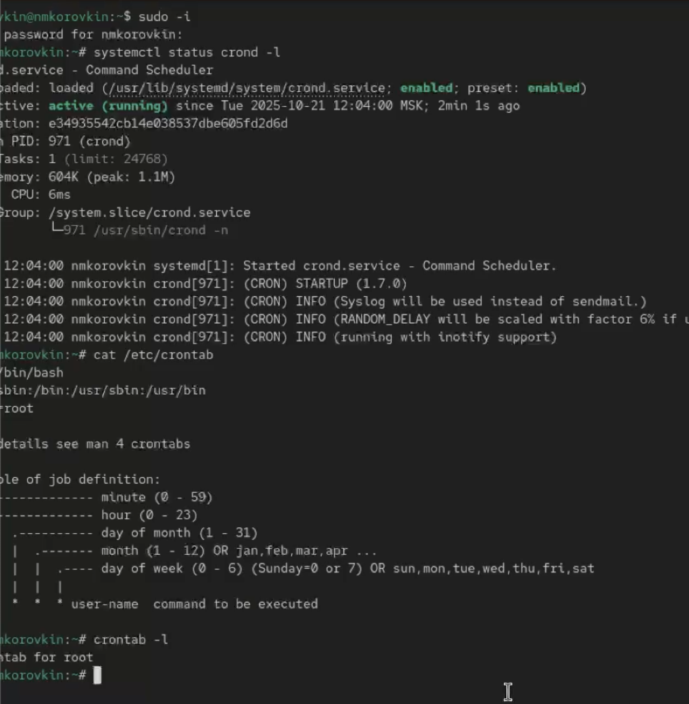{#fig:1 width=70%}

crontab -e
В редакторе vi я добавил следующую строку:
После этого я сохранил изменения (Esc :wq).(рис. [-@fig:002])

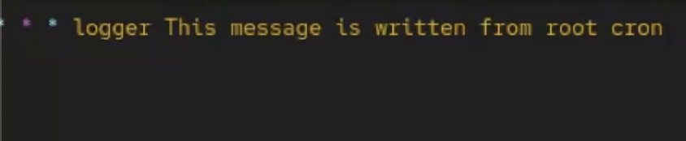{#fig:2 width=70%}

Пояснение синтаксиса:

*/1 * * * * logger This message is written from root cron
*/1 — выполнение задания каждую минуту,
остальные * означают "каждый час", "каждый день месяца", "каждый месяц" и "каждый день недели",
команда logger записывает указанное сообщение в системный журнал /var/log/messages.

После этого я снова вывел список заданий: crontab -l
Там появилась добавленная строка с заданием.
Через несколько минут я проверил системный журнал: grep written /var/log/messages(рис. [-@fig:003])

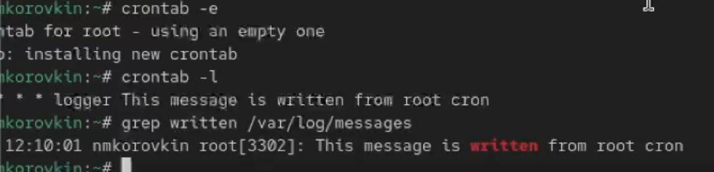{#fig:3 width=70%}

В результате cron успешно выполнял команду каждую минуту.

0 */1 * * 1-5 logger This message is written from root cron
Пояснение синтаксиса:
0 */1 * * 1-5 — выполнение в начале каждого часа (0 минут),
*/1 — каждый час,
1-5 — только в будние дни (понедельник–пятница),
команда остаётся прежней.
(рис. [-@fig:004])

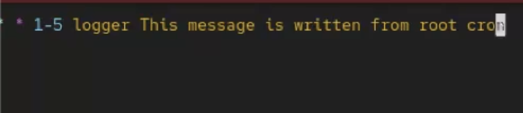{#fig:4 width=70%}

Я сохранил изменения и убедился через crontab -l, что запись обновлена(рис. [-@fig:005])

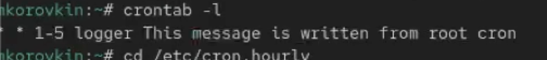{#fig:5 width=70%}

Создание собственного сценария
Я перешёл в каталог /etc/cron.hourly и создал файл сценария:cd /etc/cron.hourly touch eachhour(рис. [-@fig:006])

{#fig:6 width=70%}

Открыл его для редактирования и добавил:
#!/bin/sh
logger This message is written at $(date)(рис. [-@fig:007])

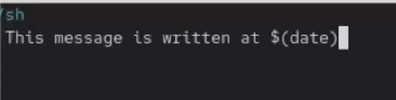{#fig:7 width=70%}

Затем я сделал файл исполняемым chmod +x eachhour
Затем я перешёл в каталог /etc/cron.d и создал файл расписания с тем же именем.(рис. [-@fig:008])

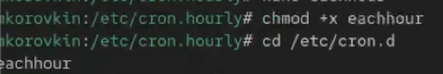{#fig:8 width=70%}

В файл записал следующее:

11 * * * * root logger This message is written from /etc/cron.d

Пояснение синтаксиса:
11 * * * * — выполнение в 11-й минуте каждого часа,
root — пользователь, от имени которого выполняется команда,
logger — записывает сообщение в системный журнал.
(рис. [-@fig:009])

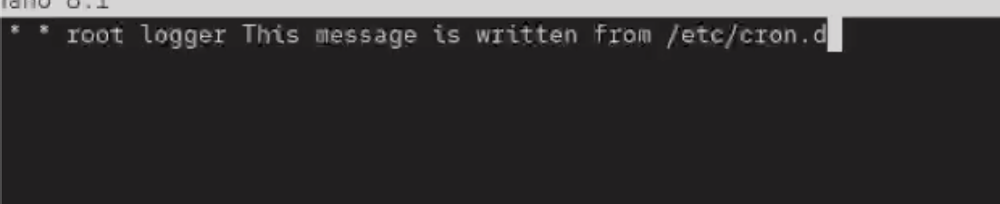{#fig:9 width=70%}

Через некоторое время я проверил журнал

grep written /var/log/messages (рис. [-@fig:0010])

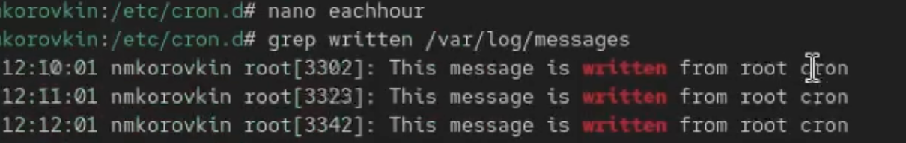{#fig:10 width=70%}

сценарий сработал по расписанию.

Затем я снова получил права администратора после чего, проверил, работает ли служба: systemctl status atd
Результат показал, что служба активна и запущена.
Теперь я запланирую выполнение команды на определенное время(рис. [-@fig:011])

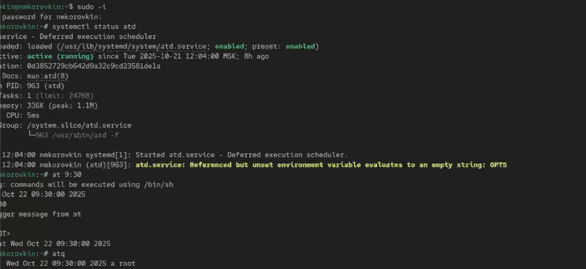{#fig:11 width=70%}

Сначала я запланировал выполнение команды logger message from at в 9.06
при помощи at 
После появления приглашения я ввёл
logger message from at
и завершил ввод комбинацией Ctrl + D.(рис. [-@fig:012])

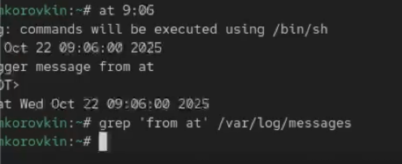{#fig:12 width=70%}

Однако в первый раз ничего не сработало. Тогда я поменял значение на другое время - и вновь запустил команду. Подождав минут 20 я ввел grep 'from at' /var/log/messages
В логе успешно отобразилась запись.(рис. [-@fig:013])

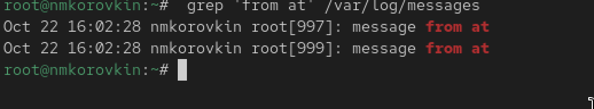{#fig:13 width=70%}

# Ответ на контрольные вопросы

1. Чтобы задание выполнялось раз в 2 недели, можно использовать запись с шагом по дням:

0 0 */14 * * <команда>

(каждые 14 дней в полночь).

2. Чтобы выполнялось 1-го и 15-го числа каждого месяца в 2:00 ночи:

0 2 1,15 * * <команда>

3. Чтобы выполнялось каждые 2 минуты каждый день:

*/2 * * * * <команда>

4. Чтобы выполнялось 19 сентября каждого года:

0 0 19 9 *

(в полночь 19 сентября).

5. Чтобы выполнялось каждый четверг сентября ежегодно:

0 0 * 9 4 команда

(где 4 — это четверг, 9 — сентябрь).

6. Чтобы назначить задание для пользователя *alice*:

crontab -u alice -e
Пример:
crontab -u alice -l — покажет расписание заданий пользователя *alice*.

7. Чтобы запретить пользователю *bob* использовать cron, нужно добавить его в файл `/etc/cron.deny`:

echo "bob" >> /etc/cron.deny
Теперь *bob* не сможет создавать задания cron.

8. Чтобы задание выполнялось даже если сервер был выключен во время запуска — нужно использовать `anacron`.
Пример: добавить задание в `/etc/anacrontab`, например:

1 5 cron.daily /path/to/script.sh

(выполнится при следующем запуске системы).

9. Чтобы узнать, какие задания cron запланированы у текущего пользователя:

crontab -l

Для всех системных заданий — cat /etc/crontab

# Выводы

В ходе выполнения данной лабораторной работы мы получили навыки работы с планировщиками событий cron и at.

# Список литературы{.unnumbered}

::: {#refs}
:::
