---
## Front matter
title: "Лабораторная работа №9"
subtitle: "Отчёт"
author: "Коровкин Никита Михайлович"

## Generic otions
lang: ru-RU
toc-title: "Содержание"

## Bibliography
bibliography: bib/cite.bib
csl: pandoc/csl/gost-r-7-0-5-2008-numeric.csl

## Pdf output format
toc: true # Table of contents
toc-depth: 2
lof: true # List of figures
lot: true # List of tables
fontsize: 12pt
linestretch: 1.5
papersize: a4
documentclass: scrreprt
## I18n polyglossia
polyglossia-lang:
  name: russian
  options:
	- spelling=modern
	- babelshorthands=true
polyglossia-otherlangs:
  name: english
## I18n babel
babel-lang: russian
babel-otherlangs: english
## Fonts
mainfont: PT Serif
romanfont: PT Serif
sansfont: PT Sans
monofont: PT Mono
mainfontoptions: Ligatures=TeX
romanfontoptions: Ligatures=TeX
sansfontoptions: Ligatures=TeX,Scale=MatchLowercase
monofontoptions: Scale=MatchLowercase,Scale=0.9
## Biblatex
biblatex: true
biblio-style: "gost-numeric"
biblatexoptions:
  - parentracker=true
  - backend=biber
  - hyperref=auto
  - language=auto
  - autolang=other*
  - citestyle=gost-numeric
## Pandoc-crossref LaTeX customization
figureTitle: "Рис."
tableTitle: "Таблица"
listingTitle: "Листинг"
lofTitle: "Список иллюстраций"
lotTitle: "Список таблиц"
lolTitle: "Листинги"
## Misc options
indent: true
header-includes:
  - \usepackage{indentfirst}
  - \usepackage{float} # keep figures where there are in the text
  - \floatplacement{figure}{H} # keep figures where there are in the text
---

# Цель работы

Получить навыки работы с контекстом безопасности и политиками SELinux.

# Задание

1. Продемонстрируйте навыки по управлению режимами SELinux (см. раздел 9.4.1).
2. Продемонстрируйте навыки по восстановлению контекста безопасности SELinux (см.
раздел 9.4.2).
3. Настройте контекст безопасности для нестандартного расположения файлов вебслужбы (см. раздел 9.4.3).
4. Продемонстрируйте навыки работы с переключателями SELinux (см. раздел 9.4.4).

# Выполнение лабораторной работы

Сначала я запустил терминал и получил права администратора с помощью команды:su -
После входа под суперпользователем я решил просмотреть текущее состояние SELinux. Для этого я использовал команду: sestatus -v
На экране появилась подробная информация о текущей политике безопасности.(рис. [-@fig:001])

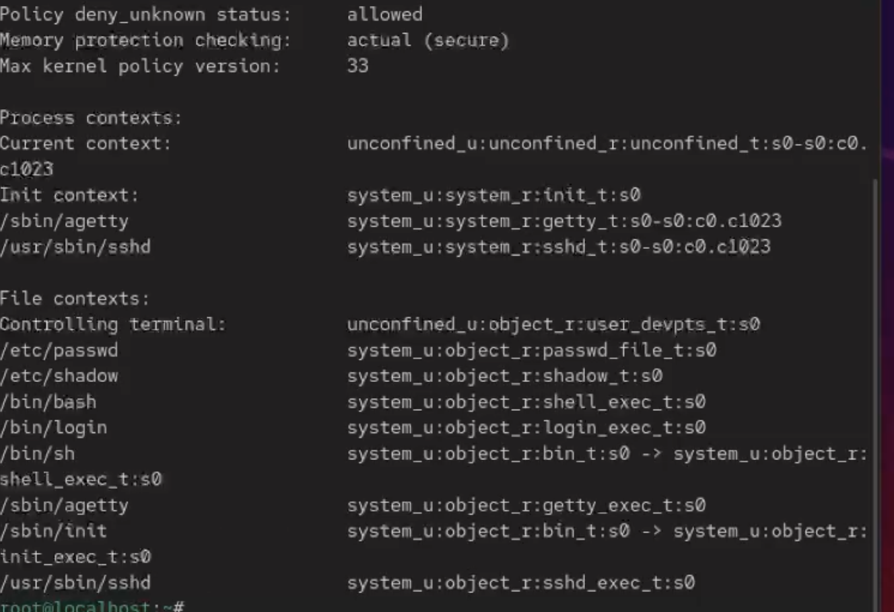{#fig:01 width=70%}

Рассмотрим все, что тут есть.

Policy deny_unknown status: allowed - Это показывает, как SELinux обращается с неизвестными типами объектов или действий, не описанными в политике.
Memory protection checking: actual (secure) - Эта строка сообщает, что проверка защиты памяти действительно включена и активна.
Max kernel policy version: 33 - Указывает максимальную версию политики SELinux, которую поддерживает ядро данной системы.

В разделе Process contexts отображаются контексты безопасности для различных системных процессов — то есть, под какими SELinux-метками они работают.

Current context: unconfined_u:unconfined_r:unconfined_t:s0-s0:c0.c1023
Это контекст текущего пользователя и его роли:

unconfined_u - пользователь SELinux - неограниченный, с полными правами.

unconfined_r - роль пользователя.

unconfined_t - тип (domain), в котором выполняется процесс - тоже неограниченный.

s0-s0:c0.c1023 - диапазон уровней безопасности и категорий (MLS/MCS). В данном случае это полный диапазон, доступный для root.

Иными словами, я нахожусь под пользователем root, у которого нет ограничений SELinux.

system_u — системный пользователь.

system_r — роль системы.

init_t — домен (тип) процесса init.

s0 — уровень безопасности (обычный базовый уровень).

/sbin/agetty system_u:system_r:getty_t:s0-s0:c0.c1023 
Контекст для процесса agetty — программы, отвечающей за терминальные сессии (экран входа).

getty_t - тип, указывающий, что это процесс для управления tty-устройствами.

/usr/sbin/sshd system_u:system_r:sshd_t:s0-s0:c0.c1023 - Контекст для демона SSH.
sshd_t - тип, указывающий, что это служба SSH, выполняющая аутентификацию и управление подключениями.

Чтобы уточнить режим работы, я ввёл команду getenforce.Система ответила “Enforcing”, что означает, что SELinux активно применяет политику безопасности и блокирует любые неразрешённые действия.(рис. [-@fig:002])

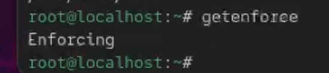{#fig:02 width=70%}

Я временно перевёл SELinux в разрешающий режим (Permissive), чтобы он только фиксировал нарушения, но не блокировал их. После повторного ввода getenforce я увидел, что режим действительно изменился на “Permissive”.
(рис. [-@fig:003])

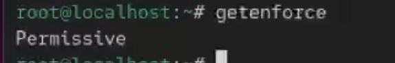{#fig:03 width=70%}

Затем я открыл файл /etc/sysconfig/selinux и с помощью текстового редактора изменил параметр:
SELINUX=disabled
Это полностью отключает SELinux. После сохранения изменений я перезагрузил систему.(рис. [-@fig:004])

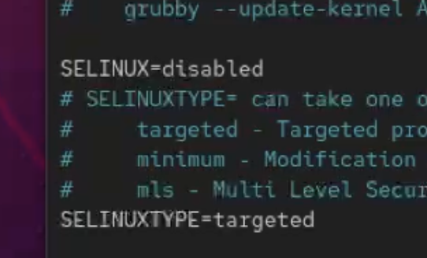{#fig:04 width=70%}

Когда система вновь запустилась, я снова открыл терминал, получил права администратора и проверил состояние SELinux командой getenforce. Теперь система выдала “Disabled”, что подтверждает, что SELinux полностью отключён.

Чтобы вернуть SELinux в рабочее состояние, я снова отредактировал файл /etc/sysconfig/selinux, установив значение:
SELINUX=enforcing(рис. [-@fig:005])

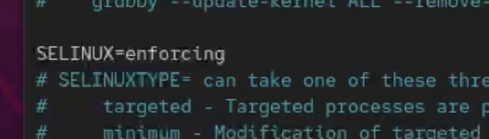{#fig:05 width=70%}

После сохранения изменений я перезагрузил систему. Во время загрузки появилось предупреждение о необходимости восстановления меток SELinux, процесс занял некоторое время и завершился дополнительной перезагрузкой.

После повторного запуска я вновь вошёл под администратором и проверил состояние с помощью sestatus -v. Результат показал, что система снова работает в режиме принудительного контроля(рис. [-@fig:006])

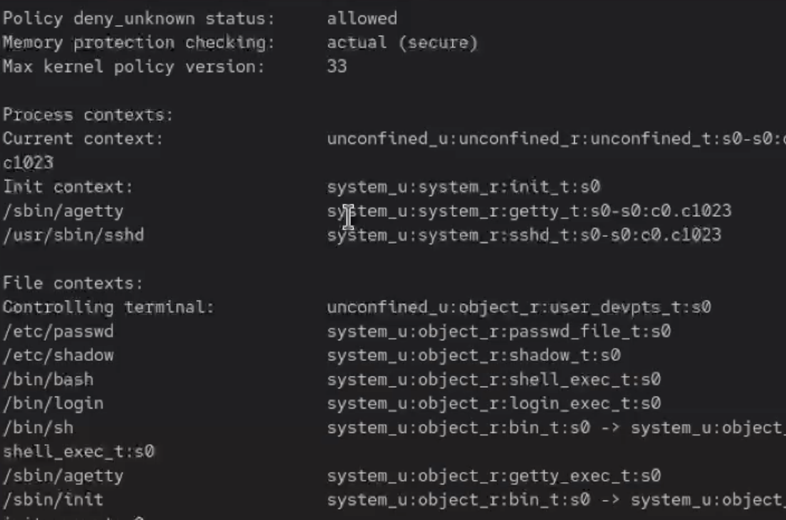{#fig:06 width=70%}

Далее я решил поработать с контекстами безопасности. Сначала я посмотрел контекст безопасности системного файла /etc/hosts с помощью команды: ls -Z /etc/hosts

Я увидел, что у него установлен контекст system_u:object_r:net_conf_t:s0, где net_conf_t указывает на то, что это файл конфигурации сети.
Я скопировал этот файл в домашний каталог(рис. [-@fig:007])

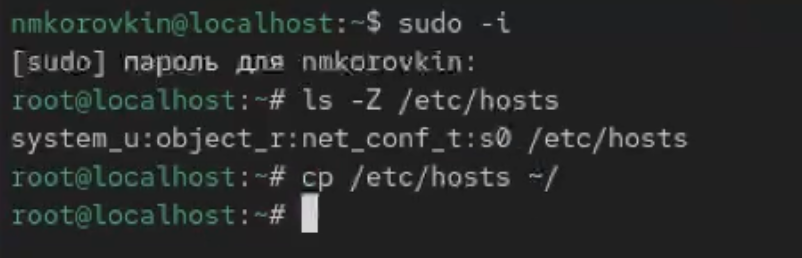{#fig:07 width=70%

После этого я снова посмотрел контекст скопированного файла (ls -Z ~/hosts) и заметил, что теперь у него контекст admin_home_t. Это произошло потому, что при копировании создаётся новый файл, и SELinux назначает ему контекст, соответствующий месту, где он находится — в данном случае домашнему каталогу администратора.
Затем я попытался переместить файл обратно в /etc: mv ~/hosts /etc и подтвердил замену существующего файла. (рис. [-@fig:008])

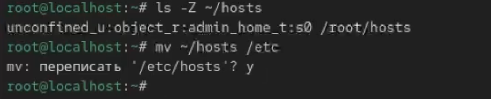{#fig:08 width=70%}

После проверки (ls -Z /etc/hosts) оказалось, что у файла всё ещё контекст admin_home_t, хотя он теперь находится в системном каталоге.

Для массового исправления контекстов на всей файловой системе я создал специальный файл - touch /.autorelabel. и перезагрузил систему. Система автоматически обновила контексты безопасности всех файлов.(рис. [-@fig:009])

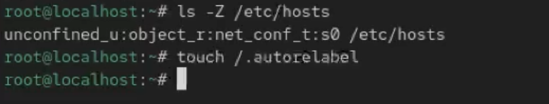{#fig:09 width=70%}

После этого я приступил к настройке веб-сервера Apache. Я установил необходимые пакеты
dnf -y install httpd 
dnf -y install lynx(рис. [-@fig:010])

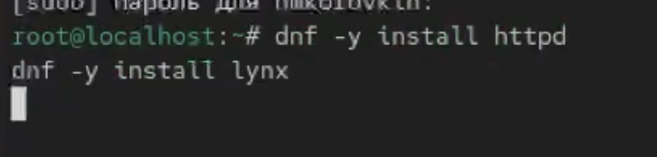{#fig:10 width=70%}

Далее я создал каталог для размещения веб-контента,
Перешёл в этот каталог (cd /web), создал файл index.html и добавил в него текст - Welcome to my web-server(рис. [-@fig:011])

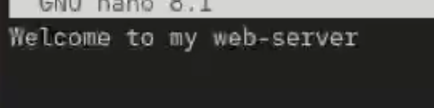{#fig:11 width=70%}

После этого я открыл конфигурационный файл /etc/httpd/conf/httpd.conf и изменил путь к корневому каталогу веб-сервера. Я закомментировал строку: DocumentRoot "/var/www/html"
и добавил: DocumentRoot "/web"(рис. [-@fig:012])

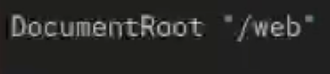{#fig:12 width=70%}

Также я закомментировал другой блок(рис. [-@fig:013])

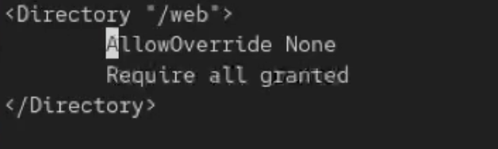{#fig:13 width=70%}

Далее я запустил веб-сервер и настроил его автозапуск: systemctl start http, systemctl enable httpd(рис. [-@fig:014])

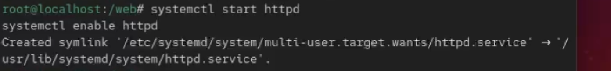{#fig:14 width=70%}

Затем я проверил работу сервера, запустив текстовый браузер lynx http://localhost
Сначала я увидел стандартную страницу, что означало, что сервер пока обращается к старому каталогу.(рис. [-@fig:015])

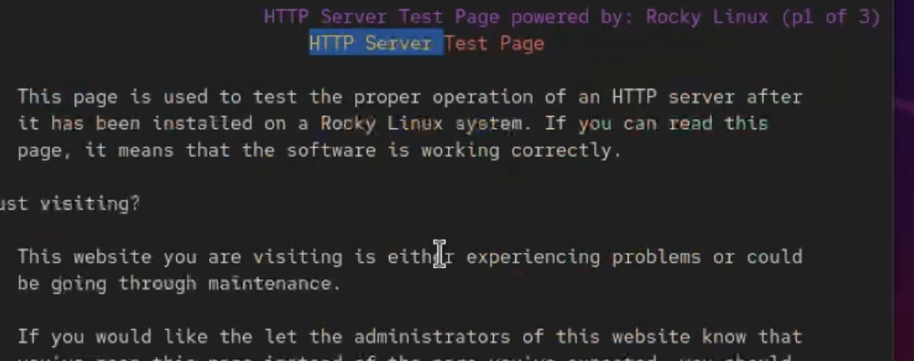{#fig:15 width=70%}

Чтобы исправить это, я назначил каталогу /web правильную метку контекста SELinux, разрешающую доступ веб-серверу:
semanage fcontext -a -t httpd_sys_content_t "/web(/.*)?"
После этого я восстановил контекст: restorecon -R -v /web
Теперь, когда я снова открыл lynx http://localhost, на экране появилась моя собственная страница с надписью(рис. [-@fig:016])

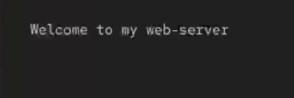{#fig:16 width=70%}

Это подтвердило, что веб-сервер работает корректно и SELinux настроен правильно.

Далее я изучил работу переключателей SELinux для FTP-сервера. Сначала я посмотрел все доступные параметры для FTP-службы: getsebool -a | grep ftp(рис. [-@fig:017])

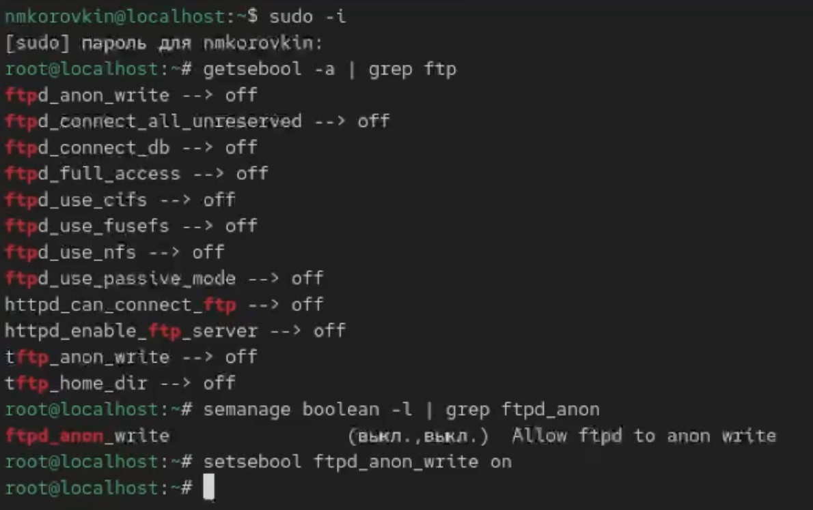{#fig:17 width=70%}

Среди них я нашёл переключатель ftpd_anon_write, который по умолчанию имел значение off — это значит, что анонимные пользователи не могут записывать файлы.
Чтобы узнать подробнее, какие переключатели отвечают за службу FTP и за что каждый из них отвечает, я использовал: semanage boolean -l | grep ftpd_anon
После этого я временно разрешил анонимную запись командой setsebool ftpd_anon_write on

После этого я проверил результат:
getsebool ftpd_anon_write
Значение изменилось на on, но это изменение действовало только до следующей перезагрузки.
Чтобы включить параметр постоянно, я выполнил:
setsebool -P ftpd_anon_write on
После этого снова просмотрел список:
semanage boolean -l | grep ftpd_anon(рис. [-@fig:018])

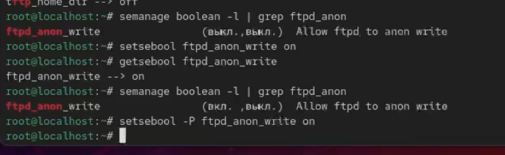{#fig:18 width=70%}

Теперь переключатель имел значение on как для временной, так и для постоянной настройки. Таким образом, я изменил политику SELinux, разрешив анонимным пользователям записывать данные на FTP-сервер.

# Ответ на контрольные вопросы

1. Чтобы временно перевести SELinux в разрешающий режим (permissive):

setenforce 0

2. Чтобы посмотреть все доступные переключатели SELinux:

sestatus -v

3. Пакет, который делает логи SELinux читаемыми:
setroubleshoot-server

4. Чтобы применить контекст `httpd_sys_content_t` к каталогу `/web`:

semanage fcontext -a -t httpd_sys_content_t "/web(/.*)?"
restorecon -Rv /web

5. Для полного отключения SELinux нужно изменить файл:
/etc/selinux/config

SELINUX=disabled

6. Все сообщения SELinux записываются в:
/var/log/audit/audit.log

7. Чтобы узнать доступные типы контекстов для службы FTP:

semanage fcontext -l | grep ftp

grep ftp /etc/selinux/targeted/contexts/files/file_contexts

8. Если сервис работает неправильно и нужно узнать, что блокирует SELinux
sealert -a /var/log/audit/audit.log

(или посмотреть в `/var/log/audit/audit.log` напрямую)

# Выводы

В ходе выполнения данной лабораторной работы были получены навыки работы с контекстом безопасности и политиками SELinux.

# Список литературы{.unnumbered}

::: {#refs}
:::
