---
## Front matter
title: "Лабораторная работа №10"
subtitle: "Отчёт"
author: "Коровкин Никита Михайлович"

## Generic otions
lang: ru-RU
toc-title: "Содержание"

## Bibliography
bibliography: bib/cite.bib
csl: pandoc/csl/gost-r-7-0-5-2008-numeric.csl

## Pdf output format
toc: true # Table of contents
toc-depth: 2
lof: true # List of figures
lot: true # List of tables
fontsize: 12pt
linestretch: 1.5
papersize: a4
documentclass: scrreprt
## I18n polyglossia
polyglossia-lang:
  name: russian
  options:
	- spelling=modern
	- babelshorthands=true
polyglossia-otherlangs:
  name: english
## I18n babel
babel-lang: russian
babel-otherlangs: english
## Fonts
mainfont: PT Serif
romanfont: PT Serif
sansfont: PT Sans
monofont: PT Mono
mainfontoptions: Ligatures=TeX
romanfontoptions: Ligatures=TeX
sansfontoptions: Ligatures=TeX,Scale=MatchLowercase
monofontoptions: Scale=MatchLowercase,Scale=0.9
## Biblatex
biblatex: true
biblio-style: "gost-numeric"
biblatexoptions:
  - parentracker=true
  - backend=biber
  - hyperref=auto
  - language=auto
  - autolang=other*
  - citestyle=gost-numeric
## Pandoc-crossref LaTeX customization
figureTitle: "Рис."
tableTitle: "Таблица"
listingTitle: "Листинг"
lofTitle: "Список иллюстраций"
lotTitle: "Список таблиц"
lolTitle: "Листинги"
## Misc options
indent: true
header-includes:
  - \usepackage{indentfirst}
  - \usepackage{float} # keep figures where there are in the text
  - \floatplacement{figure}{H} # keep figures where there are in the text
---

# Цель работы

Получить навыки работы с утилитами управления модулями ядра операционной системы

# Задание

1. Продемонстрируйте навыки работы по управлению модулями ядра (см. раздел 10.4.1).
2. Продемонстрируйте навыки работы по загрузке модулей ядра с параметрами 

# Выполнение лабораторной работы

Я запустил терминал и получил полномочия администратора, введя команду su -. После этого я посмотрел, какие устройства подключены к системе и какие модули ядра с ними связаны, используя команду lspci -k.(рис. [-@fig:001])

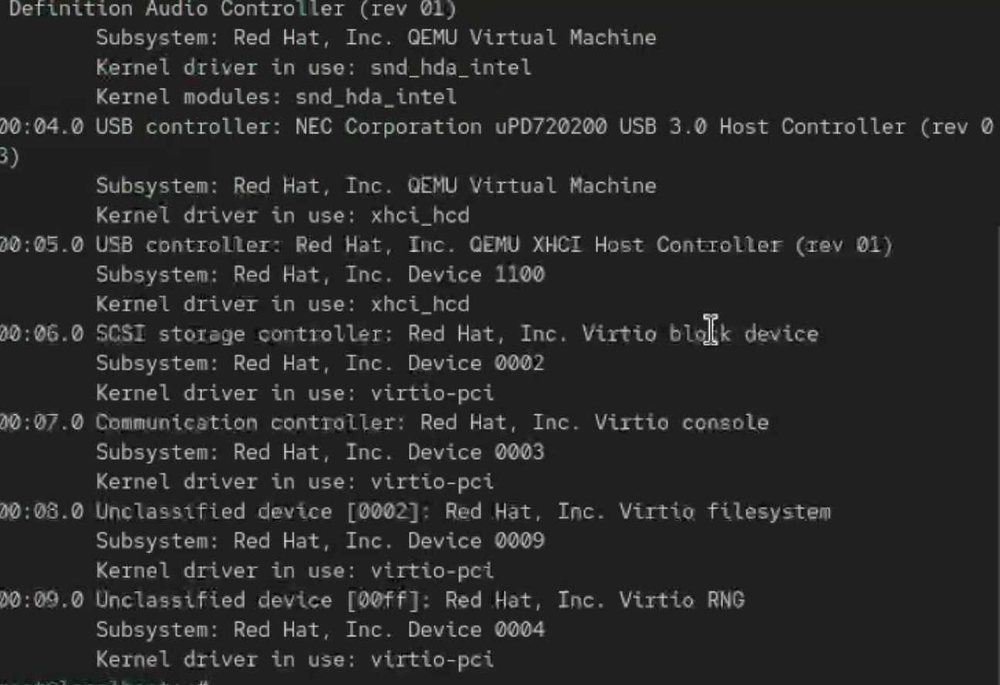{#fig:01 width=70%}

В выводе отобразились все устройства —  сетевой адаптер, контроллер USB и другие. 
.
Затем я вывел список всех загруженных модулей ядра с помощью команды lsmod | sort. Эта команда показала, какие модули сейчас используются системой, а также их взаимозависимости.(рис. [-@fig:002])

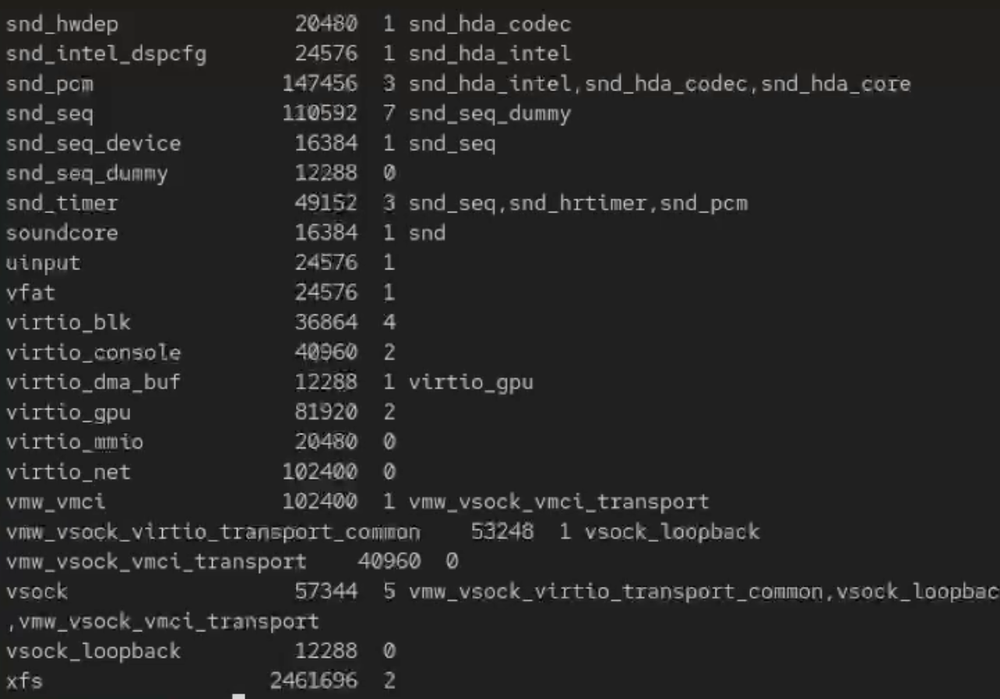{#fig:02 width=70%}

Чтобы проверить, загружен ли модуль ext4, я ввёл команду lsmod | grep ext4.(рис. [-@fig:003])

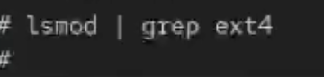{#fig:03 width=70%} 

Для загрузки модуля я использовал команду modprobe ext4, после чего снова проверил список модулей.(рис. [-@fig:004])

{#fig:04 width=70%}

Теперь ext4 появился в выводе, значит модуль успешно загружен.(рис. [-@fig:005])

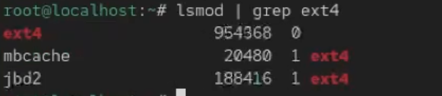{#fig:05 width=70%}

Далее я посмотрел подробную информацию о модуле ext4 с помощью команды modinfo ext4. Перечислю вывод - Rocky kernel signing key - это имя ключа, которым подписан модуль ext4.
sig_key: 24:2F:36:2D:03:F4:44:18:02:8C:20:2B:26:07:EC:2A:2C:64:31:51

Это отпечаток (fingerprint) открытого ключа, которым модуль был подписан.
Он используется для проверки, что подпись сделана доверенным ключом.
sig_hashalgo: sha256 — алгоритм хеширования, применяемый при создании подписи.
signature: используется ядром Linux для проверки, что модуль не был изменён после компиляции и что он подписан доверенным ключом.(рис. [-@fig:006])

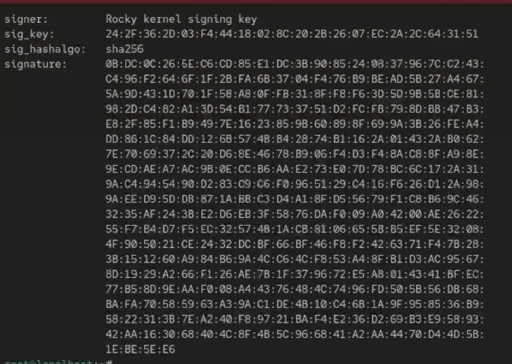{#fig:06 width=70%}

После этого я попробовал выгрузить модуль ext4 командой modprobe -r ext4. Иногда ядро не позволяет выгрузить модуль, если он используется системой (например, когда файловая система ext4 используется для текущего корневого раздела). Поэтому команда может не сработать с первого раза. В этом случае система выдаёт сообщение о том, что модуль занят.
Я также попробовал выгрузить модуль xfs командой modprobe -r xfs. (рис. [-@fig:007])

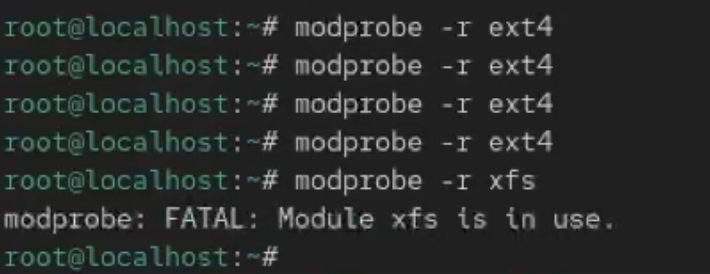{#fig:07 width=70%}

Затем я снова запустил терминал от имени администратора и проверил, загружен ли модуль Bluetooth lsmod | grep bluetooth.

Так как он не был загружен, я добавил его командой modprobe bluetooth, после чего убедился, что модуль действительно появился в списке активных.(рис. [-@fig:008])

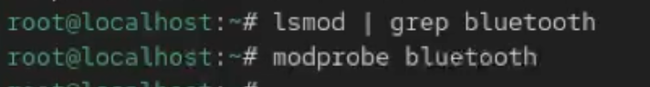{#fig:08 width=70%}

Модуль присутствует. Чтобы узнать, какие ещё модули связаны с Bluetooth, я снова использовал lsmod | grep bluetooth. В выводе появилось rfkill(рис. [-@fig:009])

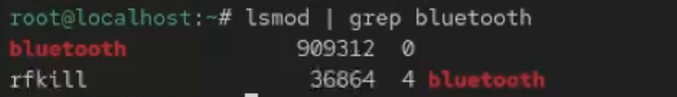{#fig:09 width=70%}

Затем я посмотрел информацию о самом модуле bluetooth с помощью modinfo bluetooth.Здесь также отображаются ключ, которыми подписан этот модуль и присутствуют его параметры.(рис. [-@fig:010])

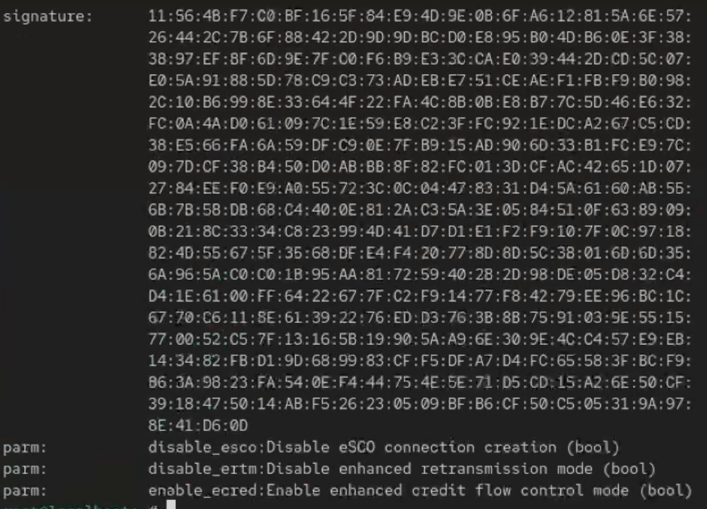{#fig:10 width=70%}

После проверки я выгрузил модуль командой modprobe -r bluetooth.(рис. [-@fig:011])

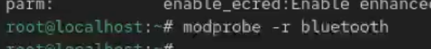{#fig:11 width=70%}

Далее я снова открыл терминал с правами администратора и посмотрел текущую версию ядра с помощью команды uname -r. После этого я вывел список всех пакетов, относящихся к ядру, используя dnf list kernel.(рис. [-@fig:012])

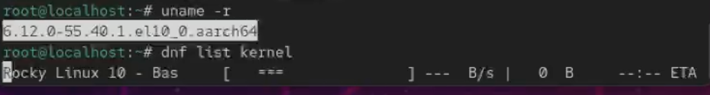{#fig:12 width=70%}

Чтобы убедиться, что система полностью обновлена, я выполнил dnf upgrade --refresh. Это важно перед обновлением ядра, чтобы избежать конфликтов.(рис. [-@fig:013])

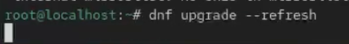{#fig:13 width=70%}

После этого я обновил ядро и саму систему.(рис. [-@fig:014])

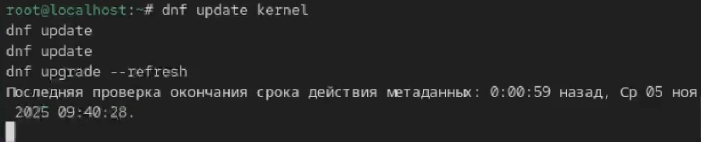{#fig:14 width=70%}

Когда обновление завершилось, я перезагрузил компьютер и при загрузке выбрал новое ядро в меню.(рис. [-@fig:015])

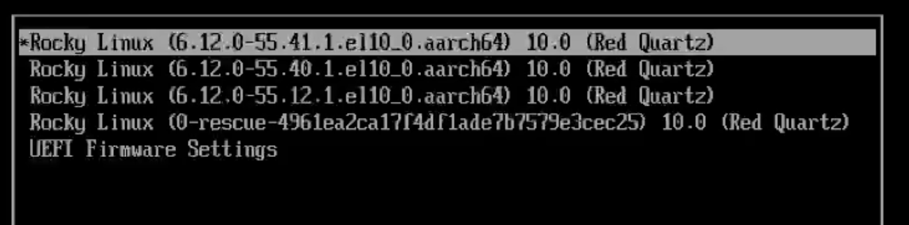{#fig:15 width=70%}

После входа в систему я снова проверил версию ядра через uname -r — она изменилась, значит обновление прошло успешно. Команда hostnamectl также показывает текущую версию ядра и другую системную информацию.(рис. [-@fig:016])

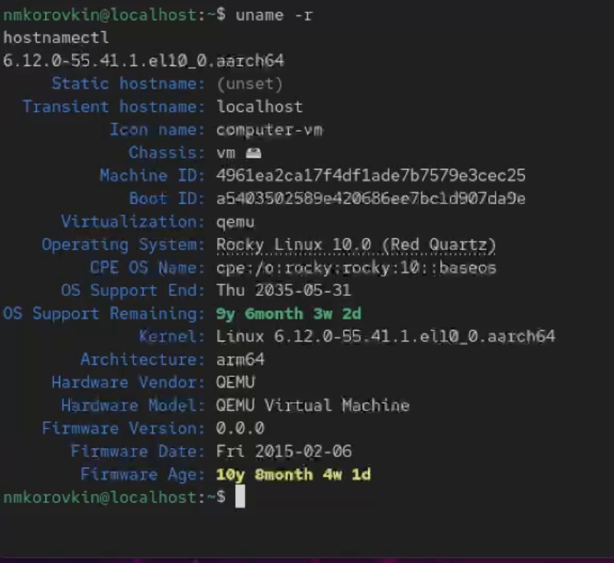{#fig:16 width=70%}

# Ответ на контрольные вопросы

1. Какая команда показывает текущую версию ядра?
Команда uname -r.
2. Как можно посмотреть более подробную информацию о текущей версии ядра?
С помощью команды hostnamectl, которая показывает не только версию ядра, но и данные о системе, хосте и архитектуре.
3. Какая команда показывает список загруженных модулей ядра?
Команда lsmod.
4. Какая команда позволяет определять параметры модуля ядра?
Команда modinfo имя_модуля.
5. Как выгрузить модуль ядра?
Командой modprobe -r имя_модуля.
6. Что можно сделать, если при попытке выгрузить модуль появляется ошибка?
Ошибка обычно означает, что модуль используется системой. В этом случае нужно сначала остановить процесс или отключить устройство, которое использует модуль, а затем повторить команду.
7. Как определить, какие параметры модуля ядра поддерживаются?
Командой modinfo имя_модуля — в выводе перечислены все доступные параметры и их описание.
8. Как установить новую версию ядра?
Сначала обновить пакеты системы (dnf upgrade --refresh), затем выполнить dnf update kernel, перезагрузить систему и выбрать новое ядро при загрузке.

# Выводы

В ходе выполнения данной лабораторной работы были получены навыки управления ядром.

# Список литературы{.unnumbered}

::: {#refs}
:::
