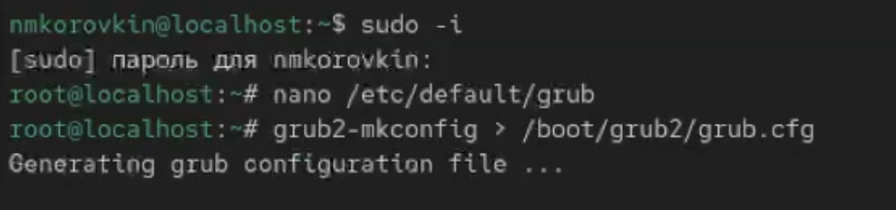
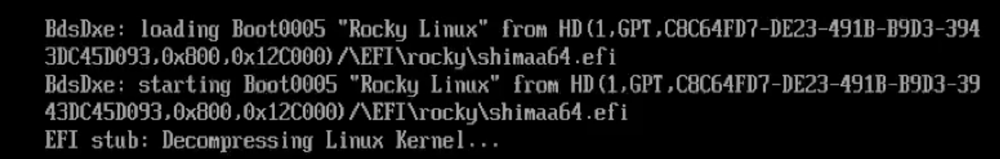
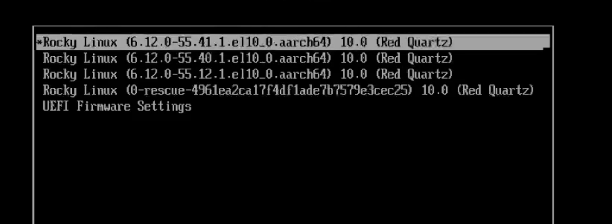
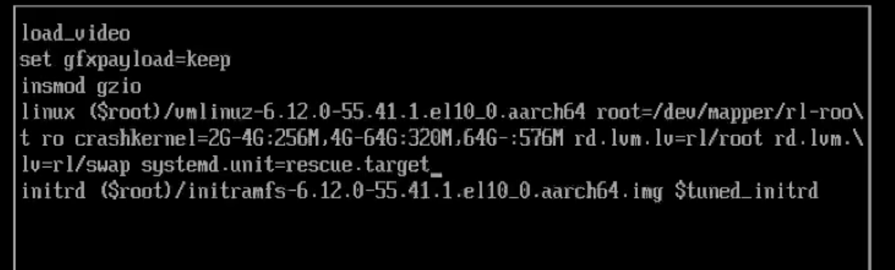
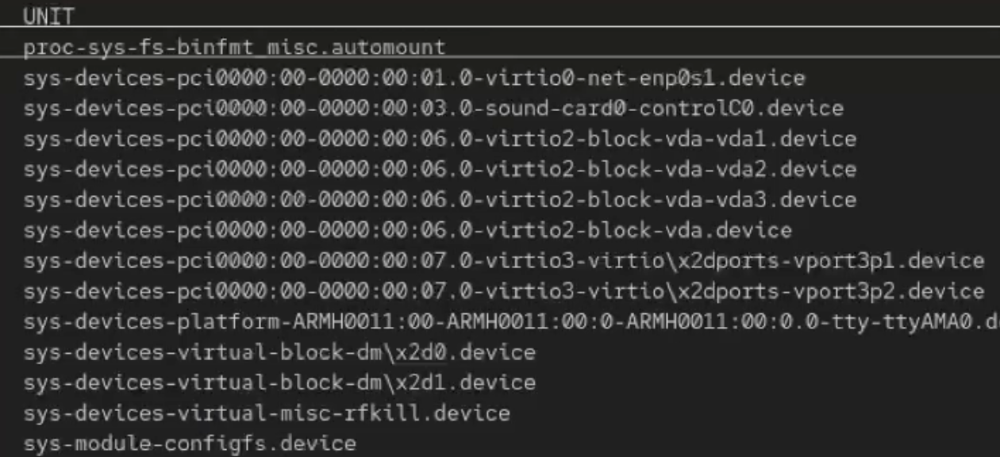
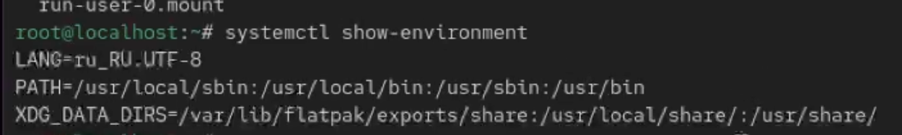
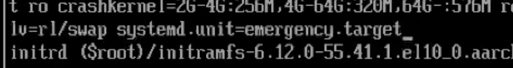
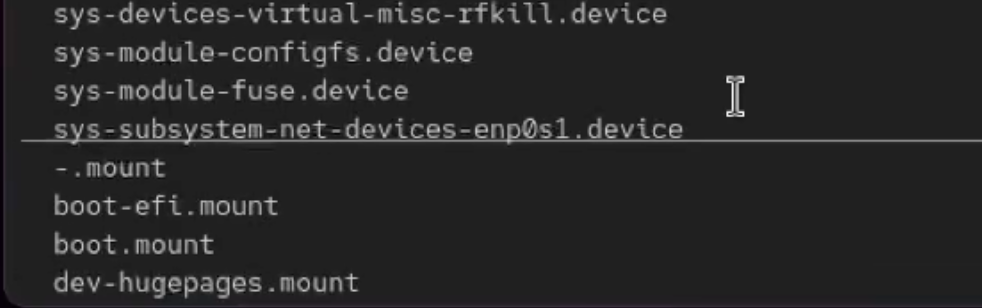
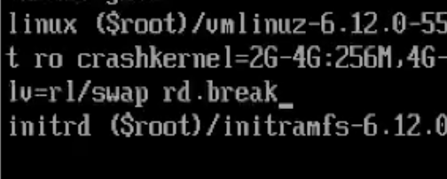
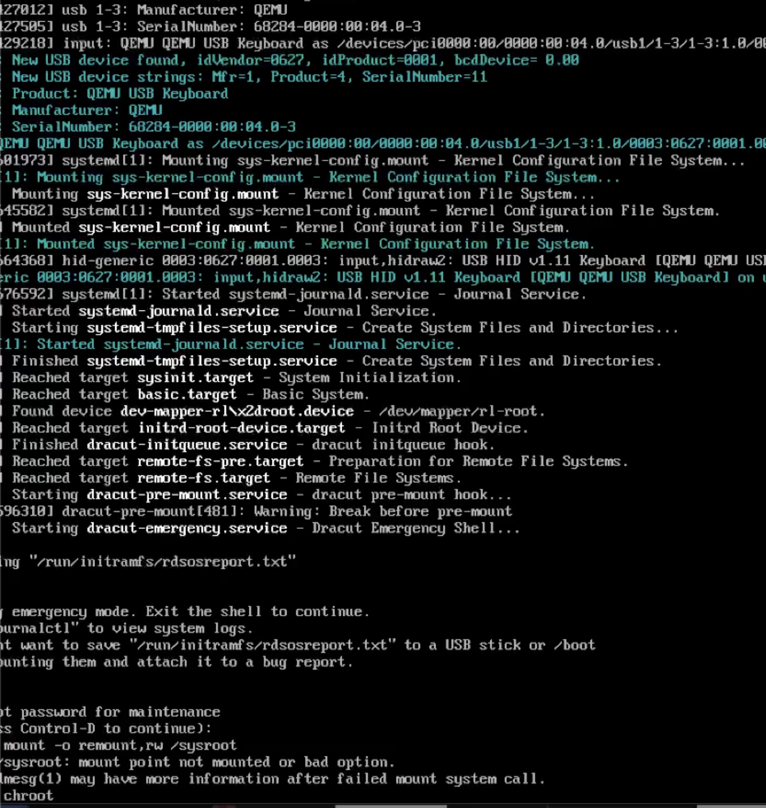

---
## Front matter
lang: ru-RU
title: Отчёт по выполнению лабораторной работы №11
subtitle: Работа с ядром Linux.
author:
  - Коровкин Н. М.
institute:
  - Российский университет дружбы народов, Москва, Россия
date: 30 октября 2025

## i18n babel
babel-lang: russian
babel-otherlangs: english

## Formatting pdf
toc: false
toc-title: Содержание
slide_level: 2
aspectratio: 169
section-titles: true
theme: metropolis
header-includes:
 - \metroset{progressbar=frametitle,sectionpage=progressbar,numbering=fraction}
 - '\makeatletter'
 - '\beamer@ignorenonframefalse'
 - '\makeatother'
 
## Fonts
mainfont: PT Serif
romanfont: PT Serif
sansfont: PT Sans
monofont: PT Mono
mainfontoptions: Ligatures=TeX
romanfontoptions: Ligatures=TeX
sansfontoptions: Ligatures=TeX,Scale=MatchLowercase
monofontoptions: Scale=MatchLowercase,Scale=0.9
---

# Информация

## Докладчик

:::::::::::::: {.columns align=center}
::: {.column width="70%"}

  * Коровкин Никита Михайлович
  * Студент
  * Российский университет дружбы народов
  * [1132246835@pfur.ru](mailto:1132246835@pfur.ru)

:::
::: {.column width="30%"}

:::
::::::::::::::

## Цель работы

Получить навыки работы с загрузчиком системы GRUB2.

## Задание

1. Продемонстрируйте навыки по изменению параметров GRUB и записи изменений
в файл конфигурации (см. раздел 11.4.1).
2. Продемонстрируйте навыки устранения неполадок при работе с GRUB (см. раздел 11.4.2).
3. Продемонстрируйте навыки работы с GRUB без использования root (см. раздел 11.4.3).

## Выполнение лабораторной работы

Сначала я открываю терминал и получаю права администратора командой su -. Затем я редактирую файл /etc/default/grub, чтобы включить показ меню загрузки. Для этого я нахожу параметр GRUB_TIMEOUT и ставлю ему значение 10, чтобы меню показывалось 10 секунд. После этого сохраняю файл и закрываю редактор. 
Когда изменения готовы, я обновляю конфигурацию GRUB командой: grub2-mkconfig -o /boot/grub2/grub.cfg(рис. [-@fig:001])

{#fig:01 width=70%}

## Выполнение лабораторной работы

Теперь я перезагружаю систему и проверяю, появляется ли меню GRUB и вижу ли я процесс загрузки. (рис. [-@fig:002])

{#fig:02 width=70%}

## Выполнение лабораторной работы

Затем я перезагружаю компьютер. Как только появляется меню GRUB, я выбираю строку с текущим ядром и нажимаю e, чтобы отредактировать параметры загрузки. (рис. [-@fig:003])

{#fig:03 width=70%} 

## Выполнение лабораторной работы

Там Я нахожу строку, которая начинается с linux — именно она отвечает за загрузку ядра. В её конец я добавляю systemd.unit=rescue.target. Это переводит систему в режим rescue — минимальную среду для восстановления. (рис. [-@fig:004])

{#fig:04 width=70%}

## Выполнение лабораторной работы

Когда появится запрос, я ввожу пароль root. После входа я могу посмотреть, какие модули системы загружены, командой:systemctl list-units(рис. [-@fig:005])

{#fig:05 width=70%}

## Выполнение лабораторной работы

Чтобы посмотреть переменные окружения, я использую: systemctl show-environment(рис. [-@fig:006])

{#fig:06 width=70%}

## Выполнение лабораторной работы

После проверки я делаю перезагрузку

Когда GRUB откроется снова, я снова нажимаю e на том же пункте загрузки. Теперь в конце строки с ядром я добавляю systemd.unit=emergency.target — это ещё более минимальный режим, где загружается только самое необходимое. (рис. [-@fig:007])

{#fig:07 width=70%}

## Выполнение лабораторной работы

Нажимаю Ctrl + X, ввожу пароль root и после входа снова смотрю список загруженных модулей той же командой systemctl list-units. Теперь модулей намного меньше — это нормально для emergency-режима. После проверки я перезагружаю систему через systemctl reboot.(рис. [-@fig:008])

{#fig:08 width=70%}

## Выполнение лабораторной работы

Если у меня возникла ситуация, когда пароль root утерян, мне я могу сбросить его. Для этого я перезагружаю компьютер и в меню GRUB выбираю текущую версию ядра, нажимаю e, чтобы редактировать параметры. В конце строки, которая загружает ядро, я добавляю rd.break 
(рис. [-@fig:009])

{#fig:09 width=70%}

## Выполнение лабораторной работы

После этого из-за особенностей виртуальной машины  UTM, меня перестало пускать в операционную систему - только режим восстановления. Там тоже ничего не работало(рис. [-@fig:010])

{#fig:10 width=70%}

## Ответ на контрольные вопросы

1. rd.break останавливает загрузку до монтирования системы, чтобы сбросить пароль root.
rhgb и quiet надо убрать, чтобы видеть сообщения загрузки.

2. Система продолжает загрузку с этими параметрами и останавливается в initramfs.

3. Это минимальная среда перед основной системой. Остановка нужна, чтобы изменить root-пароль до монтирования /.

4. Чтобы перевести системный раздел в режим чтения/записи и иметь возможность менять файлы.

5. Чтобы перейти в установленную систему и выполнять команды как будто она запущена.

6. Устанавливает новый пароль пользователя root.

7. SELinux ещё не включён, контекст файлов неправильный. Команда загружает политику, чтобы исправить контекст.

8. Чтобы установить правильный SELinux-контекст для /etc/shadow, иначе вход не сработает.

9. Чтобы принудительно и сразу перезагрузить систему из initramfs, где обычный reboot может не работать.

## Выводы

В ходе выполнения данной лабораторной работы были получены навыки работы с grub

## Список литературы{.unnumbered}

::: {#refs}
:::
