---
## Front matter
lang: ru-RU
title: Отчёт по выполнению лабораторной работы №12
subtitle: Работа с сетью
author:
  - Коровкин Н. М.
institute:
  - Российский университет дружбы народов, Москва, Россия
date: 30 октября 2025

## i18n babel
babel-lang: russian
babel-otherlangs: english

## Formatting pdf
toc: false
toc-title: Содержание
slide_level: 2
aspectratio: 169
section-titles: true
theme: metropolis
header-includes:
 - \metroset{progressbar=frametitle,sectionpage=progressbar,numbering=fraction}
 - '\makeatletter'
 - '\beamer@ignorenonframefalse'
 - '\makeatother'
 
## Fonts
mainfont: PT Serif
romanfont: PT Serif
sansfont: PT Sans
monofont: PT Mono
mainfontoptions: Ligatures=TeX
romanfontoptions: Ligatures=TeX
sansfontoptions: Ligatures=TeX,Scale=MatchLowercase
monofontoptions: Scale=MatchLowercase,Scale=0.9
---

# Информация

## Докладчик

:::::::::::::: {.columns align=center}
::: {.column width="70%"}

  * Коровкин Никита Михайлович
  * Студент
  * Российский университет дружбы народов
  * [1132246835@pfur.ru](mailto:1132246835@pfur.ru)

:::
::: {.column width="30%"}

:::
::::::::::::::

## Цель работы

Получить навыки настройки сетевых параметров системы.

## Задание

1. Продемонстрируйте навыки использования утилиты ip (см. раздел 12.4.1).
2. Продемонстрируйте навыки использования утилиты nmcli (см. раздел 12.4.2 и 12.4.3).

## Выполнение лабораторной работы

Сначала я получаю права администратора через su -, чтобы иметь доступ ко всем сетевым настройкам.
После этого я вывожу информацию о сетевых интерфейсах командой:
ip -s link(рис. [-@fig:001])

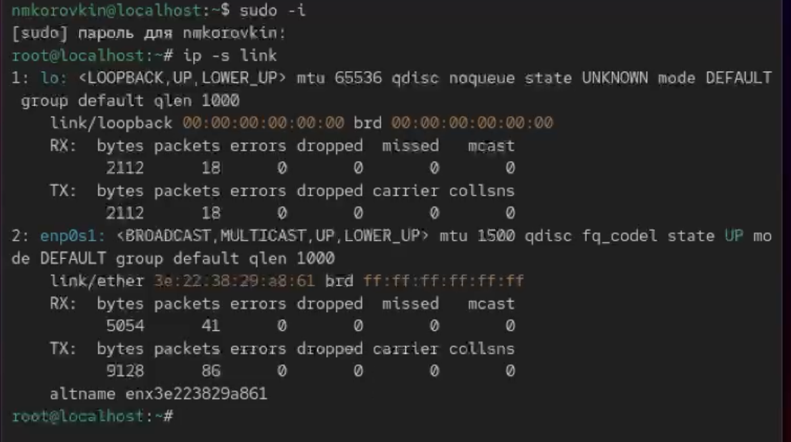{#fig:01 width=70%}

## вывожу информацию о сетевых адаптерах

Тут видно состояние сетевых адаптеров: их имена, MAC-адреса, состояние (UP/DOWN), количество отправленных и полученных пакетов, а также ошибки. Например, по одному из интерфейсов я могу увидеть, сколько пакетов он принял, сколько передал и были ли ошибки на уровне канала.
Далее я смотрю текущие маршруты

Здесь отображаются маршруты по умолчанию, шлюз, сети, доступные через конкретные интерфейсы. По этой информации можно понять, через какой шлюз идёт интернет, и какие сети доступны напрямую.

Чтобы узнать назначенные IP-адреса, я использую:ip addr show(рис. [-@fig:002])

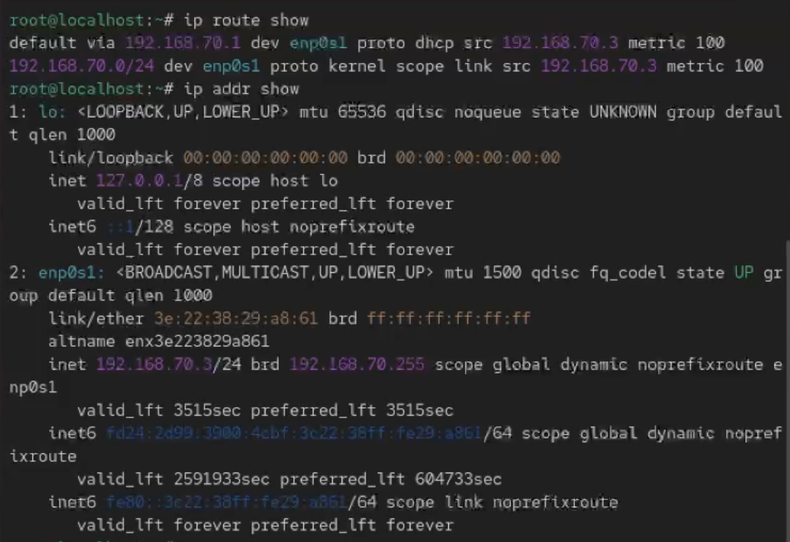{#fig:02 width=70%}

## Отправка пакетов

Для проверки связи с интернетом я отправляю четыре ICMP-пакета на Google DNS: ping -c 4 8.8.8.8(рис. [-@fig:003])

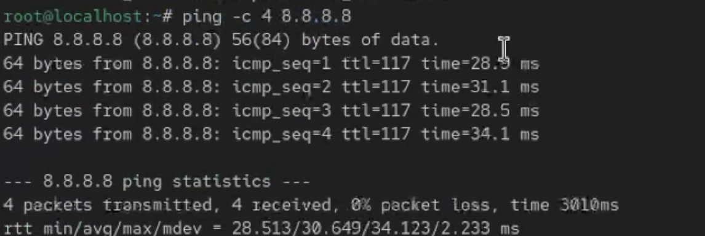{#fig:03 width=70%}

## Добавление  АйПи

Потом я добавляю дополнительный IP-адрес к своему интерфейсу: ip addr add 10.0.0.10/24 dev <интерфейс>(рис. [-@fig:004])

{#fig:04 width=70%}

## Выполнение лабораторной работы

И проверяю, что адрес действительно появился снова через ip addr show.(рис. [-@fig:005])

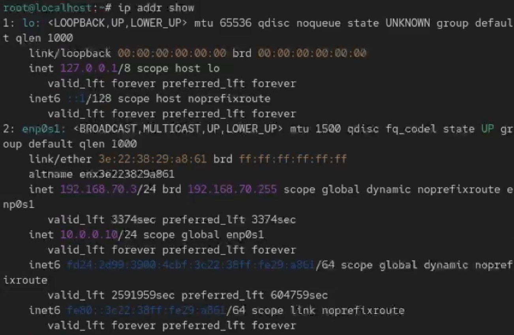{#fig:05 width=70%}

## Выполнение лабораторной работы

После этого я сравниваю вывод утилиты ip с командой ifconfig, чтобы увидеть различия в форматах и уровне детализации(рис. [-@fig:006])

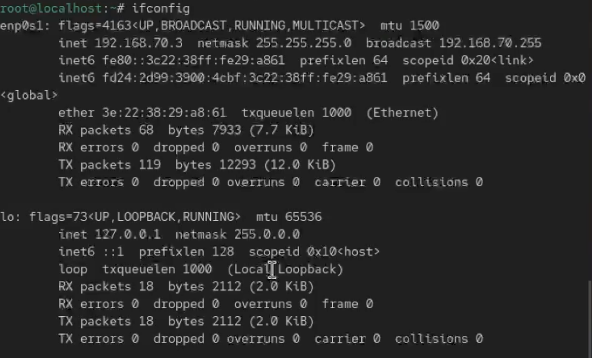{#fig:06 width=70%}

## Изучаем порты

Чтобы посмотреть все прослушиваемые TCP и UDP порты, я выполняю:ss -tu(рис. [-@fig:007])

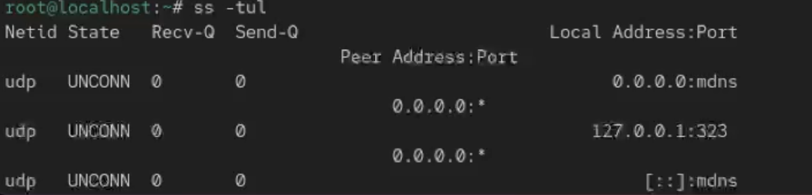{#fig:07 width=70%}l

## Список соединений

Снова получаю root-права и смотрю список всех известных соединений nmcli connection show

Затем создаю новое Ethernet-соединение с именем dhcp для нужного интерфейса: nmcli connection add con-name "dhcp" type ethernet ifname <ifname>(рис. [-@fig:008])

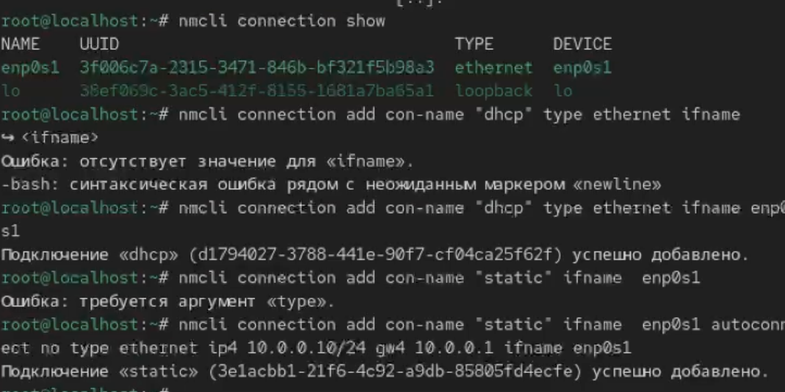{#fig:08 width=70%}

## Проверка

Проверю подключения.(рис. [-@fig:009])

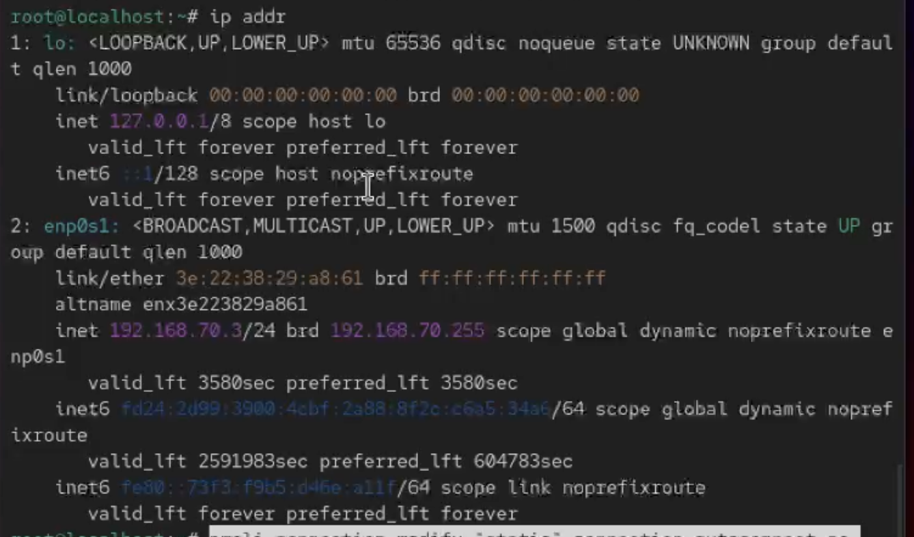{#fig:09 width=70%}

## Меняю адрес и работаю со статическим соединеним

После этого добавляю статическое соединение для того же интерфейса, указывая статический IP и шлюз:

nmcli connection add con-name "static" type ethernet ifname "<ifname>" autoconnect no ip4 10.0.0.10/24 gw4 10.0.0.1

Снова проверяю список соединений и теперь я переключаюсь на статическое соединение:

nmcli connection up "static"

И убеждаюсь, что IP-адрес поменялся (через nmcli con show и ip addr).
После тестирования возвращаюсь к DHCP:nmcli connection up "dhcp"
Потом отключаю автоподключение статического соединения:
nmcli connection modify "static" connection.autoconnect no

Добавляю DNS-сервер: nmcli connection modify "static" ipv4.dns 10.0.0.10

Добавляю второй DNS-сервер: nmcli connection modify "static" +ipv4.dns 8.8.8.8

Меняю основной статический IP-адрес, добавляю ещё один адрес и после изменения параметров активирую соединение снова(рис. [-@fig:010])

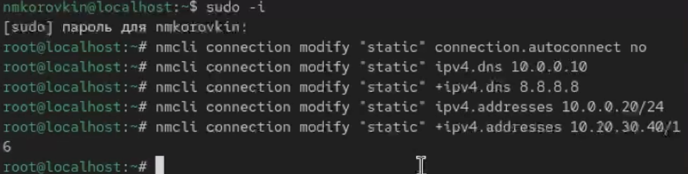{#fig:10 width=70%}

## Выполнение лабораторной работы

Через nmtui я смотрю параметры всех сетевых профилей и проверяю настройки вручную.(рис. [-@fig:011])

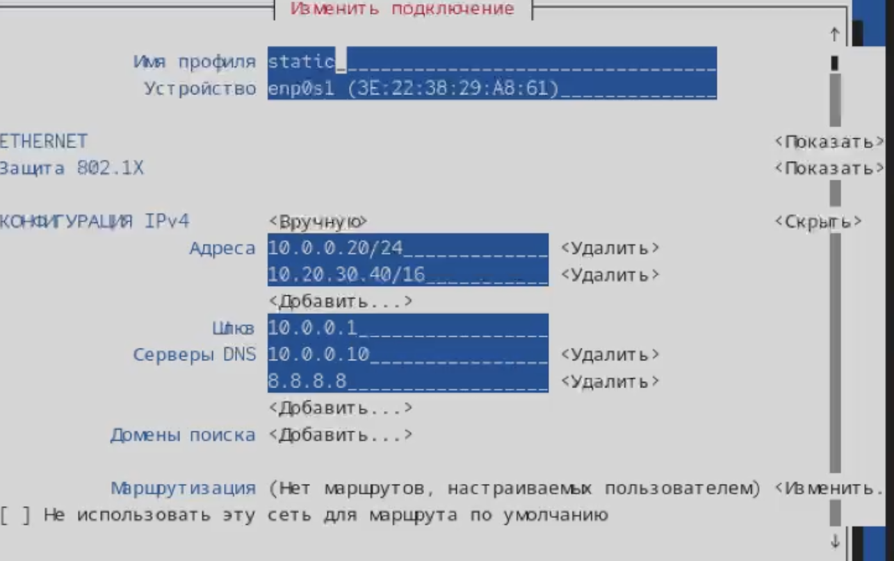{#fig:11 width=70%}

## интерфейс

Так я захожу в графический интерфейс системы и изучаю сетевые параметры там.(рис. [-@fig:012])

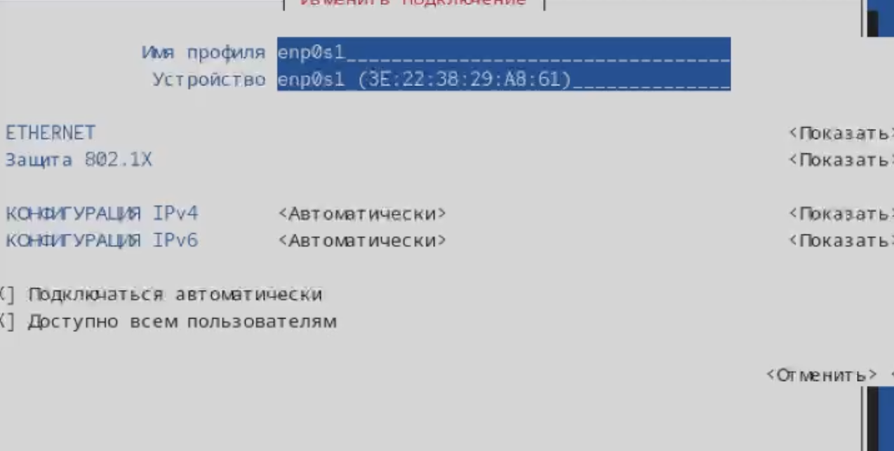{#fig:12 width=70%}

## Возвращаемся к исходному соединению

После изучения я возвращаюсь на исходное сетевое соединение

nmcli connection up enp0s1(рис. [-@fig:013])

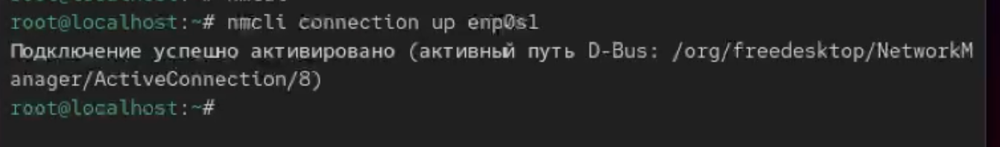{#fig:13 width=70%}

## Контрольные вопросы

1. Какая команда отображает только статус соединения, но не IP-адрес?

nmcli device status

Она показывает, какие устройства подключены, в каком они статусе, но сами адреса не выводит.

2. Какая служба управляет сетью в ОС типа RHEL?

В RHEL сетью управляет служба NetworkManager.
Она отвечает за настройки интерфейсов, подключений и автоматическое управление сетью.

3. Какой файл содержит имя узла (устройства) в ОС типа RHEL?

Имя устройства (hostname) хранится в файле:

/etc/hostname

4. Какая команда позволяет вам задать имя узла (устройства)?

hostnamectl set-hostname <новое_имя>

5. Какой конфигурационный файл можно изменить для включения разрешения имён для конкретного IP-адреса?

/etc/hosts

Там можно вручную прописать IP-адрес и имя хоста.

6. Какая команда показывает текущую конфигурацию маршрутизации?

Самая простая команда:

ip route show

Она выводит таблицу маршрутов.

7. Как проверить текущий статус службы NetworkManager?

Я проверяю так:

systemctl status NetworkManager

Команда показывает, запущена служба или нет.

## Выводы

В ходе выполнения данной лабораторной работы были получены навыки настройки сетевых параметров

## Список литературы{.unnumbered}

::: {#refs}
:::
