---
## Front matter
lang: ru-RU
title: Отчёт по выполнению лабораторной работы №13
subtitle: Работа с сетью
author:
  - Коровкин Н. М.
institute:
  - Российский университет дружбы народов, Москва, Россия
date: 30 октября 2025

## i18n babel
babel-lang: russian
babel-otherlangs: english

## Formatting pdf
toc: false
toc-title: Содержание
slide_level: 2
aspectratio: 169
section-titles: true
theme: metropolis
header-includes:
 - \metroset{progressbar=frametitle,sectionpage=progressbar,numbering=fraction}
 - '\makeatletter'
 - '\beamer@ignorenonframefalse'
 - '\makeatother'
 
## Fonts
mainfont: PT Serif
romanfont: PT Serif
sansfont: PT Sans
monofont: PT Mono
mainfontoptions: Ligatures=TeX
romanfontoptions: Ligatures=TeX
sansfontoptions: Ligatures=TeX,Scale=MatchLowercase
monofontoptions: Scale=MatchLowercase,Scale=0.9
---

# Информация

## Докладчик

:::::::::::::: {.columns align=center}
::: {.column width="70%"}

  * Коровкин Никита Михайлович
  * Студент
  * Российский университет дружбы народов
  * [1132246835@pfur.ru](mailto:1132246835@pfur.ru)

:::
::: {.column width="30%"}

:::
::::::::::::::

## Цель работы

Получить навыки настройки пакетного фильтра в Linux.

## Задание

1. Используя firewall-cmd:
– определить текущую зону по умолчанию;
– определить доступные для настройки зоны;
– определить службы, включённые в текущую зону;
– добавить сервер VNC в конфигурацию брандмауэра.
2. Используя firewall-config:
– добавьте службы http и ssh в зону public;
– добавьте порт 2022 протокола UDP в зону public;
– добавьте службу ftp.
3. Выполните задание для самостоятельной работы (раздел 13.5).

## Выполнение Лабораторной работы

Я начал работу с настройкой брандмауэра firewalld в Rocky. Сначала мне понадобились административные права, поэтому я вошёл под root с помощью команды:sudo  -i
Дальше я решил посмотреть, какая зона используется по умолчанию. Для этого я выполнил:
firewall-cmd --get-default-zone
После этого я выяснил, какие зоны вообще доступны в системе:
firewall-cmd --get-zones(рис. [-@fig:001])

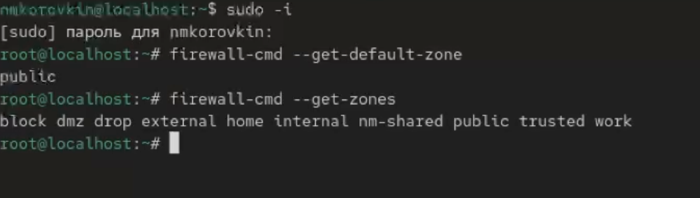{#fig:1 width=70%}

## Выполнение Лабораторной работы

Чтобы понять, какие службы может обрабатывать firewalld, я вывел полный список сервисов: firewall-cmd --get-services(рис. [-@fig:002])

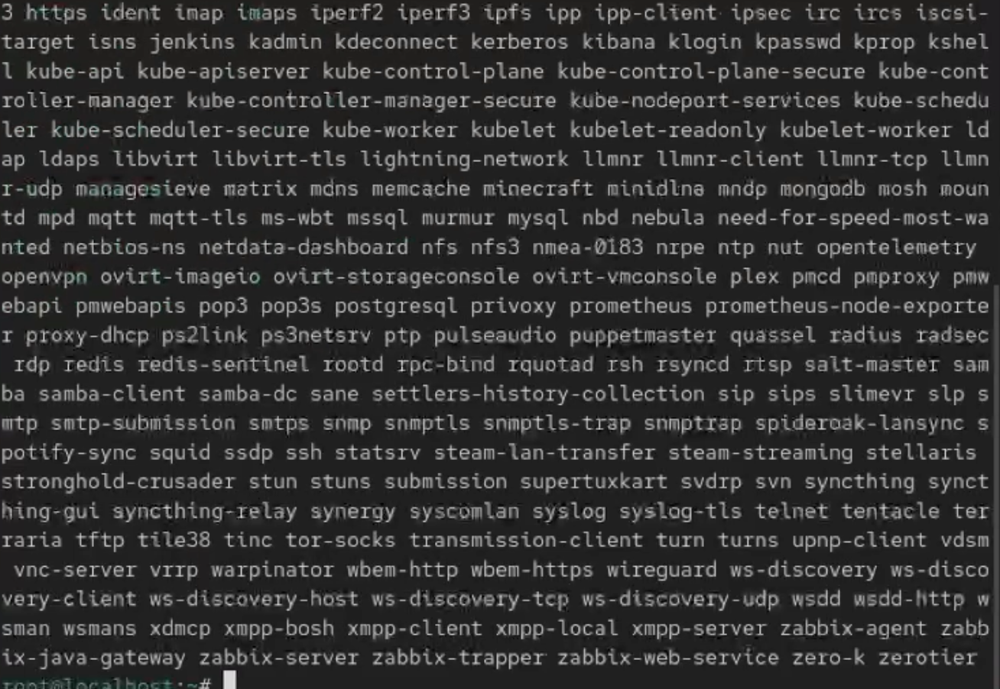{#fig:2 width=70%}

## Выполнение Лабораторной работы

Затем я проверил, какие службы уже активны в текущей зоне: firewall-cmd --list-services
Мне нужно было сравнить текущую конфигурацию с конфигурацией конкретной зоны, поэтому я использовал команды:firewall-cmd --list-all(рис. [-@fig:003])

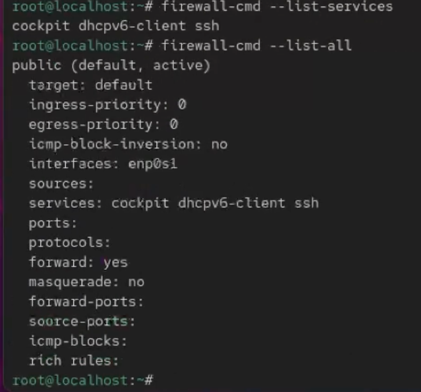{#fig:3 width=70%}

## Выполнение Лабораторной работы

и firewall-cmd --list-all --zone=public(рис. [-@fig:004])

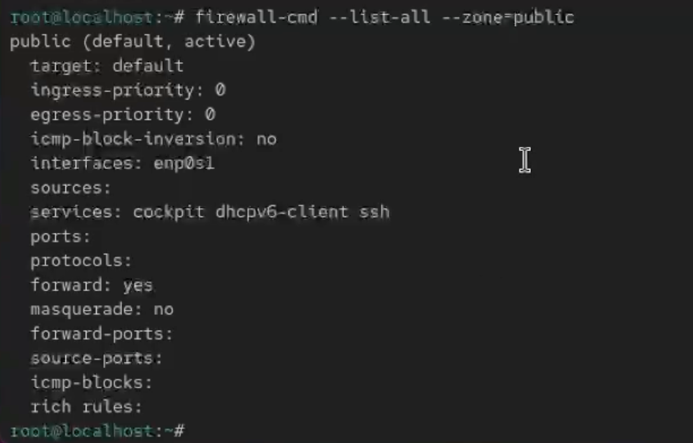{#fig:4 width=70%}

## Выполнение Лабораторной работы

Далее я решил добавить службу VNC-сервера во временную конфигурацию (configuration runtime):
firewall-cmd --add-service=vnc-server
И сразу проверил, что она появилась:
firewall-cmd --list-all(рис. [-@fig:005])

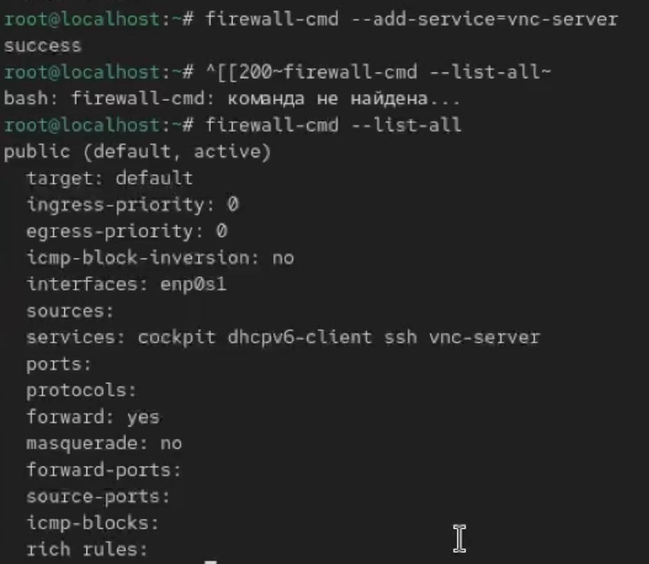{#fig:5 width=70%}

## Выполнение Лабораторной работы

После этого я перезапустил firewalld: systemctl restart firewalld
И снова проверил список служб(рис. [-@fig:006])

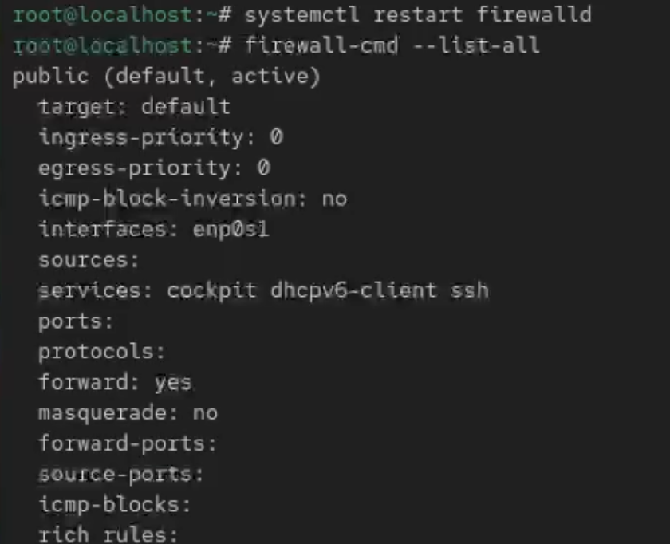{#fig:6 width=70%}

## Выполнение Лабораторной работы

Здесь я заметил, что vnc-server пропал. Это произошло потому, что я добавил службу во временную конфигурацию. При перезапуске firewalld runtime-настройки сбрасываются, и остаются только постоянные (permanent).
Чтобы добавить VNC-сервер так, чтобы он сохранялся навсегда, я выполнил firewall-cmd --add-service=vnc-server --permanent
После этого я снова вывел список firewall-cmd --list-all(рис. [-@fig:007])

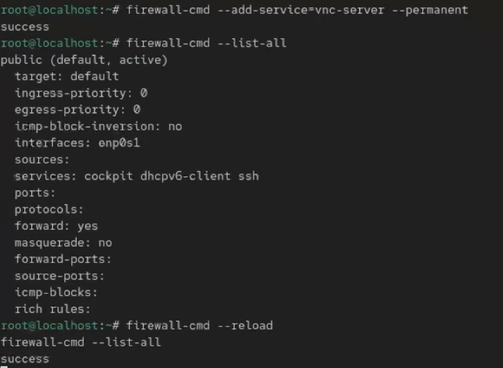{#fig:7 width=70%}

## Выполнение Лабораторной работы

Здесь VNC-сервис не появился — это нормально. Постоянные настройки не отображаются в runtime-конфигурации, пока её не перезагрузить.
Поэтому я перезагрузил firewalld - firewall-cmd --reload

После этого я добавил порт 2022 по протоколу TCP в постоянную конфигурацию firewall-cmd --add-port=2022/tcp --permanent
и перезагрузил настройки
firewall-cmd --reload
И убедился, что порт появился firewall-cmd --list-allрис.( [-@fig:008])

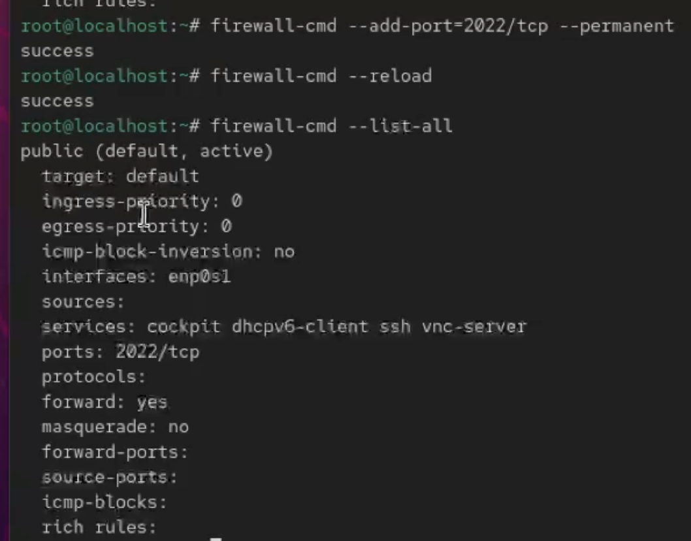{#fig:8 width=70%}

## Выполнение Лабораторной работы

Настройка брандмауэра через графический интерфейс firewall-config
Здесь я использовал графическую утилиту. 
Сначала я переключил режим конфигурации на постоянный. Это делается в меню Configuration, где я выбрал Permanent. В этом режиме все изменения автоматически становятся постоянными.(рис. [-@fig:009])

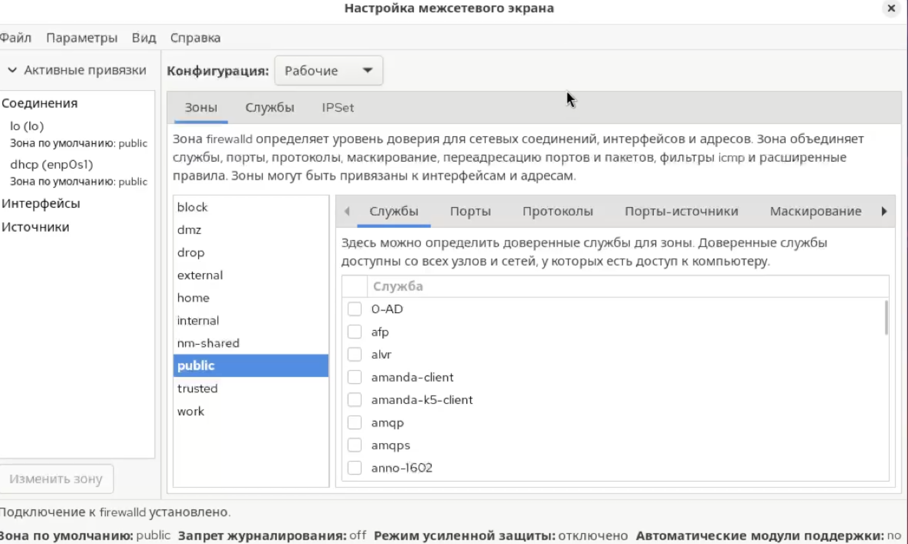{#fig:9 width=70%}

## Выполнение Лабораторной работы

Дальше я перешёл в зону public и включил в списке служб следующие сервисы: http, https, ftp.(рис. [-@fig:010])

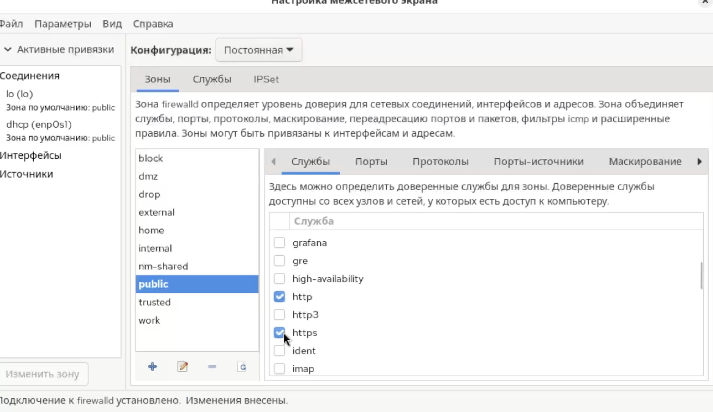{#fig:10 width=70%}

## Выполнение Лабораторной работы

После этого я перешёл на вкладку Ports, нажал Add, ввёл порт 2022, протокол udp, и добавил его.(рис. [-@fig:011])

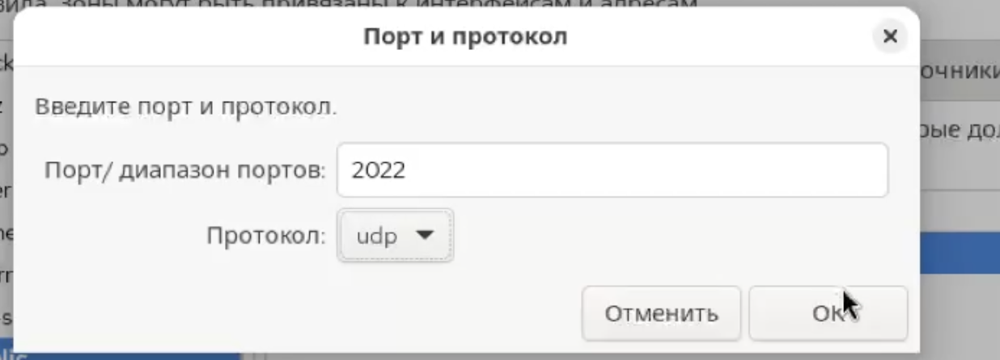{#fig:11 width=70%}

Когда я закрыл утилиту, я вернулся в терминал,перезагрузил настройки и ввел команду firewall-cmd --list-all
После перезагрузки конфигурации все изменения стали активными.

## Выполнение Лабораторной работы

Далее я разрешил TELNET через CLI. Сначала добавил службу как временную через sudo firewall-cmd --add-service=telnet
Затем сделал её постоянной:
sudo firewall-cmd --add-service=telnet --permanent
И перезагрузил настройки(рис. [-@fig:012])

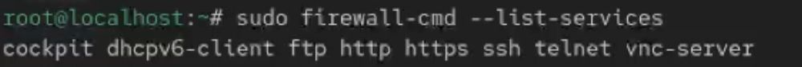{#fig:12 width=70%}

## Выполнение Лабораторной работы

В списке появилась telnet.

После я открыл Firewall Configuration 
Выбрал зону public, перешёл на вкладку Services и включил:
– IMAP
– POP3
– SMTP
Убедился, что конфигурация в режиме Permanent, поэтому изменения сохраняются.(рис. [-@fig:013])

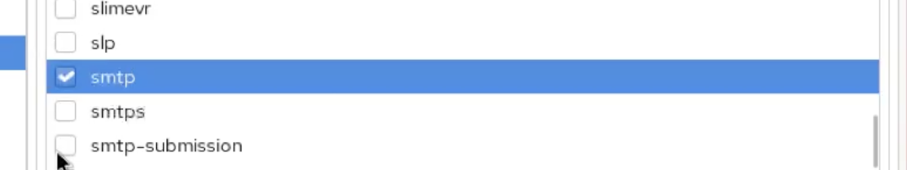{#fig:13 width=70%}

## Выполнение Лабораторной работы

После перезагрузки системы Я проверил, что службы активны: sudo firewall-cmd --list-services
В списке появились telnet, imap, pop3, smtp — значит, настройки применены и постоянны.(рис. [-@fig:014])

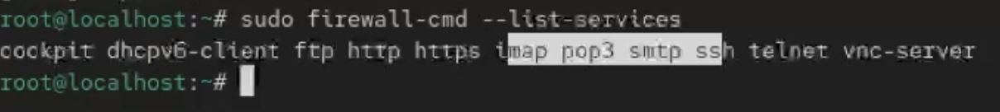{#fig:14 width=70%}

# Контрольные вопросы

1. Перед запуском firewall-config должна быть запущена служба firewalld.

2. Чтобы добавить UDP-порт 2355 в зону по умолчанию, я использовал бы:
   firewall-cmd --add-port=2355/udp

3. Показать всю конфигурацию во всех зонах позволяет команда:
firewall-cmd --list-all-zones
 

4. Удалить службу vnc-server из текущей конфигурации можно так:
firewall-cmd --remove-service=vnc-server

5. Чтобы активировать конфигурацию, добавленную через --permanent, я выполняю: firewall-cmd --reload

6. Проверить, что новая конфигурация стала активной, можно параметром:
firewall-cmd --list-all

7. Интерфейс eno1 я бы добавил в зону public командой:
   firewall-cmd --zone=public --add-interface=eno1

8. Если интерфейс добавлять без указания зоны, он попадёт в зону по умолчанию

## Выводы

В ходе выполнения данной лабораторной работы были получены навыки настройки сетевых параметров

## Список литературы{.unnumbered}

::: {#refs}
:::
