---
## Front matter
title: "Лабораторная работа №14"
subtitle: "Отчёт"
author: "Коровкин Никита Михайлович"

## Generic otions
lang: ru-RU
toc-title: "Содержание"

## Bibliography
bibliography: bib/cite.bib
csl: pandoc/csl/gost-r-7-0-5-2008-numeric.csl

## Pdf output format
toc: true # Table of contents
toc-depth: 2
lof: true # List of figures
lot: true # List of tables
fontsize: 12pt
linestretch: 1.5
papersize: a4
documentclass: scrreprt
## I18n polyglossia
polyglossia-lang:
  name: russian
  options:
	- spelling=modern
	- babelshorthands=true
polyglossia-otherlangs:
  name: english
## I18n babel
babel-lang: russian
babel-otherlangs: english
## Fonts
mainfont: PT Serif
romanfont: PT Serif
sansfont: PT Sans
monofont: PT Mono
mainfontoptions: Ligatures=TeX
romanfontoptions: Ligatures=TeX
sansfontoptions: Ligatures=TeX,Scale=MatchLowercase
monofontoptions: Scale=MatchLowercase,Scale=0.9
## Biblatex
biblatex: true
biblio-style: "gost-numeric"
biblatexoptions:
  - parentracker=true
  - backend=biber
  - hyperref=auto
  - language=auto
  - autolang=other*
  - citestyle=gost-numeric
## Pandoc-crossref LaTeX customization
figureTitle: "Рис."
tableTitle: "Таблица"
listingTitle: "Листинг"
lofTitle: "Список иллюстраций"
lotTitle: "Список таблиц"
lolTitle: "Листинги"
## Misc options
indent: true
header-includes:
  - \usepackage{indentfirst}
  - \usepackage{float} # keep figures where there are in the text
  - \floatplacement{figure}{H} # keep figures where there are in the text
---

# Цель работы

Получить навыки создания разделов на диске и файловых систем. Получить навыки монтирования файловых систем.

# Задание

1. Добавьте два диска на виртуальной машине (раздел 14.4.1).
2. Продемонстрируйте навыки создания разделов MBR с помощью fdisk (раздел 14.4.2).
3. Продемонстрируйте навыки создания логических разделов с помощью fdisk (раздел 14.4.3).
4. Продемонстрируйте навыки создания раздела подкачки с помощью fdisk (раздел 14.4.4).
5. Продемонстрируйте навыки создания разделов GPT с помощью gdisk (раздел 14.4.5).
6. Продемонстрируйте навыки форматирования файловой системы XFS (раздел 14.4.6).
7. Продемонстрируйте навыки форматирования файловой системы EXT4 (раздел 14.4.7).
8. Продемонстрируйте навыки ручного монтирования файловых систем (раздел 14.4.8).
9. Продемонстрируйте навыки монтирования файловых систем с помощью /etc/fstab
(раздел 14.4.9).
10. Выполните задание для самостоятельной работы (раздел 14.5).

# Выполнение Лабораторной работы

Добавление дисков в VirtualBox
Для своей виртуалки я добавил два диска по 512 МБ. Так как я работаю с  UTM, мне пришлось выбрать немного другие настройки и другой формат. НО в конечном  итоге получилось 2 диска.(рис. [-@fig:001])

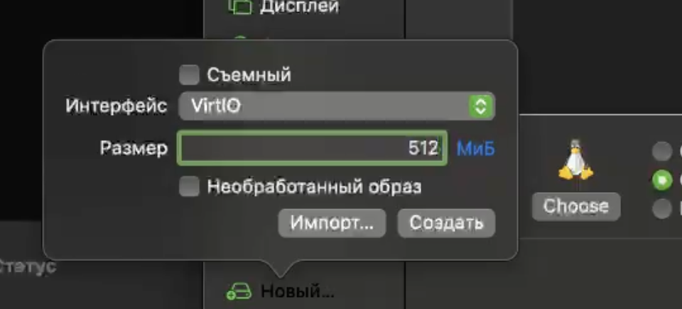{#fig:1 width=70%}

После загрузки системы я вошёл в root и использовал  fdisk --list
Появились новые устройства: /dev/vdb и /dev/vdc.(рис. [-@fig:002])

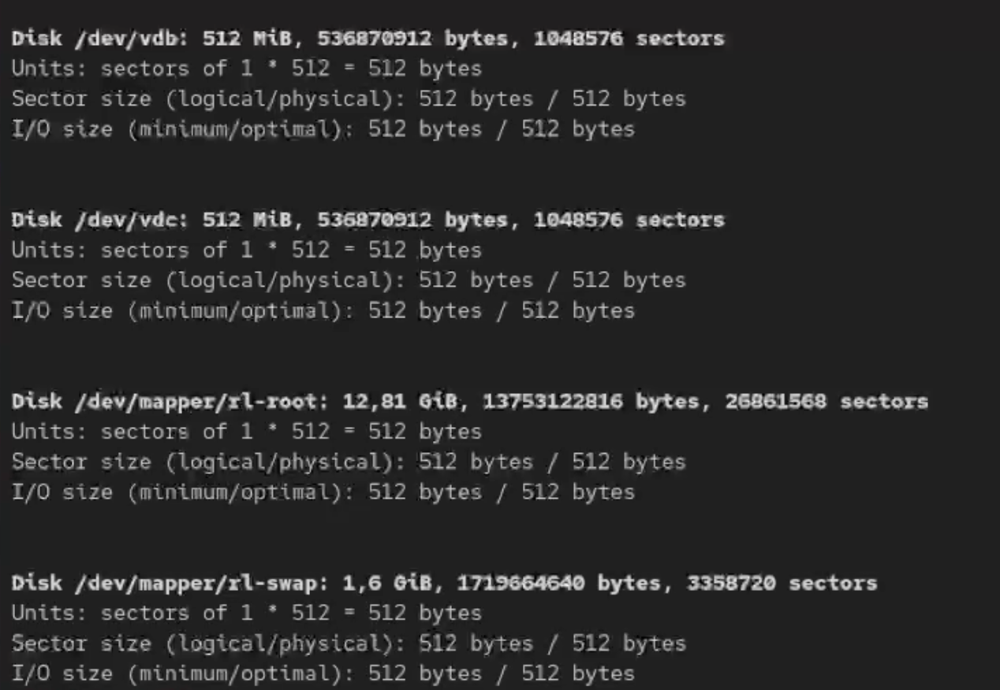{#fig:2 width=70%}

Создание основного раздела на /dev/vdb
Запускаю fdisk: fdisk /dev/vdb
Дальше я: посмотрел справку (m)(рис. [-@fig:003])

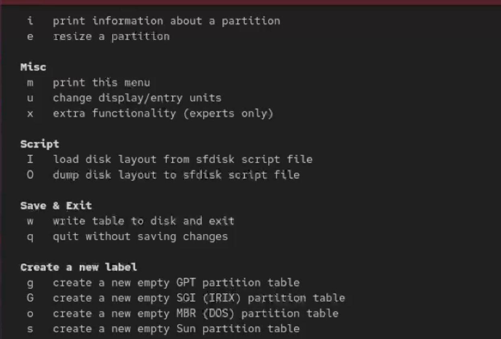{#fig:3 width=70%}

посмотрел текущее состояние (p) и начал создавать новый раздел (n)(рис. [-@fig:004])

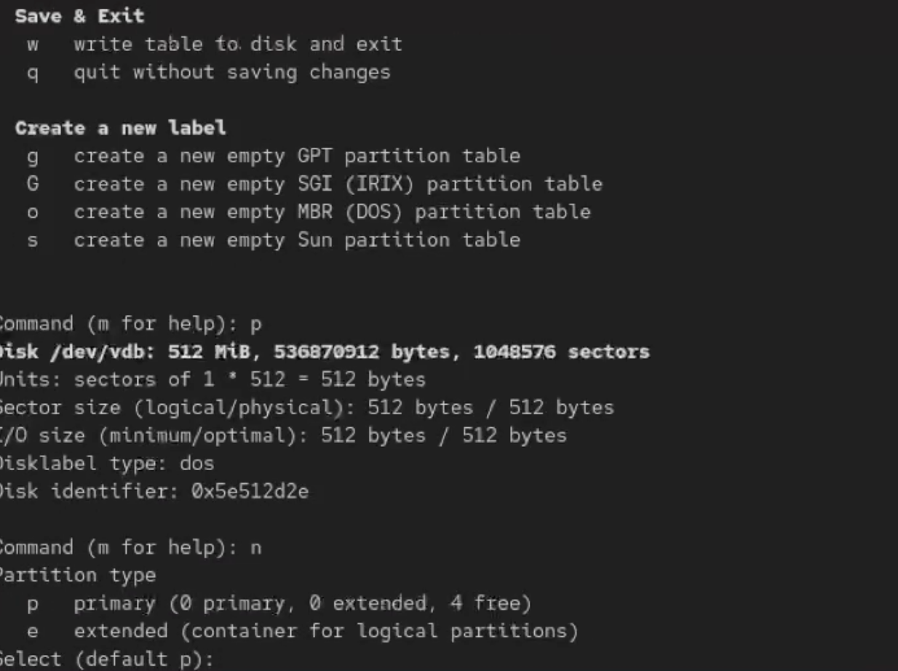{#fig:4 width=70%}

* выбрал primary (p)(рис. [-@fig:005])

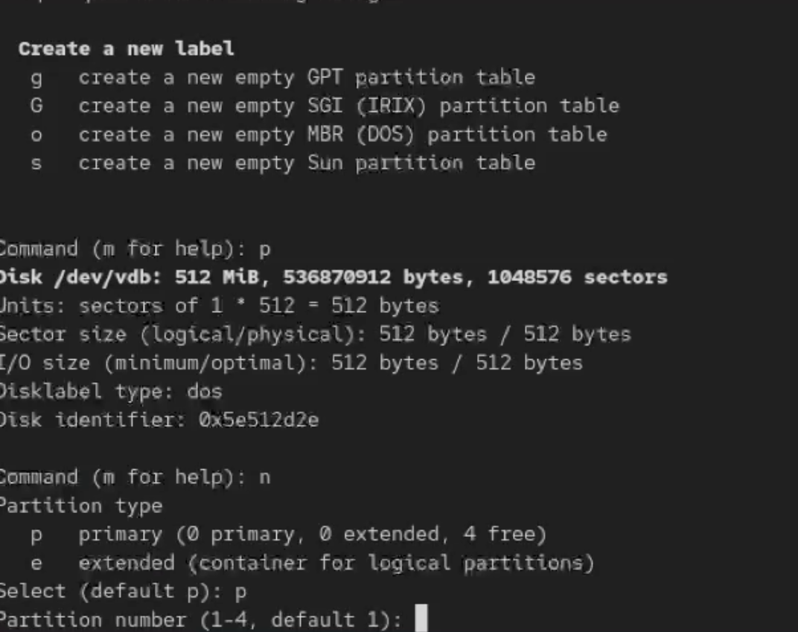{#fig:5 width=70%}
подтвердил первый сектор по умолчанию (Enter)
последним сектором задал размер +100M:
тип раздела оставил по умолчанию — 83 
записал изменения: w(рис. [-@fig:006])

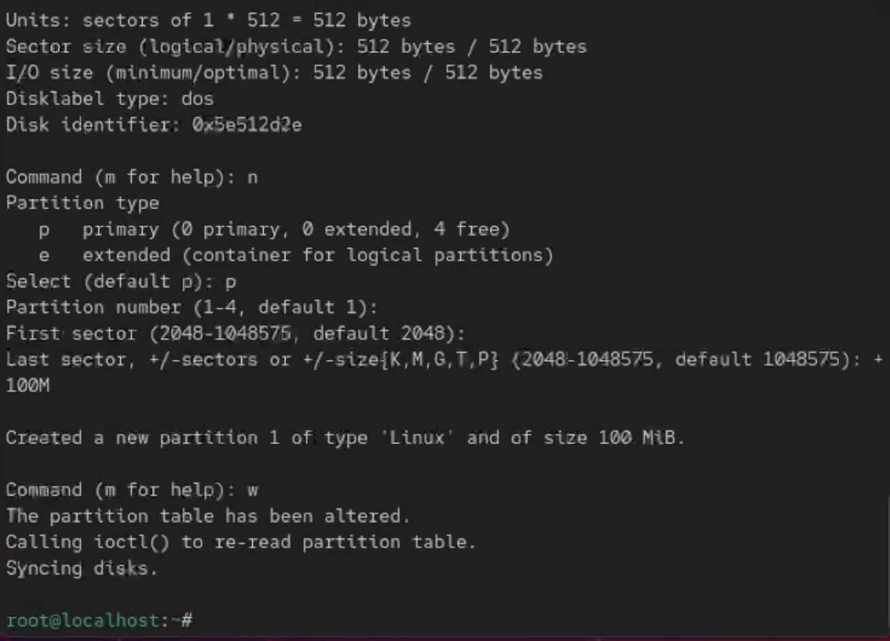{#fig:6 width=70%}



Проверка таблицы разделов

fdisk -l /dev/vdb(рис. [-@fig:007])

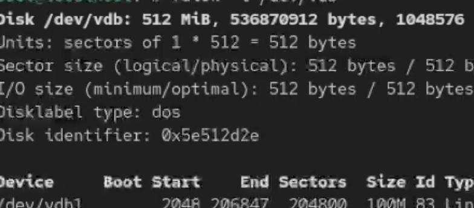{#fig:7 width=70%}

cat /proc/partitions
Разница в том, что fdisk показывает реальную структуру разделов, а /proc/partitions — то, что видит ядро в данный момент.
Затем делаем обновление таблицы разделов ядра(рис. [-@fig:008])

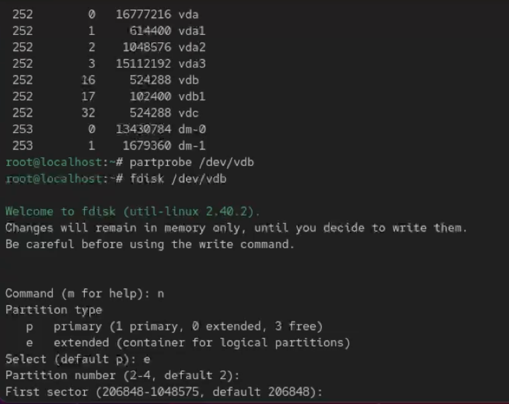{#fig:8 width=70%}

После создаем расширенный и логический раздел на /dev/vdb
Снова запускаю fdisk:

fdisk /dev/vdb
Далее:
1. Добавил новый раздел: n
2. Выбрал тип: e
3. Оставил диапазон по умолчанию (Enter два раза).
4. После создания расширенного — снова n, чтобы создать логический.
5. Сектор по умолчанию, а размер сделал +101M 
6.  Сохранил: w
10. Обновил таблицу: partprobe /dev/vdb 


А затем проверил: cat /proc/partitions fdisk --list /dev/vdb(рис. [-@fig:010])

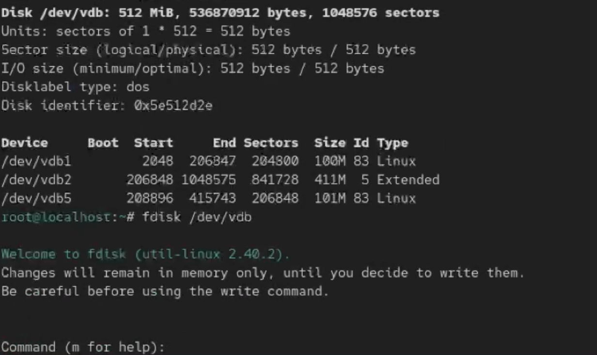{#fig:10 width=70%}

Создание ещё одного логического раздела + настройка swap
Создание раздела

fdisk /dev/vdb
n
Так как все первичные заняты, создаётся логический раздел №6.
Первый сектор — Enter.
Последний сектор: +100M
Сменю тип на swap t затем пишу  6 и 82
Записываю с помощью w и обновляю таблицу: partprobe /dev/vdb(рис. [-@fig:011])

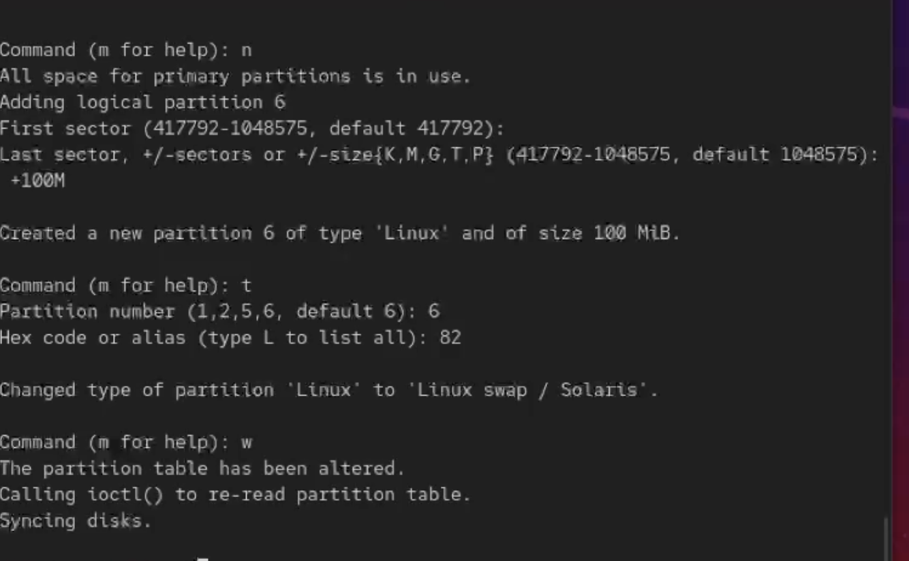{#fig:11 width=70%}

Форматирую swap через  mkswap /dev/vdb6. Затем swapon /dev/vdb6 и free -m(рис. [-@fig:012])

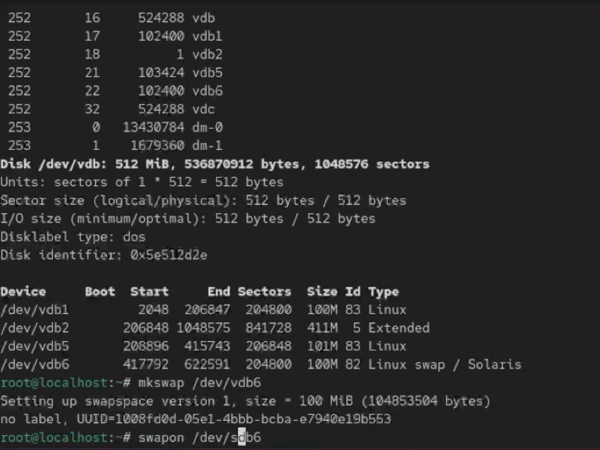{#fig:12 width=70%}

Далее посмотрим структуру - gdisk -l /dev/vdc

И теперь создадим раздел с помощью gdisk /dev/vdc
n
Я оставил номер раздела по умолчанию.
Первый сектор — Enter.
Последний сектор — Enter или размер: +100M
Тип раздела — по умолчанию 8300.

Проверил таблицу через p
Записал и обновил(рис. [-@fig:014])

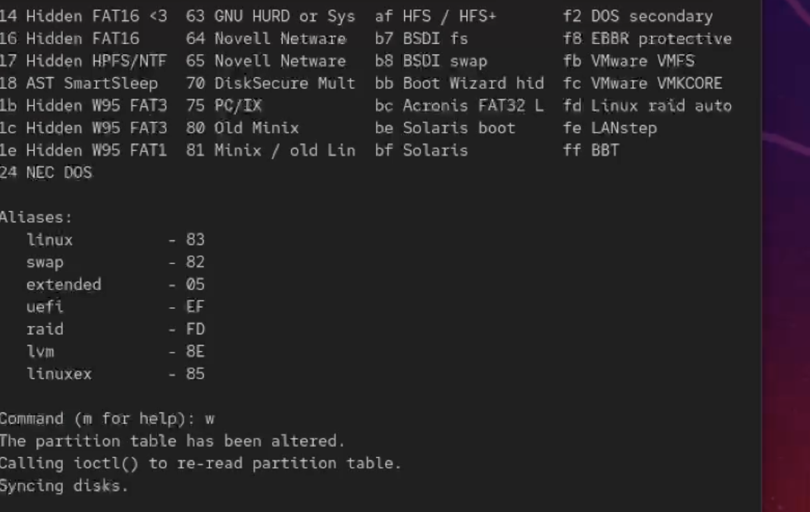{#fig:14 width=70%}

После этого случилась непредвиденная ошибка, которую пока не получилось решить. Выключая виртуальную машину, я нажал на обновление ОС и закрыл программу до окончания. В итоге, виртуальная машина не запускается.(рис. [-@fig:015])

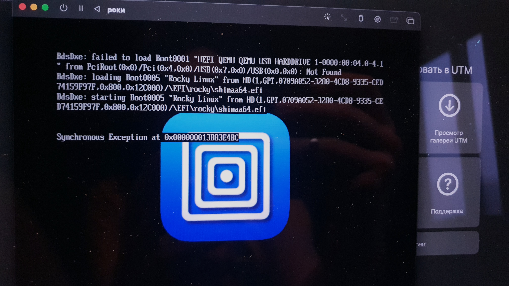{#fig:16 width=70%}

устранить ошибку не получилось даже в режиме отладки.

# Контрольные вопросы

1. Для создания разделов GUID (GPT) используется gdisk (или parted).

2. Для создания разделов MBR используется fdisk.

3. Для автоматического монтирования при загрузке используется файл /etc/fstab.

4. Чтобы раздел не монтировался автоматически, указывают опцию noauto.

5. Раздел типа 82 — это swap. Форматирование mkswap /dev/имя раздела

6. Проверить без перезагрузки можно командой mount -a

7. Без указания типа mkfs по умолчанию создаёт ext2 (зависит от системы, но классический ответ — ext2).

8. Форматирование в EXT4 - mkfs.ext4 /dev/имя раздела

9. UUID всех устройств можно увидеть командой blkid

# Выводы

В ходе выполнения данной лабораторной работы были получены навыки разбиения дисков

# Список литературы{.unnumbered}

::: {#refs}
:::
