---
## Front matter
lang: ru-RU
title: Отчёт по выполнению лабораторной работы №16
subtitle: Работа с дисками
author:
  - Коровкин Н. М.
institute:
  - Российский университет дружбы народов, Москва, Россия
date: 6 декабря 2025

## i18n babel
babel-lang: russian
babel-otherlangs: english

## Formatting pdf
toc: false
toc-title: Содержание
slide_level: 2
aspectratio: 169
section-titles: true
theme: metropolis
header-includes:
 - \metroset{progressbar=frametitle,sectionpage=progressbar,numbering=fraction}
 - '\makeatletter'
 - '\beamer@ignorenonframefalse'
 - '\makeatother'
 
## Fonts
mainfont: PT Serif
romanfont: PT Serif
sansfont: PT Sans
monofont: PT Mono
mainfontoptions: Ligatures=TeX
romanfontoptions: Ligatures=TeX
sansfontoptions: Ligatures=TeX,Scale=MatchLowercase
monofontoptions: Scale=MatchLowercase,Scale=0.9
---

# Информация

## Докладчик

:::::::::::::: {.columns align=center}
::: {.column width="70%"}

  * Коровкин Никита Михайлович
  * Студент
  * Российский университет дружбы народов
  * [1132246835@pfur.ru](mailto:1132246835@pfur.ru)

:::
::: {.column width="30%"}

:::
::::::::::::::

## Цель работы

Освоить работу с RAID-массивами при помощи утилиты mdadm.

## Задание

1. Прочитайте руководство по работе с утилитами fdisk, sfdisk и mdadm.
2. Добавить три диска на виртуальную машину (объёмом от 512 MiB каждый). При помощи sfdisk создать на каждом из дисков по одной партиции, задав тип раздела для
RAID (см. разделы 16.4.1, 16.4.2).
3. Создать массив RAID 1 из двух дисков, смонтировать его. Эмитировать сбой одного из
дисков массива, удалить искусственно выведенный из строя диск, добавить в массив
работающий диск (см. раздел 16.4.2).
4. Создать массив RAID 1 из двух дисков, смонтировать его. Добавить к массиву третий диск. Эмитировать сбой одного из дисков массива. Проанализировать состояние
массива, указать различия по сравнению с предыдущим случаем (см. раздел 16.4.3).
5. Создать массив RAID 1 из двух дисков, смонтировать его. Добавить к массиву третий
диск. Изменить тип массива с RAID1 на RAID5, изменить число дисков в массиве с 2 на 3.
Проанализировать состояние массива

## Выполнение Лабораторной работы

Для выполнения работы я добавил к виртуальной машине три дополнительных диска по 512 MiB к контроллеру SATA в VirtualBox. Диски создавал как динамические VDI.(рис. [-@fig:001])

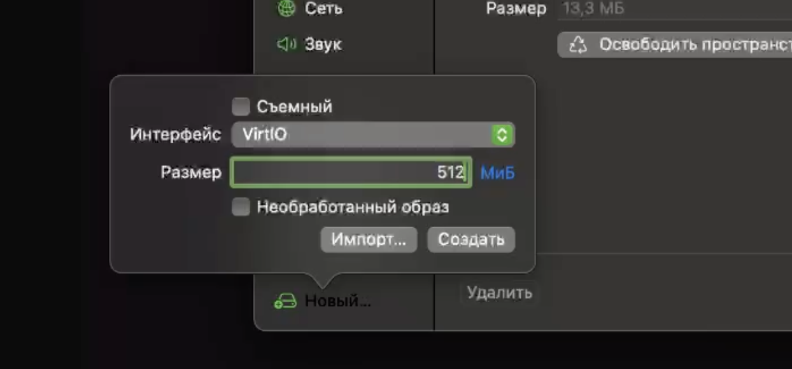{#fig:1 width=70%}

## Выполнение Лабораторной работы

Создание RAID-диска
После запуска виртуальной машины я получил права администратора: su -
Сначала проверил, что все добавленные диски корректно определились системой: fdisk -l | grep /dev/sd
Так как предыдущая работа была выполнена успешно, новые диски отобразились(рис. [-@fig:002])

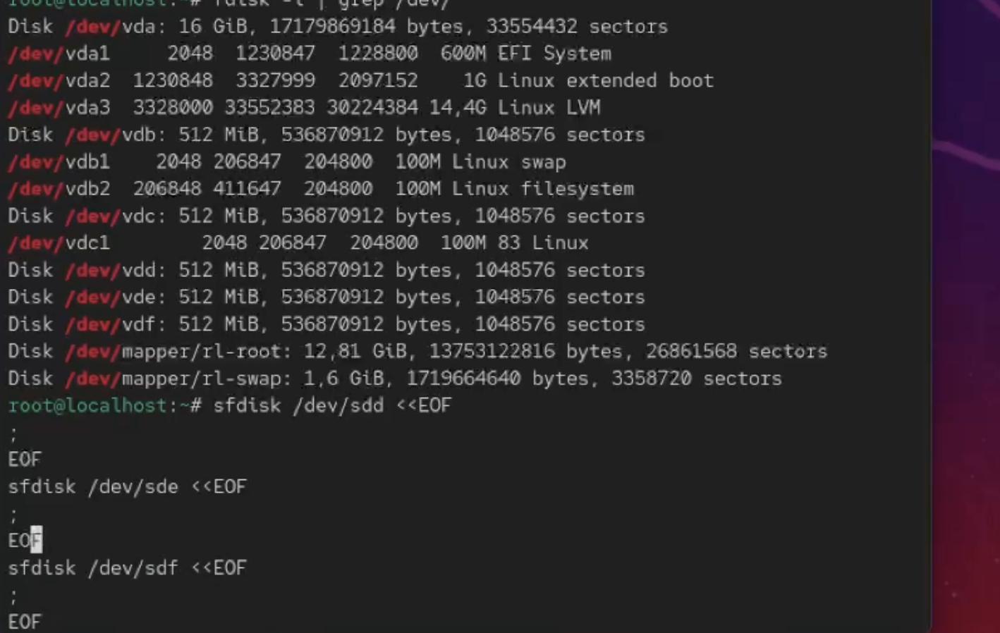{#fig:2 width=70%}

## Выполнение Лабораторной работы

Создание разделов на дисках
На каждом из дисков я создал по одному разделу, занимающему весь диск

Далее я проверил текущий тип созданных разделов:

sfdisk --print-id /dev/sdd 1
sfdisk --print-id /dev/sde 1
sfdisk --print-id /dev/sdf 1
По умолчанию разделы имеют тип Linux (83).
Чтобы посмотреть, какие RAID-типы доступны, я выполнил: sfdisk -T | grep -i raid

Я изменил тип всех трёх разделов на Linux raid autodetect (fd):
sfdisk --change-id /dev/sdd 1 fd
sfdisk --change-id /dev/sde 1 fd
sfdisk --change-id /dev/sdf 1 fd(рис. [-@fig:003])

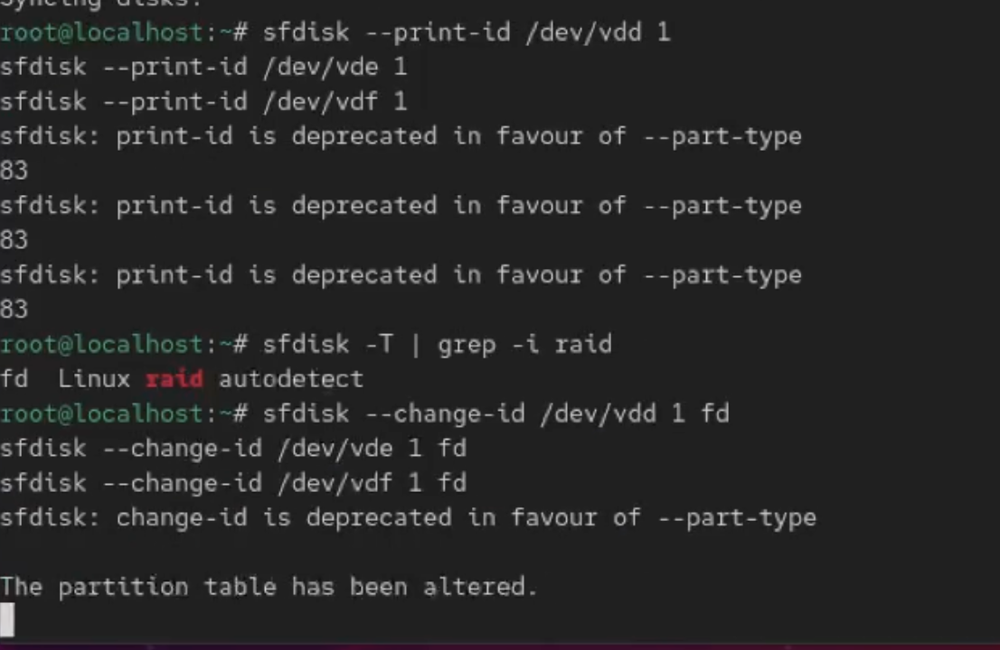{#fig:3 width=70%}
'
## Выполнение Лабораторной работы

После этого проверил состояние каждого диска с помощью команд sfdisk -l /dev/sdd sfdisk -l /dev/sde sfdisk -l /dev/sdf
Все диски содержат по одному RAID-разделу.(рис. [-@fig:004])

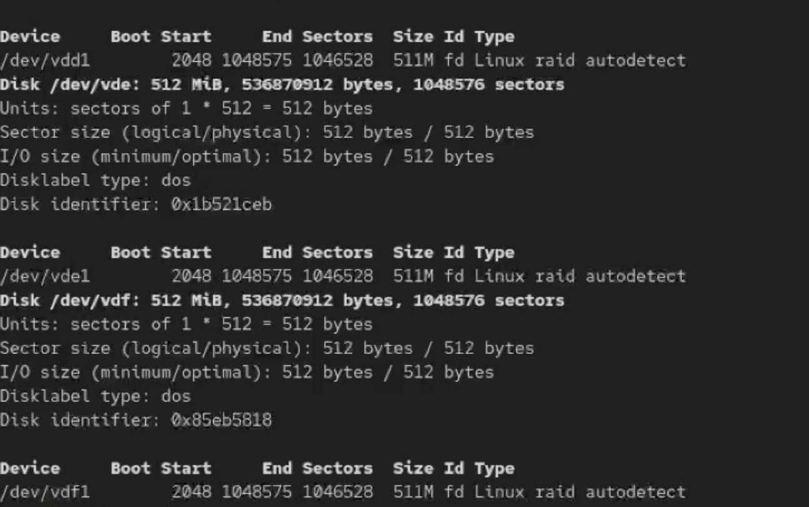{#fig:4 width=70%}

## Выполнение Лабораторной работы

Перед созданием массива рейд я убедился, что утилита mdadm установлена и 
создал массив RAID 1 из двух дисков: mdadm --create --verbose /dev/md0 --level=1 --raid-devices=2 /dev/sdd1 /dev/sde1(рис. [-@fig:005])

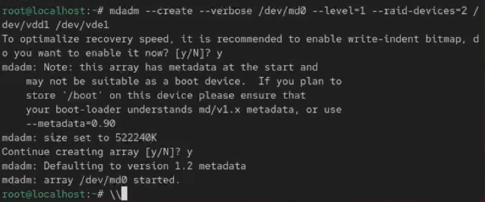{#fig:5 width=70%}

## Выполнение Лабораторной работы

после этого проверим состояние массива
Массив находится в состоянии active, оба диска работают.(рис. [-@fig:006])

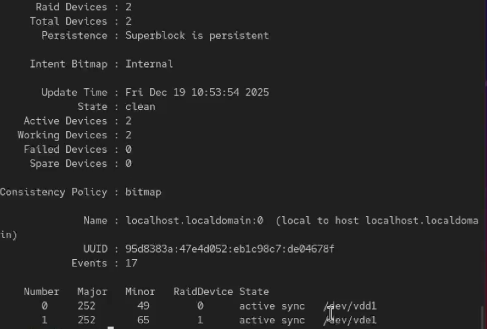{#fig:6 width=70%}

## Выполнение Лабораторной работы

Затем на RAID-массиве я создал файловую систему ext4: mkfs.ext4 /dev/md0
Создал точку монтирования и смонтировал массив: mkdir /data
mount /dev/md0 /data
Для автоматического монтирования добавил строку в /etc/fstab:
/dev/md0 /data ext4 defaults 1 2
Имитация отказа диска
Чтобы проверить отказоустойчивость, я сымитировал сбой одного диска: -mdadm /dev/md0 --fail /dev/sde1
После этого удалил сбойный диск из массива - mdadm /dev/md0 --remove /dev/sde1(рис. [-@fig:007])

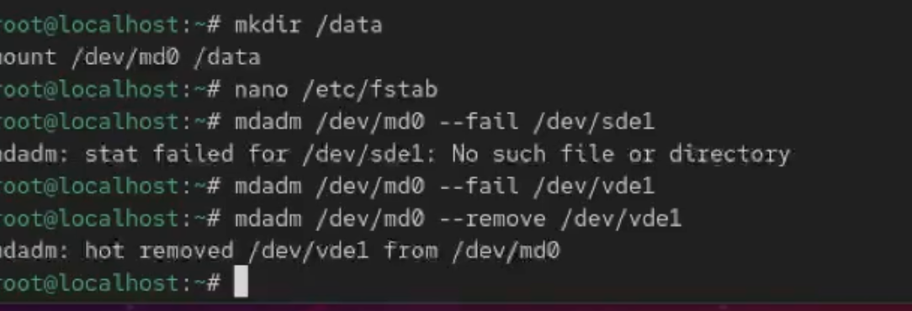{#fig:7 width=70%}

## Выполнение Лабораторной работы

Затем добавил новый диск вместо отказавшего - mdadm /dev/md0 --add /dev/sdf1
После добавления диск начал процесс синхронизации, что видно в /proc/mdstat.

Для корректного завершения работы я удалил RAID-массив
umount /dev/md0
mdadm --stop /dev/md0
И очистил RAID-метаданные на всех дисках:
mdadm --zero-superblock /dev/sdd1
mdadm --zero-superblock /dev/sde1
mdadm --zero-superblock /dev/sdf1(рис. [-@fig:008])

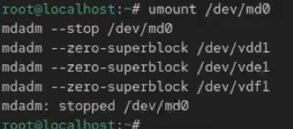{#fig:8 width=70%}

## Выполнение Лабораторной работы

После этого я создал RAID 1 из двух дисков - mdadm --create --verbose /dev/md0 --level=1 --raid-devices=2 /dev/sdd1 /dev/sde1
Добавил третий диск как горячий резерв - mdadm --add /dev/md0 /dev/sdf1
Подмонтировал массив -mount /dev/md0(рис. [-@fig:009])

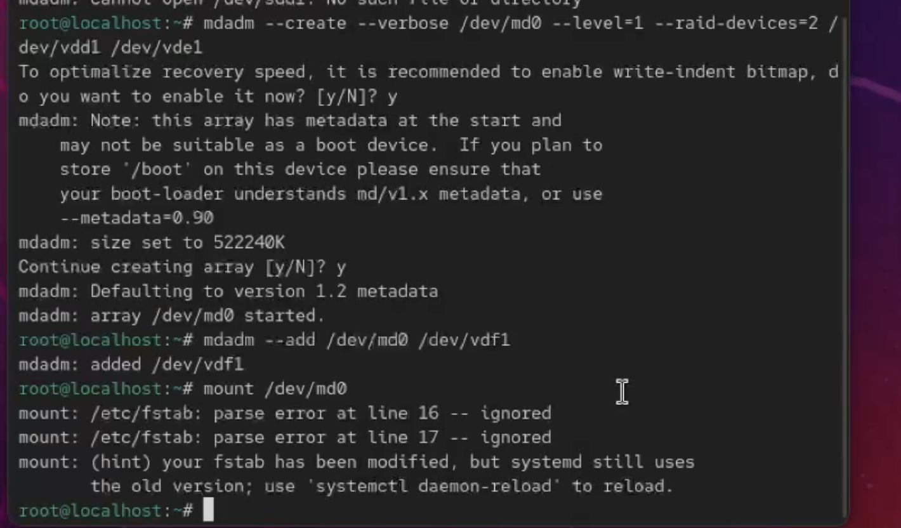{#fig:9 width=70%}

## Выполнение Лабораторной работы

После я проверил состояние(рис. [-@fig:010])

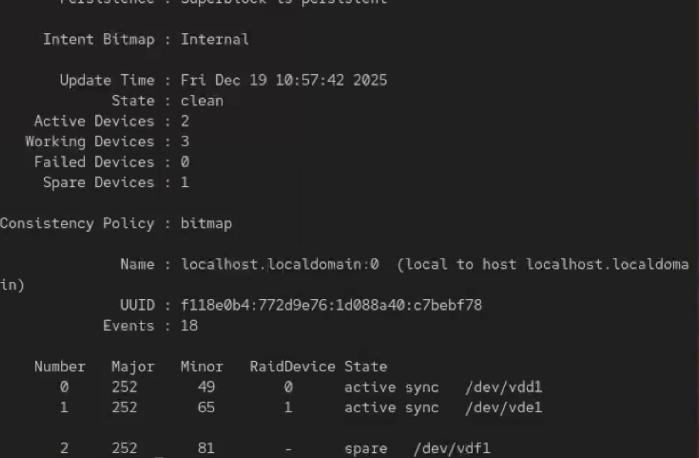{#fig:10 width=70%}

## Выполнение Лабораторной работы

Массив работает, третий диск помечен как spare.

Затем я сымитировал отказ одного из активных дисков - mdadm /dev/md0 --fail /dev/sde1
После этого массив автоматически начал перестроение с использованием резервного диска, что подтверждается выводом - mdadm --detail /dev/md0

Очистка конфигурации
После проверки я остановил массив и очистил метаданные umount /dev/md0
mdadm --stop /dev/md0
mdadm --zero-superblock /dev/sdd1
mdadm --zero-superblock /dev/sde1
mdadm --zero-superblock /dev/sdf1(рис. [-@fig:011])

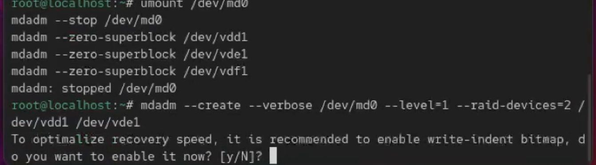{#fig:11 width=70%}

## Выполнение Лабораторной работы

Потом я снова получил права администратора и создал RAID 1 - mdadm --create --verbose /dev/md0 --level=1 --raid-devices=2 /dev/sdd1 /dev/sde1
Добавил третий диск mdadm --add /dev/md0 /dev/sdf1(рис. [-@fig:012])

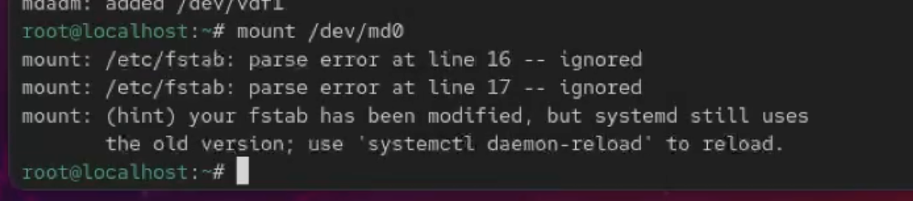{#fig:12 width=70%}

## Выполнение Лабораторной работы

Подмонтировал массив и проверил состояние cat /proc/mdstat
mdadm --detail /dev/md0(рис. [-@fig:013])

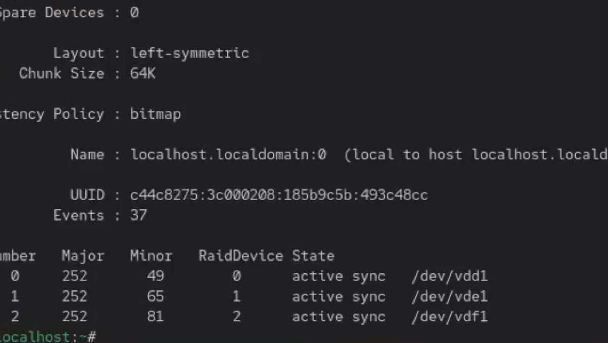{#fig:13 width=70%}

## Выполнение Лабораторной работы

Завершение работы
После завершения работы я остановил массив: umount /dev/md0
mdadm --stop /dev/md0
Очистил метаданные:

mdadm --zero-superblock /dev/sdd1
mdadm --zero-superblock /dev/sde1
mdadm --zero-superblock /dev/sdf1(рис. [-@fig:014])

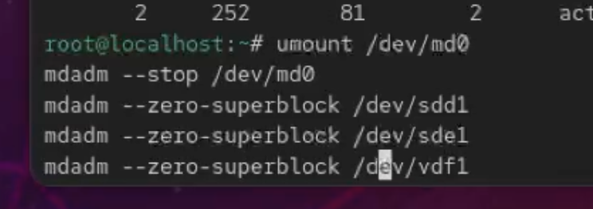{#fig:14 width=70%}

## Выполнение Лабораторной работы

И в конце закомментировал запись в /etc/fstab:

## Контрольные вопросы

1. Определение RAID

RAID (Redundant Array of Independent Disks) — это технология объединения нескольких физических жёстких дисков в один логический массив для повышения производительности, надёжности хранения данных или и того и другого одновременно.

2. Типы RAID-массивов

Основные типы RAID: RAID 0 RAID 1 RAID 5 RAID 6 RAID 10 (1+0)

Также существуют менее распространённые и комбинированные уровни (RAID 50, RAID 60), но на практике чаще всего используются перечисленные выше.

3. Характеристика RAID 0, RAID 1, RAID 5, RAID 6
RAID 0

Алгоритм работы: Данные разбиваются на блоки и записываются поочерёдно на все диски (striping).

Назначение: Максимальная производительность.

Надёжность: Отсутствует. Отказ одного диска = потеря всех данных.

Минимум дисков: 2.

Пример применения:Временные данные, кэш, видеомонтаж, где важна скорость, а не сохранность.

RAID 1

Алгоритм работы: Полное зеркалирование данных — одинаковая информация записывается на оба диска.

Назначение: Максимальная надёжность.

Надёжность: Высокая. Массив работает при отказе одного диска.

Минимум дисков: 2.

Пример применения: Серверы, системные разделы, базы данных с критически важной информацией.

RAID 5

Алгоритм работы: Данные и контрольная информация (parity) распределяются по всем дискам массива.

Назначение: Баланс между производительностью, надёжностью и объёмом.

Надёжность: Выдерживает отказ одного диска.

Минимум дисков: 3.

Пример применения: Файловые серверы, NAS, корпоративные хранилища.

RAID 6

Алгоритм работы:
Как RAID 5, но используется двойная контрольная информация.

Назначение: Повышенная надёжность.
Надёжность: Выдерживает отказ двух дисков одновременно.
Минимум дисков: 4.
Пример применения: Крупные серверы хранения данных, системы с повышенными требованиями к отказоустойчивости.

## Выводы

В ходе выполнения данной лабораторной работы были получены навыки разбиения дисков

## Список литературы{.unnumbered}

::: {#refs}
:::
